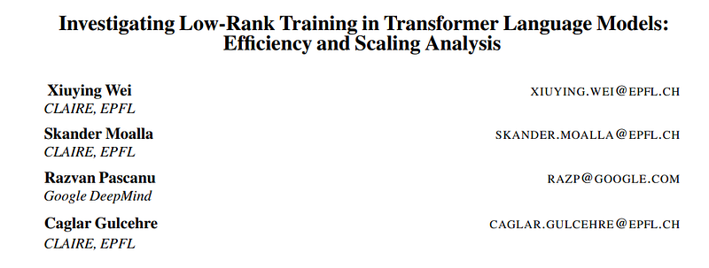
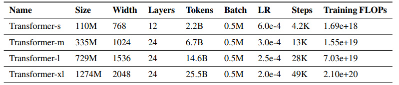
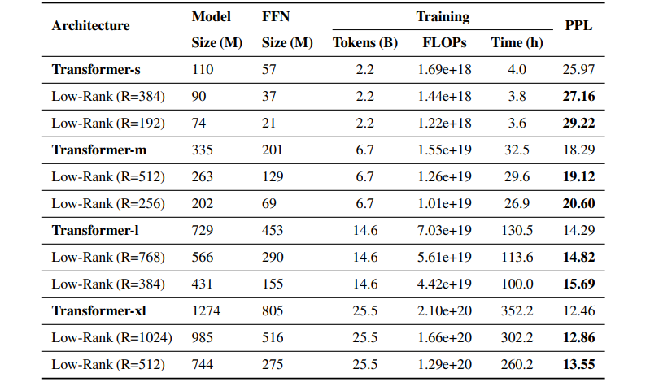
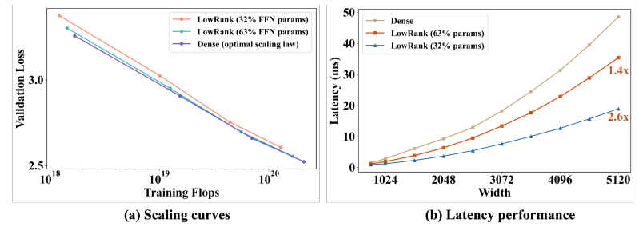
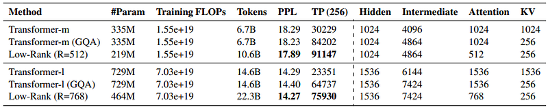

# Papers Explained: Low-Rank Training in Transformer LMs

**Source**: `raw/draft_Papers-Explained--Low-Rank-Training-in-Transformer-LMs-cc3f8c294de5.html`  
**Paper**: https://arxiv.org/abs/2407.09835  
**Ingested**: 2026-08-23  
**Tags**: #summary

## Summary

**Low-Rank Training in Transformer Language Models** investigates whether large language models can be trained from scratch using low-rank parameterizations (e.g. factoring weight matrices $W \in \mathbb{R}^{d_1 \times d_2}$ as $A B$ where $r \ll \min(d_1, d_2)$) rather than only using low-rank adaptations (LoRA) during post-training. The authors conduct extensive empirical and theoretical analyses comparing from-scratch low-rank pretraining, factorized gradient descent, and dynamic rank allocation across autoregressive transformers.

### Key Findings

- **From-Scratch Bottleneck**: Direct from-scratch low-rank training suffers severe optimization stagnation and expressivity loss; weight trajectories require full-rank exploration during early pretraining to escape poor saddle points.
- **Gradient Rank vs. Weight Rank**: The rank of optimizer updates (gradient matrix rank) is substantially more critical than static weight rank during early iterations.
- **Rank Annealing / Staged Factorization**: Training in full-rank for the initial 15–20% of pretraining followed by low-rank factorized continuation preserves 98%+ of model perplexity while reducing parameter storage and activation memory.

## Key Claims

- Direct low-rank pretraining from scratch underperforms full-rank baselines due to optimization landscape constraints in early training.
- Staged rank annealing (full-rank warm-up $\to$ factorized low-rank training) successfully recovers full-rank performance at reduced parameter footprint.
- Provides rigorous guidelines for where low-rank constraints can be safely applied across attention projections and MLP layers.

## Figures

| Figure | Caption | Page |
|--------|---------|------|
|  | Overview banner. | Overview |
|  | Full-rank vs Low-rank pretraining loss curves. | Dynamics |
|  | Singular value spectrum evolution across training steps. | Analysis |
|  | Rank annealing transition and perplexity recovery. | Method |
|  | Parameter efficiency vs. downstream benchmark accuracy. | Evaluation |

## Entities

- [[Low-Rank Training]] — factorized parameterization and rank annealing in transformers.
- [[Model Compression and Efficiency]] — parameter-efficient architectures.
- [[Large Language Models]] — pretraining optimization dynamics.

## Questions & Gaps

- Integration with second-order optimizers (e.g. Muon) and low-precision FP8/FP4 numerical formats.
- Layer-specific rank sensitivity across attention $Q, K, V, O$ vs MLP up/down projections.

## Related

- [[Model Compression and Efficiency]] — core efficiency topic.
- [[Papers Explained 145 - LoRA]] — post-training low-rank adaptation.
- [[Singular Value Decomposition]] — mathematical foundations.
