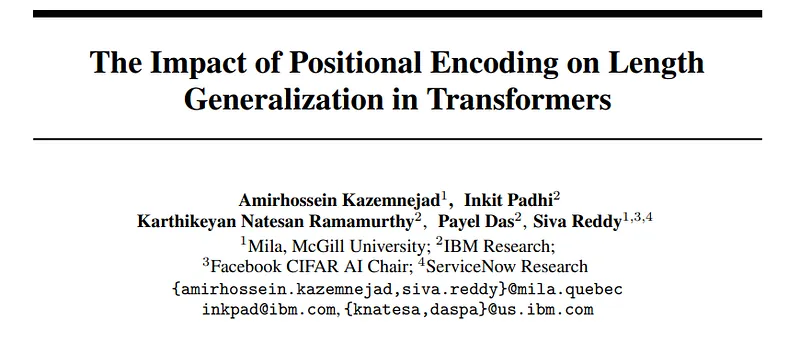
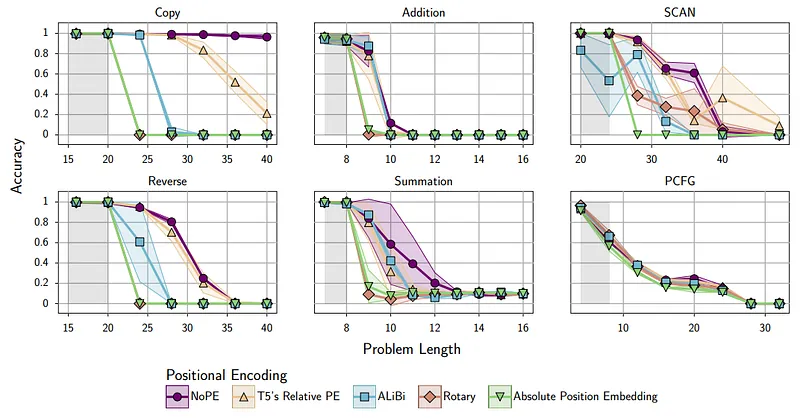
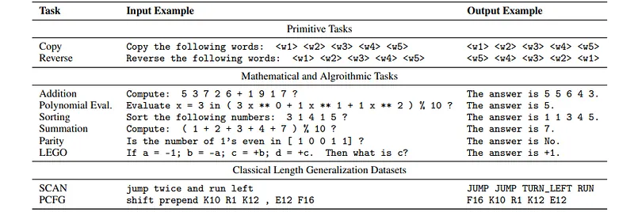
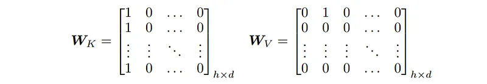
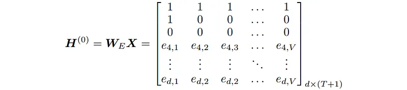
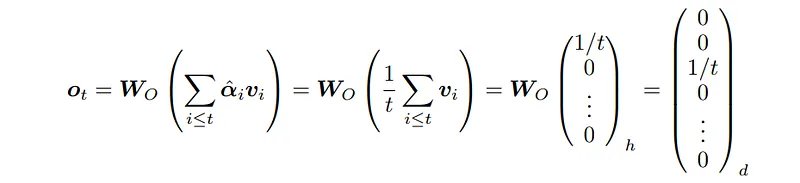
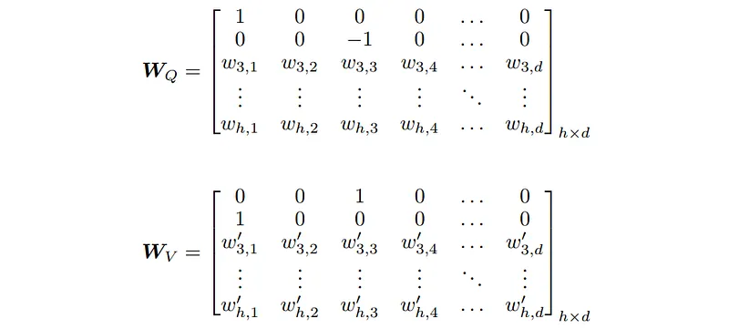
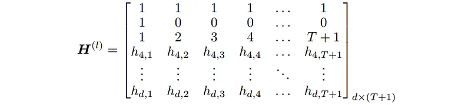
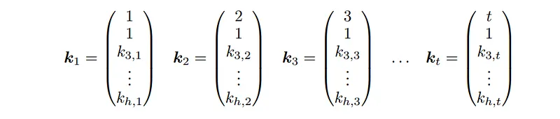
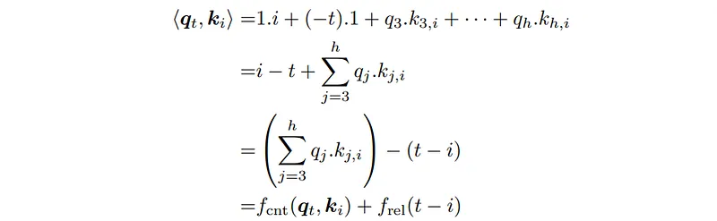

# Papers Explained: No Position Encoding (NoPE)

**Source**: `raw/draft_Papers-Explained--No-Position-Encoding--NoPE--9a670429a736.md`  
**Paper**: https://arxiv.org/abs/2305.19466  
**Ingested**: 2026-08-23  
**Tags**: #summary

## Summary

**No Position Encoding (NoPE)** investigates whether decoder-only autoregressive Transformers actually require explicit positional encodings (such as sinusoidal, learned absolute, RoPE, or ALiBi). Kazemnejad et al. (2023) show that **causal attention masking alone implicitly injects positional information**, allowing models trained without any explicit positional encodings (NoPE) to learn both absolute and relative positional relationships. Furthermore, NoPE demonstrates superior context length extrapolation compared to traditional absolute positional encodings and matches or exceeds RoPE on length generalization.

### How NoPE Represents Position

Because the lower-triangular causal attention mask restricts each token $i$ to attend only to tokens $j \le i$, the number of available receptive-field tokens directly encodes the absolute position $i$.
1. **Absolute Positional Signal**: The norm and unnormalized query-key product implicitly scale with token index $i$, allowing the model to distinguish prefix positions from later positions.
2. **Relative Positional Signal**: Multi-head self-attention learns to represent relative distances $i - j$ through attention probability decay and token-shifting key transformations.
3. **Length Extrapolation**: Because NoPE has no fixed positional tables or rotary frequencies tuned to specific pretraining sequence bounds, it does not suffer catastrophic out-of-distribution frequency breakdown when evaluating on sequences $2\times\text{--}4\times$ longer than the pretraining window.

## Key Claims

- Causal masking inherently provides autoregressive Transformers with sufficient inductive bias to represent both absolute and relative positions.
- NoPE matches explicit positional encodings on standard in-distribution language modeling benchmarks.
- NoPE significantly outperforms learned and sinusoidal absolute positional encodings on length generalization and context extrapolation.

## Figures

| Figure | Caption | Page |
|--------|---------|------|
|  | NoPE overview banner. | Overview |
|  | Causal attention masking and implicit position flow. | Method |
|  | Linear probing of absolute token positions across layers. | Analysis |
|  | Relative position probing and attention distance curves. | Analysis |
|  | Context length extrapolation comparison: NoPE vs RoPE vs ALiBi. | Evaluation |
|  | In-distribution language modeling perplexity across model scales. | Evaluation |
|  | Synthetic tracking tasks (copying, associative recall). | Synthetic |
|  | Attention map visualization showing emergence of relative heads. | Visualization |
|  | Query and Key vector norm scaling with sequence depth. | Dynamics |
|  | Impact of sequence length during pretraining. | Ablations |
|  | Layer-wise emergence of positional representations. | Layer Analysis |
|  | Downstream evaluation on GLUE and SuperGLUE benchmarks. | Downstream |
|  | Comparison across causal vs. non-causal bidirectional attention. | Non-Causal |
|  | Passkey retrieval and needle-in-a-haystack extrapolation. | Retrieval |
|  | Token distance sensitivity heatmaps. | Analysis |
|  | Mathematical proof of implicit causal position encoding. | Theory |
|  | Training throughput and memory comparison. | Efficiency |
|  | Extrapolation curves up to 8k tokens. | Scaling |
|  | Summary of positional encoding paradigms. | Taxonomy |

## Entities

- [[NoPE]] — No Position Encoding paradigm for causal transformers.
- [[Positional Encoding]] — positional representations in transformers.
- [[Long Context]] — sequence length generalization.
- [[Large Language Models]] — causal autoregressive models.

## Questions & Gaps

- Failure of NoPE in bidirectional non-causal models (BERT/T5) where causal masking is absent.
- Performance on exact multi-digit arithmetic and symbolic tasks requiring precise absolute coordinate indexing.

## Related

- [[Papers Explained Review 06 - Position Encodings]] — position encodings survey.
- [[Positional Encoding]] — core concept.
- [[Papers Explained: Attention with Linear Biases (ALiBi)]] — linear bias alternative.
- [[Papers Explained: Rotary Position Embedding (RoPE)]] — rotary alternative.
