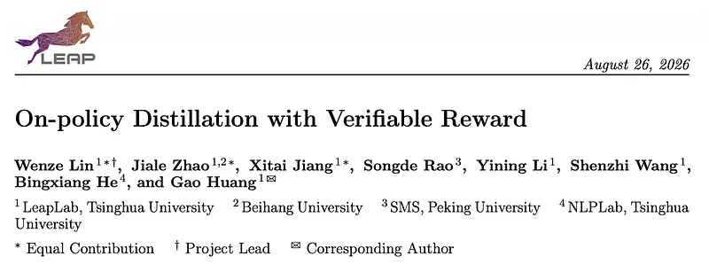
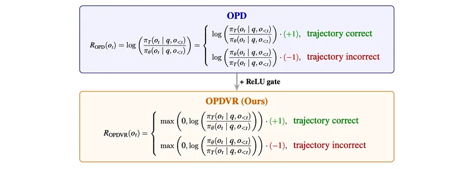
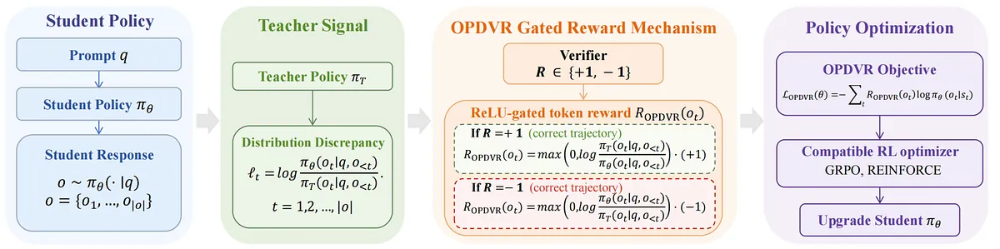
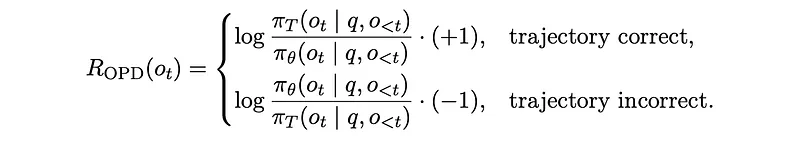
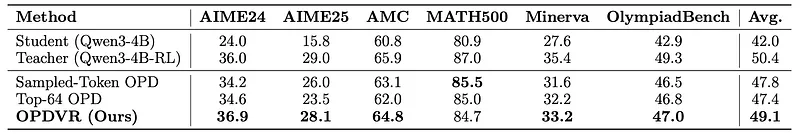
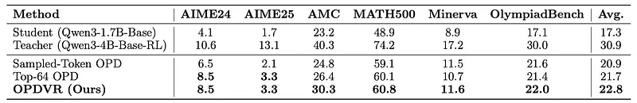
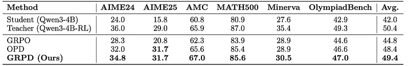

# Papers Explained: On-policy Distillation with Verifiable Reward

**Source**: `raw/2026-08-30_Papers-Explained--On-policy-Distillation-with-Verifiable-Reward-3f231794b5b4.md`  
**Paper**: https://arxiv.org/abs/2608.24696  
**Ingested**: 2026-08-30  
**Tags**: #summary

## Summary

This paper introduces **On-policy Distillation with Verifiable Reward (OPDVR)**, a simple, hyperparameter-free framework that unifies **On-Policy Distillation (OPD)** and **Reinforcement Learning with Verifiable Rewards (RLVR)** for post-training reasoning language models. While RLVR provides sparse task-level ground-truth outcome verification and can exceed teacher capability, it suffers from high variance and sample inefficiency. Conversely, sampled-token OPD provides dense token-level distributional supervision on student rollouts, but is agnostic to trajectory correctness and intrinsically bounded by the teacher distribution. Existing combinations typically rely on heuristic weighting or multi-stage scheduling, introducing optimization instability and hyperparameter sensitivity.

The authors show that the gradient of sampled-token OPD is algebraically identical to a policy gradient whose implicit token-level reward is the log-probability ratio between teacher and student: $R_{\text{OPD}}(o_t) = \log (\pi_T(o_t) / \pi_\theta(o_t))$. However, because the sign of this ratio depends purely on relative policy confidence rather than task correctness, standard OPD frequently violates basic reinforcement learning principles—assigning negative rewards to tokens on correct trajectories (when $\pi_T < \pi_\theta$) and positive rewards to tokens on incorrect trajectories (when $\pi_T > \pi_\theta$).

### The OPDVR Formulation

To resolve this alignment contradiction, OPDVR introduces a parameter-free **ReLU gating mechanism** conditioned on trajectory-level correctness $R \in \{-1, +1\}$:

- **Correct Trajectories ($R = +1$)**: The reward is gated by $\text{ReLU}(\log(\pi_T / \pi_\theta)) \ge 0$. Correct tokens receive positive reinforcement proportional to how much more confident the teacher is than the student, while tokens where the student is already more confident than the teacher receive a zero reward (no penalty for outperforming the teacher).
- **Incorrect Trajectories ($R = -1$)**: The penalty is gated by $-\text{ReLU}(\log(\pi_\theta / \pi_T)) \le 0$. Overconfident errors where the student assigned higher probability than the teacher are penalised aggressively, while errors where the teacher was equally or more uncertain are capped at zero.

Compactly, the token-level gated reward is defined as:
$$R_{\text{OPDVR}}(o_t) = \text{sgn}(R(o)) \cdot \text{ReLU}\left(\text{sgn}(R(o)) \cdot \log \frac{\pi_T(o_t | q, o_{<t})}{\pi_\theta(o_t | q, o_{<t})}\right)$$

### Group Relative Policy Distillation (GRPD)

Because OPDVR converts sampled-token distillation into a well-formed policy gradient objective, it seamlessly integrates with standard policy gradient and advantage-based algorithms like **Group Relative Policy Optimization (GRPO)**. In **Group Relative Policy Distillation (GRPD)**, the binary trajectory sign is replaced by the group-relative normalized advantage $\hat{A}_{i,t}$:

$$R_{\text{GRPD}}(o_{i,t}) = \text{sgn}(\hat{A}_{i,t}) \cdot \text{ReLU}\left(\text{sgn}(\hat{A}_{i,t}) \cdot \log \frac{\pi_T(o_{i,t} | q, o_{i,<t})}{\pi_\theta(o_{i,t} | q, o_{i,<t})}\right) \cdot |\hat{A}_{i,t}|$$

### Key Empirical Findings

1. **Same-Architecture Distillation**: Using a GRPO-trained Qwen3-4B teacher (on filtered DeepMath $\ge 6$) and a Qwen3-4B-nonthinking student, OPDVR consistently outperforms standard sampled-token OPD and top-64 OPD across all six evaluated benchmarks (AIME24, AIME25, AMC, MATH500, Minerva, OlympiadBench). On AIME24, OPDVR surpasses the teacher itself (+2.7 over standard OPD; +2.1 on AIME25).
2. **Cross-Architecture Distillation**: Distilling from a Qwen3-4B-base teacher to a Qwen3-1.7B-base student on DAPO-Math-17k achieves +5.5 on AMC and +1.7 on MATH500 over OPD, demonstrating strong transfer across capacity gaps.
3. **GRPD Superiority**: GRPD substantially improves over both pure GRPO and vanilla OPD, delivering large gains on challenging competition benchmarks (+6.5 on AIME24, +10.9 on AIME25).

## Key Claims

- Sampled-token on-policy distillation has an exact policy gradient interpretation where the implicit token reward is $R_{\text{OPD}}(o_t) = \log(\pi_T(o_t)/\pi_\theta(o_t))$.
- Unconstrained OPD suffers from sign-correctness misalignment: rewarding wrong completions when the teacher is overconfident, and penalizing correct student responses when student confidence exceeds teacher confidence.
- ReLU gating aligns dense token distillation signals with binary verifiable rewards without introducing extra hyperparameters or weight coefficients.
- OPDVR allows a student model to break the teacher ceiling and outperform its teacher on complex reasoning tasks (e.g. AIME24).
- Group Relative Policy Distillation (GRPD) unifies group-relative advantage estimation with gated token-level distillation, outperforming both standalone GRPO and standalone OPD.

## Figures

| Figure | Caption | Page |
|--------|---------|------|
|  | Papers Explained overview banner: On-policy Distillation with Verifiable Reward. | Overview |
|  | Sampled-token OPD sequence-level loss formulation. | Method |
|  | Per-token loss definition for sampled rollouts $o \sim \pi_\theta(\cdot \vert q)$. | Method |
|  | Gradient of the sequence-level sampled-token OPD loss with respect to $\theta$. | Method |
|  | Standard RLVR loss formulation for trajectory with outcome reward $R$. | Method |
|  | Policy gradient of the RLVR loss function. | Method |
|  | Matching score function gradient coefficients between OPD and RLVR. | Method |
|  | Definition of implicit token-level reward $R_{\text{OPD}}(o_t)$ as log-probability ratio. | Method |
|  | Trajectory correctness cases and reward sign alignment failure modes in standard OPD. | Method |
|  | Comparison of Standard OPD, RLVR, and OPDVR reward mechanisms and properties. | Method |
|  | ReLU-gated reward formulation $R_{\text{OPDVR}}(o_t)$ conditioned on trajectory outcome. | Method |
|  | Complete loss function $\mathcal{L}_{\text{OPDVR}}(\theta)$. | Method |
|  | Overview diagram of the OPDVR post-training workflow and gating logic. | Method |
|  | GRPO group-relative advantage computation $\hat{A}_{i,t}$. | GRPD |
|  | ReLU gating logic combined with group-relative advantage $\hat{A}_{i,t}$. | GRPD |
|  | Compact formulation of the GRPD token-level reward $R_{\text{GRPD}}(o_{i,t})$. | GRPD |
|  | Objective loss function for Group Relative Policy Distillation $\mathcal{L}_{\text{GRPD}}(\theta)$. | GRPD |
|  | Benchmark results on same-architecture distillation (Qwen3-4B student and teacher). | Experiments |
|  | Benchmark results on cross-architecture distillation (Qwen3-4B teacher to Qwen3-1.7B student). | Experiments |
|  | Benchmark evaluation comparing GRPD against pure GRPO and standard OPD. | Experiments |

## Entities

- [[OPDVR]] — On-policy Distillation with Verifiable Reward using ReLU-gated token log-probability ratios.
- [[GRPD]] — Group Relative Policy Distillation combining OPDVR with group-relative advantage estimation.
- [[On-Policy Distillation]] — Post-training paradigm sampling on-policy student rollouts scored by a teacher policy.
- [[Reinforcement Learning with Verifiable Rewards]] — Outcome-driven RL post-training using automated test or math verifiers.
- [[GRPO]] — Group Relative Policy Optimization algorithm providing group-normalized baseline advantages.
- [[LeapLabTHU]] — Laboratory at Tsinghua University leading research on efficient post-training and OPDVR.
- [[Qwen]] — Backbone model family evaluated (Qwen3-4B and Qwen3-1.7B).
- [[DeepMath]] — Mathematical reasoning dataset used for training teacher policies.
- [[DAPO]] — Dataset and optimization setting utilized for cross-architecture distillation benchmarks.

## Questions & Gaps

- Behavior of OPDVR in non-verifiable or subjective reward domains (e.g. creative writing, instruction following with soft rubrics).
- Interaction of token-level ReLU gating with length-penalty incentives or reasoning budget constraints.
- Scaling GRPD to multi-turn agentic environments with sparse intermediate environment feedback.

## Related

- [[On-Policy Distillation]] — Core foundation; OPDVR fixes the trajectory correctness misalignment in sampled-token OPD.
- [[Reinforcement Learning with Verifiable Rewards]] — Complementary paradigm supplying the outcome correctness ground truth.
- [[GRPO]] — Optimizer extended by GRPD with gated distillation rewards.
- [[Weak-to-Strong On-Policy Distillation]] — Related study on on-policy distillation across model capacities.
- [[On SFT RL and On-Policy Distillation]] — Conceptual analysis of on-policy sampling dynamics and teacher bounding.
- [[Distillation Regimes Compared]] — Systematic comparison of KD, OPD, OPSD, and hybrid RL-distillation regimes.
- [[Reasoning Models]] — Primary target domain including competition math (AIME, AMC, MATH500, OlympiadBench).
- [[Reinforcement Learning Topic]] — Comprehensive taxonomy of RL algorithms and post-training methods.
