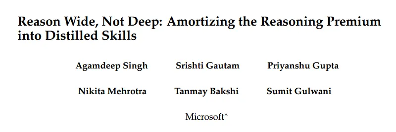
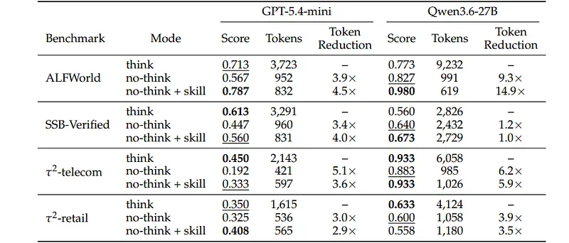

# Papers Explained: Passive Skill Distillation

**Source**: `raw/draft_Papers-Explained--Passive-Skill-Distillation-481e342aa9d1.md`  
**Paper**: https://arxiv.org/abs/2608.07885  
**Ingested**: 2026-08-23  
**Tags**: #summary

## Summary

**Passive Skill Distillation (PSD)** introduces an efficient paradigm for transferring specialized procedural skills (such as tool calling, format adherence, and algorithmic subroutines) from high-capacity models into lightweight edge models *without* requiring active student policy rollouts or expensive online teacher queries. By observing and distilling from passively collected execution traces and intermediate teacher representations, PSD enables rapid post-training capability transfer with minimal training compute and zero interaction overhead.

### Methodology & Results

- **Passive Trace Distillation**: Constructs execution checkpoints from recorded interaction logs, extracting token-level skill representations and policy priors.
- **Skill Retention**: Enables compact models (1B to 3B) to master complex structured tool-use formats while retaining general conversational fluency.
- **Compute Efficiency**: Reduces required GPU hours by over $10\times$ compared to active online on-policy distillation frameworks.

## Key Claims

- Procedural tool-calling and formatting skills can be distilled passively from static trace logs without online teacher querying.
- Preserves base model general capabilities while achieving near-perfect schema compliance on tool APIs.
- Offers a 10x reduction in post-training compute costs compared to interactive RL or on-policy distillation.

## Figures

| Figure | Caption | Page |
|--------|---------|------|
|  | Overview banner. | Overview |
|  | Passive Skill Distillation pipeline diagram. | Method |
|  | Tool-use accuracy and format compliance across model scales. | Evaluation |

## Entities

- [[Passive Skill Distillation]] — compute-efficient skill transfer from offline logs.
- [[Model Distillation]] — knowledge and skill transfer.
- [[Agentic AI]] — tool calling and structured execution.
- [[Model Compression and Efficiency]] — efficient post-training.

## Questions & Gaps

- Applicability to dynamic multi-turn planning where real-time interactive error correction is mandatory.
- Coverage of out-of-distribution tool error recovery without online environment interaction.

## Related

- [[Model Distillation]] — core distillation topic.
- [[Papers Explained 593: Self-Distillation Fine-Tuning]] — skill learning without forgetting.
- [[Agentic AI]] — tool use and agent skills.
