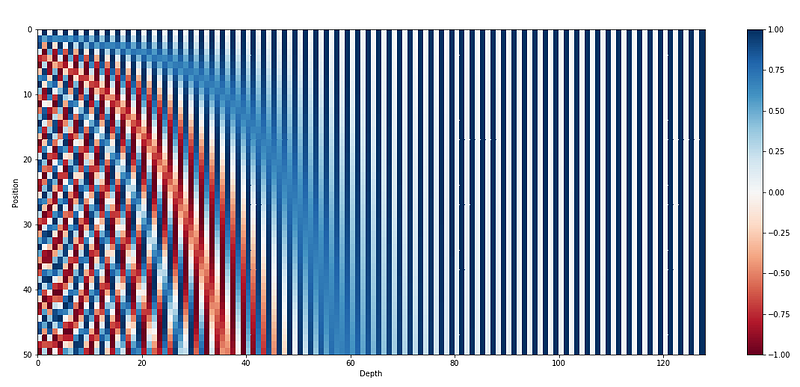
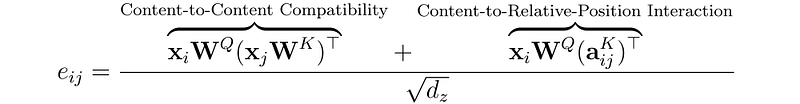

# Papers Explained: Position Encodings in Transformers

**Source**: `raw/draft_Papers-Explained--Position-Encodings-in-Transformers-3dafda9e6f47.html`  
**Papers**: https://arxiv.org/abs/1706.03762, https://arxiv.org/abs/1705.03122, https://arxiv.org/abs/1803.02155  
**Ingested**: 2026-08-23  
**Tags**: #summary

## Summary

**Position Encodings in Transformers** provides a comprehensive foundational survey of positional representation methods in Transformer architectures. Because the self-attention mechanism is inherently permutation-equivariant (treating inputs as an unordered set of tokens), explicit or implicit positional representations must be introduced so that the model can understand word order, syntax, and long-range dependencies. The article covers the mathematical formulation, inductive biases, and trade-offs among the three foundational positional paradigms: **Sinusoidal Positional Encodings** (Vaswani et al., 2017), **Learned Absolute Positional Embeddings** (Gehring et al., 2017), and **Relative Positional Encodings** (Shaw et al., 2018).

### Three Foundational Paradigms

1. **Sinusoidal Positional Encoding (Vaswani et al., 2017)**:
   - Uses fixed trigonometric functions of varying frequencies:
   $$PE_{(pos, 2i)} = \sin\left(\frac{pos}{10000^{2i/d_{model}}}\right), \quad PE_{(pos, 2i+1)} = \cos\left(\frac{pos}{10000^{2i/d_{model}}}\right)$$
   - Allows the model to attend to relative positions via linear transformations because for any fixed offset $k$, $PE_{pos+k}$ is a linear function of $PE_{pos}$.
2. **Learned Absolute Positional Embeddings (Gehring et al., 2017 / BERT / GPT-2)**:
   - Assigns a dedicated learnable parameter vector to each integer position $pos \in \{0, \dots, L_{max}-1\}$. Simple and expressive within the training context window, but strictly bounded and unable to extrapolate beyond $L_{max}$.
3. **Relative Positional Encodings (Shaw et al., 2018)**:
   - Replaces absolute coordinates with learnable relative distance vectors $a_{ij}^K, a_{ij}^V$ added directly into attention matrix multiplications, clipped at a maximum distance $k$: $\text{clip}(j - i, -k, k)$.

## Key Claims

- Self-attention is permutation-equivariant and strictly requires positional signals to process sequential data.
- Sinusoidal encoding provides zero-parameter position awareness with theoretical relative shift properties.
- Learned absolute embeddings provide maximum in-distribution flexibility but completely fail on length extrapolation.
- Relative position encodings offer stronger length generalization by focusing solely on relative token distances.

## Figures

| Figure | Caption | Page |
|--------|---------|------|
|  | Position Encodings in Transformers banner. | Overview |
|  | Sinusoidal wave pattern and frequency spectrum across embedding dimensions. | Sinusoidal |
|  | Learned absolute embedding lookup matrix. | Learned |
|  | Shaw et al. relative position attention matrix modification. | Relative |
|  | Dot-product attention geometry with positional additions. | Geometry |
|  | Comparison of translation quality across position encoding types. | Evaluation |
|  | Attention distance decay heatmaps across transformer layers. | Analysis |
|  | Summary taxonomy of positional encoding methods. | Taxonomy |

## Entities

- [[Positional Encoding]] — foundational concept page.
- [[Relative Position Embedding]] — relative distance encoding.
- [[Large Language Models]] — transformer foundation models.
- [[Attention Mechanism]] — self-attention computation.

## Questions & Gaps

- Compute overhead of Shaw-style relative position tensors during large batch training.
- Evolution of early relative encodings into modern rotary (RoPE) and linear bias (ALiBi) formulations.

## Related

- [[Papers Explained Review 06 - Position Encodings]] — broader review of modern position mechanisms.
- [[Papers Explained: Rotary Position Embedding (RoPE)]] — rotary formulation.
- [[Papers Explained: Attention with Linear Biases (ALiBi)]] — linear bias extrapolation.
- [[Papers Explained: No Position Encoding (NoPE)]] — implicit positional encoding via causal masking.
