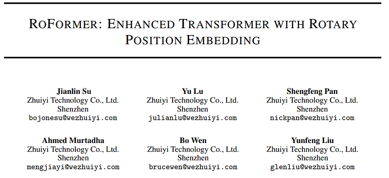
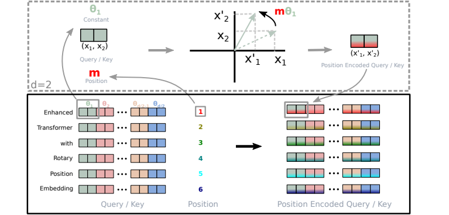
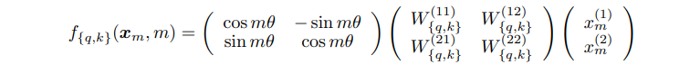
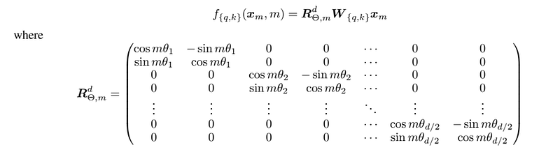
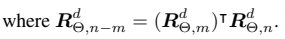
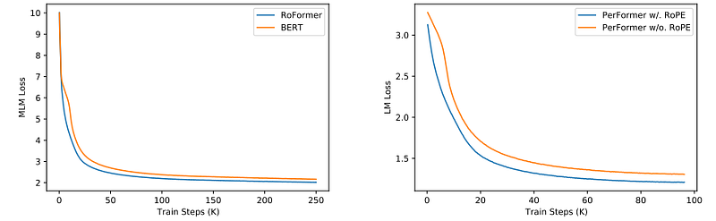
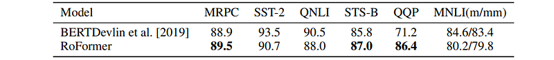

# Papers Explained: Rotary Position Embedding (RoPE)

**Source**: `raw/draft_Papers-Explained--Rotary-Position-Embedding-RoPE--5797f508073f.html`  
**Paper**: https://arxiv.org/abs/2104.09864  
**Ingested**: 2026-08-23  
**Tags**: #summary

## Summary

**Rotary Position Embedding (RoPE)** (Su et al., 2021) is the dominant positional encoding method in modern open-weights and frontier Large Language Models (including LLaMA, Mistral, Qwen, Gemma, and DeepSeek). RoPE unifies absolute and relative positional encoding by rotating Query and Key vectors in 2D chunks of the complex plane by an angle proportional to the token's absolute position $m$. In doing so, the inner product $\langle R_m q, R_n k \rangle$ becomes a function solely of the relative token distance $m - n$, naturally incorporating relative position information into dot-product self-attention while preserving absolute position awareness.

### Mathematical Formulation

1. **2D Complex Case**: For a 2D vector $(x_1, x_2)$ represented as complex number $z = x_1 + i x_2$, rotating by angle $m \theta$ is computed via multiplication by $e^{i m \theta}$:
$$R_{\Theta, m}^{2d} = \begin{pmatrix} \cos m\theta & -\sin m\theta \\ \sin m\theta & \cos m\theta \end{pmatrix}$$
2. **General $d$-Dimensional Case**: The $d$-dimensional embedding space is decomposed into $d/2$ orthogonal 2D subspaces with geometrically spaced base frequencies $\theta_i = 10000^{-2(i-1)/d}$:
$$R_{\Theta, m}^d = \text{diag}\left( R_{\Theta, m}^{2d, 1}, R_{\Theta, m}^{2d, 2}, \dots, R_{\Theta, m}^{2d, d/2} \right)$$
3. **Inner Product Property**: The inner product satisfies:
$$\langle R_m q, R_n k \rangle = q^T R_{n-m} k = g(q, k, m-n)$$
proving that self-attention weights decay naturally as relative distance $|m - n|$ grows.

## Key Claims

- Encodes absolute position via multiplicative complex rotation while ensuring dot-product attention depends purely on relative distance $m-n$.
- Self-attention weights naturally decay with increasing token distance.
- Compatible with linear and kernelized attention algorithms.
- Forms the standard positional backbone for virtually all modern frontier LLMs.

## Figures

| Figure | Caption | Page |
|--------|---------|------|
|  | RoPE overview banner. | Overview |
|  | 2D complex plane vector rotation geometry. | Method |
|  | General d-dimensional block diagonal rotation matrix. | Method |
|  | Inner product derivation showing relative distance dependence. | Theory |
|  | Relative attention decay property visualization. | Analysis |
|  | Benchmark evaluation across NLP tasks and translation. | Evaluation |
|  | Comparison: RoPE vs Sinusoidal vs Learned Absolute vs Shaw Relative. | Comparison |
|  | Long-context extrapolation behavior on synthetic tracking. | Extrapolation |
|  | Base frequency scaling analysis ($b=10000$ to $500000$). | Scaling |
|  | Computation speedup via chunked elementwise implementation. | Efficiency |
|  | Memory footprint comparison during training. | Efficiency |
|  | Attention score decay heatmaps. | Visualization |
|  | Perplexity scaling with context length. | Evaluation |
|  | RoPE integration with linear and kernelized attention. | Generalization |
|  | Multi-head dimension rotation distribution. | Analysis |
|  | Mathematical properties and norm conservation. | Theory |
|  | Summary of modern LLMs adopting RoPE. | Ecosystem |

## Entities

- [[RoPE]] — Rotary Position Embedding.
- [[Positional Encoding]] — position encoding in transformers.
- [[Jianlin Su]] — author and creator of RoPE (RoFormer).
- [[Large Language Models]] — core architecture adoption.

## Questions & Gaps

- Context length extrapolation limitations beyond pretraining bounds without frequency interpolation (resolved by YaRN, NTK-aware scaling).
- Partial rotary application (p-RoPE) to reduce KV cache memory.

## Related

- [[Papers Explained Review 06 - Position Encodings]] — comprehensive survey.
- [[Papers Explained: Yet another RoPE extensioN method (YaRN)]] — context scaling for RoPE.
- [[p-RoPE]] — partial rotary embeddings in Gemma 4.
- [[Papers Explained: Attention with Linear Biases (ALiBi)]] — alternative extrapolation approach.
