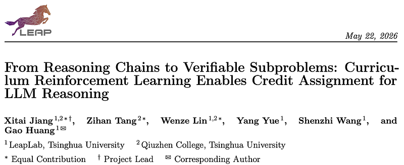
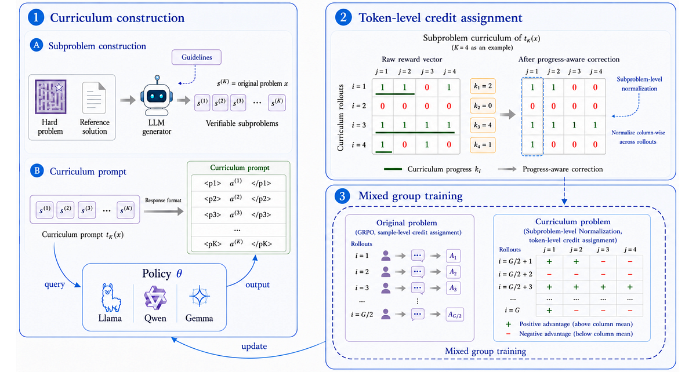
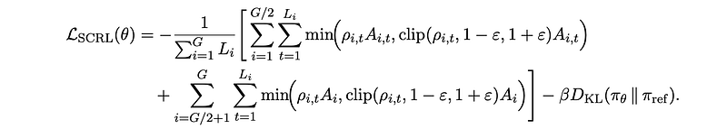
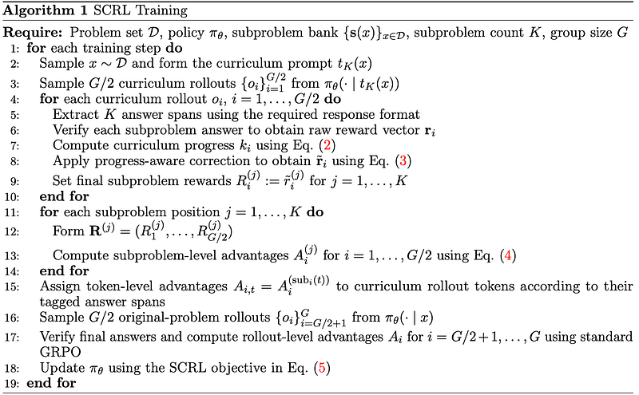
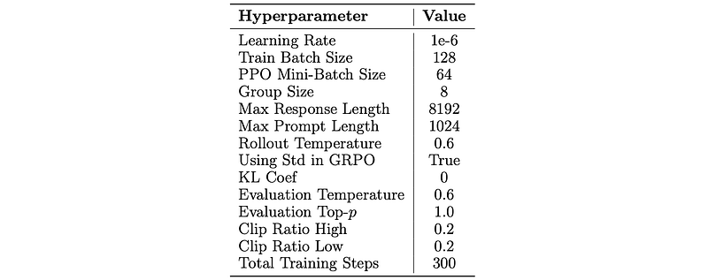
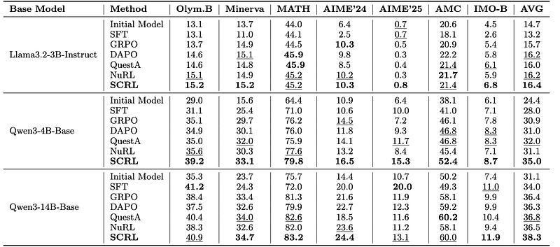
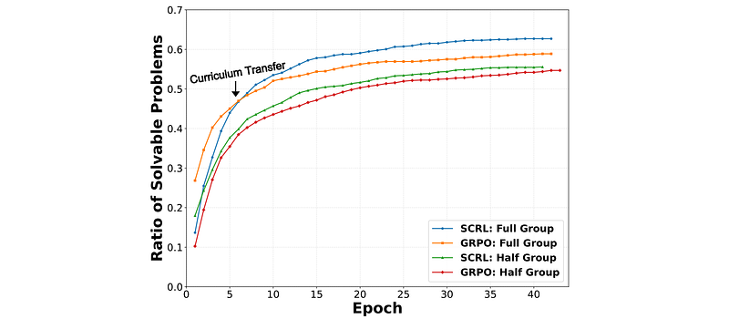
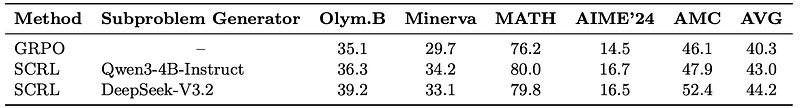
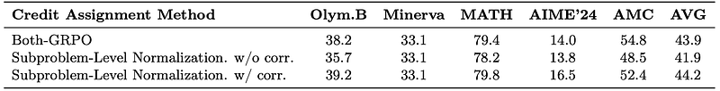

# Papers Explained: Subproblem Curriculum Reinforcement Learning (SCRL)

**Source**: `raw/draft_Papers-Explained--Subproblem-Curriculum-Reinforcement-Learning--SCRL--c1d94c6f3b00.html`  
**Paper**: https://arxiv.org/abs/2605.22074  
**Ingested**: 2026-08-23  
**Tags**: #summary

## Summary

**Subproblem Curriculum Reinforcement Learning (SCRL)** solves the sparse-reward bottleneck in long-horizon reasoning by decomposing monolithic reasoning tasks into an ordered DAG of verifiable subproblems. Rather than assigning rewards only upon full terminal correctness, SCRL introduces **Progress-Aware Subproblem Rewards**: as the agent successfully solves intermediate milestones, intermediate rewards are dispatched along the curriculum graph, guiding the policy step-by-step through complex multi-step deductions.

### Method & Progress-Aware Rewards

- **Subproblem Graph Decomposition**: Complex tasks (e.g., Olympiad proofs, multi-file code bugs) are decomposed into sub-goals with formal entry and exit specifications.
- **Progress-Aware Rewards**: Reward shaping credits valid subproblem completion while discounting repeated or redundant exploratory loops.
- **Curriculum Scheduling**: As the agent masters early subproblems, difficulty thresholds dynamically advance to focus sampling on downstream bottleneck steps.

## Key Claims

- Subproblem DAG decomposition provides dense, verifiable milestone rewards without requiring human step annotations.
- Drastically improves exploration sample efficiency on long-horizon mathematical proofs and multi-step programming.
- Eliminates reward hacking by enforcing strict verification contracts at each intermediate sub-goal.

## Figures

| Figure | Caption | Page |
|--------|---------|------|
|  | SCRL overview banner. | Overview |
|  | Subproblem DAG decomposition and curriculum scheduling. | Method |
|  | Progress-Aware Subproblem Reward formulation. | Method |
|  | Exploration efficiency comparison: SCRL vs Standard RLVR. | Results |
|  | Benchmark accuracy on OlympiadBench and Codeforces. | Results |
|  | Ablation of subproblem granularity and DAG depth. | Ablations |
|  | Policy entropy and milestone completion rates over training. | Dynamics |
|  | Qualitative proof decomposition example. | Qualitative |
|  | Verification failure recovery analysis. | Analysis |
|  | Cross-domain transfer on complex software bug localization. | Transfer |

## Entities

- [[SCRL]] — Subproblem Curriculum Reinforcement Learning.
- [[Curriculum Learning]] — curriculum progression in RL.
- [[Reasoning Models]] — long-horizon multi-step reasoning.
- [[Reinforcement Learning Topic]] — verifiable milestone rewards.

## Questions & Gaps

- Automated DAG generation reliability for messy, ill-posed natural language problems.
- Computational cost of verifying intermediate milestones in heavy sandbox environments.

## Related

- [[Curriculum Learning]] — core curriculum topic.
- [[Papers Explained: Self-Optimization via Asymmetric RL (SOAR)]] — automated curriculum peer.
- [[Reasoning Models]] — reasoning architectures.
