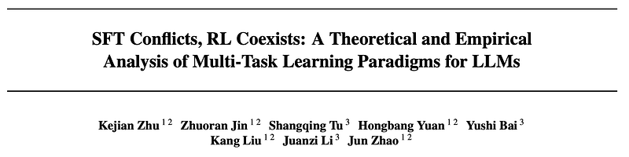
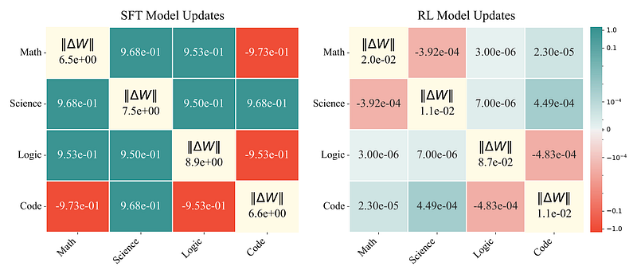
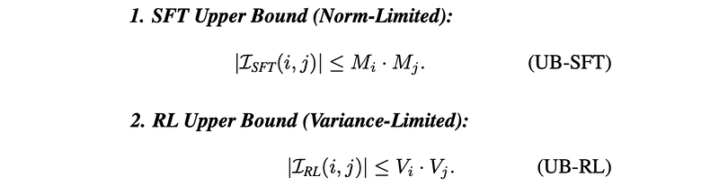
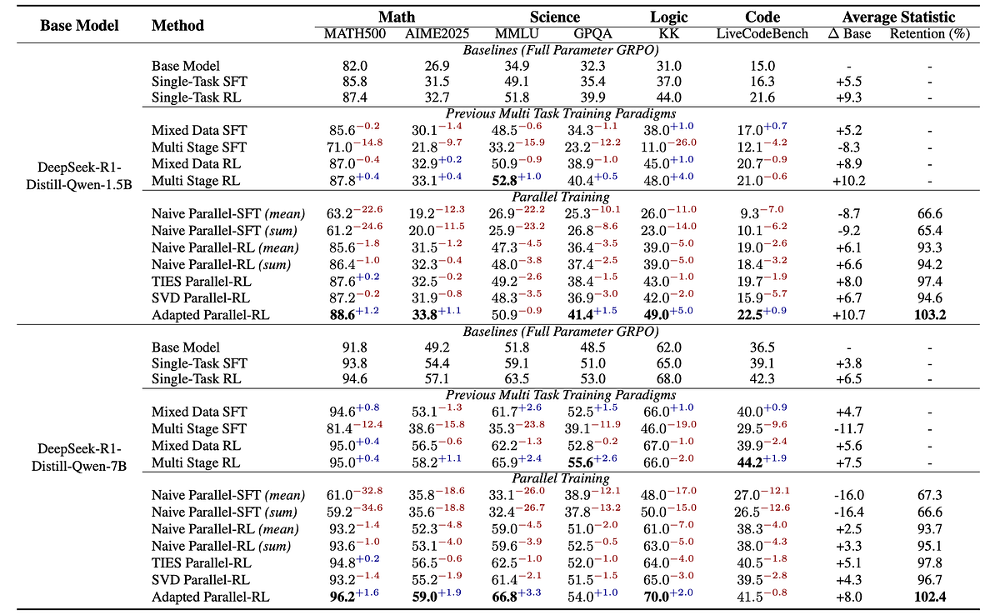
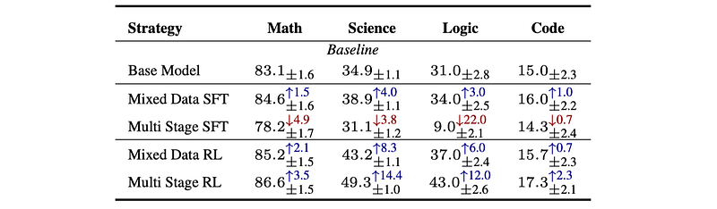
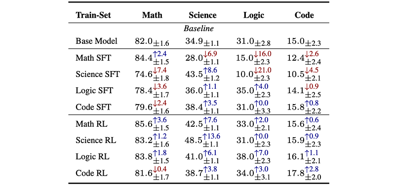

# Papers Explained: SFT Conflicts, RL Coexists

**Source**: `raw/2026-08-30_Papers-Explained--SFT-Conflicts--RL-Coexists-1ecd4a2d9bd8.html`  
**Paper**: https://arxiv.org/abs/2608.03573  
**Ingested**: 2026-08-30  
**Tags**: #summary

## Summary

This paper investigates the parametric and theoretical mechanisms governing multi-task reasoning post-training in large language models, comparing **Supervised Fine-Tuning (SFT)** with **Reinforcement Learning (RL)** using GRPO across mathematics, science, coding, and logical reasoning domains. The authors demonstrate that SFT suffers from severe task conflicts and catastrophic performance collapse in multi-stage training (averaging -23.1% below the base model across benchmarks), whereas RL exhibits robust and cumulative multi-task performance growth (+24.9% in multi-stage training and +12.6% in mixed-data training). In single-task training, SFT degrades untrained capabilities by an average of -5.1% while improving the target task (+4.0%), whereas RL improves the target task (+6.8%) while exerting a positive transfer (+2.3%) on untrained tasks, demonstrating **task coexistence**.

### Parameter Dynamics and Orthogonality

Empirical analysis of parameter update vectors ($\Delta W_i$) reveals two fundamental geometric properties:
1. **Magnitude and Sparsity**: RL parameter updates are minimal and sparse. The average $L_2$ norm of $\Delta W$ for RL is $\approx 3 \times 10^{-2}$, compared to $7.4$ for SFT (over two orders of magnitude smaller). Only ~20% of parameters in RL have update magnitudes $> 10^{-5}$, whereas 93% of parameters change in SFT.
2. **Subspace Orthogonality**: The pairwise cosine similarity of parameter updates across distinct tasks in RL is negligible ($\approx 10^{-5}$), indicating that task updates occupy mutually orthogonal subspaces. In contrast, SFT updates exhibit high directional overlap (cosine similarity $0.1$ to $1.0$) and occasional opposing directions, leading to acute parameter overwrite and interference.

### Theoretical Foundations: Norm-Limited vs. Variance-Limited Interference

The paper formalizes why RL gradients avoid inter-task interference:
- **Policy Source and RL's Razor**: SFT is off-policy and must fit an extrinsic expert distribution $\pi^*$, forcing large distributional and parametric shifts. In contrast, on-policy RL samples rollouts directly from the current policy $\pi_\theta$. Under *RL's Razor*, on-policy RL implicitly biases optimization toward solutions closest to the initial policy ($D_{KL}(\pi^* || \pi_0)$) even without an explicit KL penalty, directly inducing update sparsity and minimal parameter deviation.
- **Advantage Filtering Mechanism**: The zero-sum property of standardized advantages ($\sum_{k=1}^G \hat{A}_{i,k}(x) = 0$) algebraically subtracts the prompt-level mean gradient direction $\bar{S}_i(x)$, ensuring RL updates depend strictly on intra-group residual variation $\delta S_{i,k}(x)$. SFT retains dense common-mode directions that clash across data distributions.
- **Interference Upper Bounds (Theorem 4.5)**: Under score function norm bound $M_i^2$ and residual variance bound $V_i^2$, expected gradient interference $\mathbb{E}[\langle g_i, g_j \rangle]$ is **norm-limited** in SFT ($\le M_i M_j$) and **variance-limited** in RL ($\le \frac{V_i V_j}{G}$), which shrinks with group size $G$ and contracts further as the policy converges.

### Parallel-RL

Because task update vectors occupy approximately orthogonal subspaces ($\langle \Delta W_i, \Delta W_j \rangle \approx 0$), tasks can be trained independently in parallel and merged:
- **Naive Sum**: Directly summing independent task updates ($\Delta W = \sum_i \Delta W_i$) retains 95% of single-task RL gains (+5.0% over base), whereas Parallel-SFT collapses (retaining only 66%).
- **Sparsification**: Merging with TIES or SVD rank-1 retains 98% and 96% of single-task performance, respectively.
- **Adapted Parallel-RL**: Brief post-merge adaptation using only 5% of training samples achieves the highest accuracy (+9.4% over base model), outperforming single-task models (102.8% retention) with minimal compute overhead.

## Key Claims

- Multi-stage SFT suffers from catastrophic forgetting (-23.1% below base), while multi-stage RL accumulates capabilities (+24.9% average gain).
- Single-task SFT induces negative transfer on untrained tasks (-5.1%), whereas single-task RL exhibits task coexistence (+2.3% on untrained tasks).
- RL parameter updates have $L_2$ norms two orders of magnitude smaller than SFT ($0.03$ vs $7.4$) and pairwise cosine similarities near zero ($\approx 10^{-5}$), establishing empirical parameter orthogonality.
- Gradient interference in SFT is norm-limited by expert score function magnitude, whereas RL interference is variance-limited and filtered by the zero-sum advantage structure.
- Parallel-RL enables completely decentralized task training whose merged updates match or exceed sequential multi-task training when followed by light adaptation.

## Figures

| Figure | Caption | Page |
|--------|---------|------|
|  | Papers Explained overview banner: SFT Conflicts, RL Coexists. | Overview |
|  | Accuracy (%) of SFT and RL under multi-stage vs. mixed-data training on DeepSeek-R1-Distill-Qwen models. | Experiments |
|  | Single-task training generalization: SFT task degradation vs. RL task coexistence across math, science, code, and logic. | Experiments |
|  | Parameter update dynamics: $L_2$ norm magnitude and pairwise inter-task cosine similarity for SFT vs. RL. | Parameter Dynamics |
|  | Expected gradient formulations for off-policy SFT vs. on-policy RL with advantage weighting. | Theory |
|  | Empirical GRPO gradient formulation with standardized advantage $\hat{A}_{i,k}(x)$ and score function $S_{i,k}(x)$. | Theory |
|  | Multi-task gradient interference formulation in Supervised Fine-Tuning. | Theory |
|  | Multi-task gradient interference formulation in Reinforcement Learning. | Theory |
|  | Decomposition of RL gradient interference into intra-group residual score functions via zero-sum advantage centering. | Theory |
|  | Assumption 4.4: SFT expert score function norm bound ($M_i^2$). | Theory |
|  | Assumption 4.4: RL intra-group residual score function variance bound ($V_i^2$). | Theory |
|  | Theorem 4.5: Upper bounds on expected gradient inner products for SFT vs. GRPO RL. | Theory |
|  | Accuracy (%) across reasoning tasks for Naive, Sparse (TIES, SVD), and Adapted Parallel-RL. | Parallel-RL |

## Entities

- [[Parallel-RL]] — Distributed RL paradigm where independent task updates are merged into a unified policy.
- [[Task Coexistence]] — Empirical property where on-policy RL updates preserve and improve unoptimized capabilities.
- [[RL's Razor]] — Theoretical principle where on-policy RL implicitly minimizes divergence from initial policy, inducing sparse updates.
- [[Gradient Interference]] — Inner product of task gradients; norm-limited in SFT and variance-limited in RL.
- [[GRPO]] — Group Relative Policy Optimization algorithm used as the primary RL post-training optimizer.
- [[DeepSeek-R1-Distill-Qwen]] — Backbone model family evaluated (1.5B and 7B scales).
- [[Supervised Fine-Tuning]] — Baseline post-training paradigm demonstrating task conflicts and catastrophic forgetting.
- [[Reinforcement Learning]] — Post-training paradigm demonstrating update orthogonality and task coexistence.

## Questions & Gaps

- Extension of gradient orthogonality findings to dense non-reasoning tasks (e.g. creative writing, open chat, stylistic safety).
- Optimal sparsification and merging recipes when parallel task updates exhibit heterogeneous gradient norms or learning dynamics.
- Scaling Parallel-RL across dozens of narrow micro-tasks vs. few broad reasoning domains.

## Related

- [[Papers Explained 308 - SFT Memorizes, RL Generalizes]] — Empirical foundation showing SFT memorizes while RL generalizes out-of-distribution.
- [[GRPO]] — Optimization algorithm whose zero-sum advantage centering enables orthogonal gradient updates.
- [[Multi-Task Learning]] — General paradigm of simultaneous or sequential multi-task training in LLMs.
- [[Catastrophic Forgetting]] — Core failure mode of multi-stage SFT resolved by RL task coexistence.
- [[On SFT RL and On-Policy Distillation]] — Conceptual framing of SFT vs. RL optimization dynamics and sample distribution effects.
- [[Model Merging]] — Merging techniques (TIES, SVD linear addition) utilized by Parallel-RL.
- [[Reasoning Models]] — Core application domain spanning mathematics, code, science, and logic.
- [[Reinforcement Learning Topic]] — Comprehensive topic catalog for RL post-training and alignment.
