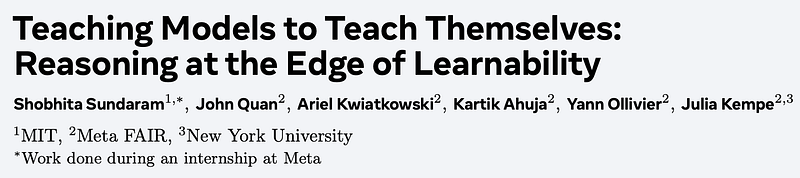
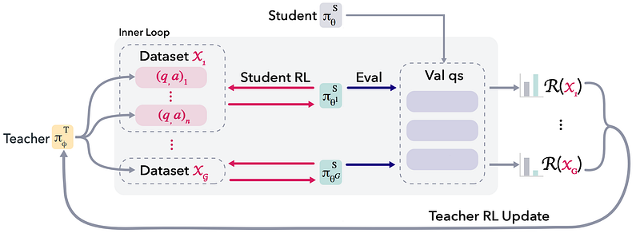
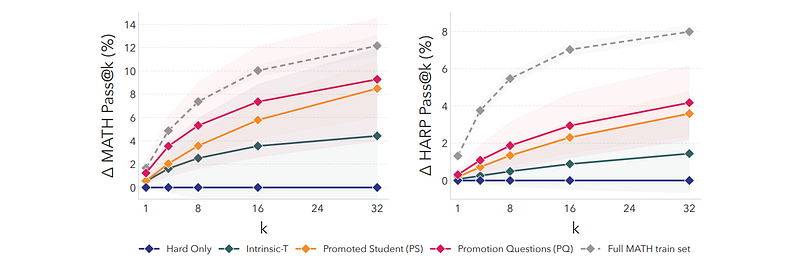

# Papers Explained: Self-Optimization via Asymmetric RL (SOAR)

**Source**: `raw/draft_Papers-Explained--Self-Optimization-via-Asymmetric-RL--SOAR--7b56235c07c2.html`  
**Paper**: https://arxiv.org/abs/2601.18778  
**Ingested**: 2026-08-23  
**Tags**: #summary

## Summary

**Self-Optimization via Asymmetric RL (SOAR)** is an asymmetric self-play and self-improvement reinforcement learning algorithm designed to bootstrap mathematical reasoning and formal problem-solving capabilities without external human demonstrations. SOAR decouples learning into an **asymmetric bi-level game**: an **Outer Loop (Teacher Policy)** that generates synthetic reasoning challenges calibrated to the student's learning frontier, and an **Inner Loop (Student Policy)** that optimizes solution rollouts using verifiable compiler and reward feedback.

### Asymmetric Bi-Level Game

- **Teacher Objective (Outer Loop)**: The teacher model generates problem statements $x$ to maximize the student's *learning progress* (rewarding problems that the student initially fails on exploration but solves after refinement, avoiding trivial or unlearnable problems).
- **Student Objective (Inner Loop)**: The student policy optimizes solution trajectory generation $\tau \sim \pi_S(\cdot \mid x)$ using verifiable rewards (GRPO / PPO).
- **Curriculum Emergence**: Automatic difficulty progression emerges naturally without manually engineered curriculum schedules.

## Key Claims

- Asymmetric teacher-student RL automates problem generation and curriculum calibration for reasoning LLMs.
- Maximizing student learning progress prevents curriculum stagnation on trivial or impossible tasks.
- Outperforms standard symmetric self-play and static RLVR baselines on competitive math (AIME, OlympiadBench).

## Figures

| Figure | Caption | Page |
|--------|---------|------|
|  | SOAR overview banner. | Overview |
|  | SOAR asymmetric bi-level optimization architecture. | Method |
|  | Outer-loop teacher curriculum objective and reward formulation. | Teacher |
|  | Inner-loop student policy update dynamics. | Student |
|  | Benchmark accuracy progression on MATH and AIME. | Results |
|  | Automatic problem difficulty scaling across training epochs. | Curriculum |

## Entities

- [[SOAR]] — Self-Optimization via Asymmetric RL.
- [[Asymmetric Self-Play]] — curriculum via asymmetric teacher-student games.
- [[Reasoning Models]] — self-improving reasoning agents.
- [[Reinforcement Learning Topic]] — RL curriculum and self-play.

## Questions & Gaps

- Preventing teacher collapse into repetitive or mathematically degenerate problem formulations.
- Grounding verification of newly generated teacher theorems in open-ended domains.

## Related

- [[Asymmetric Self-Play]] — foundational concept page.
- [[Curriculum for Reinforcement Learning]] — RL curriculum taxonomy.
- [[Papers Explained: Subproblem Curriculum Reinforcement Learning (SCRL)]] — subproblem curriculum learning.
