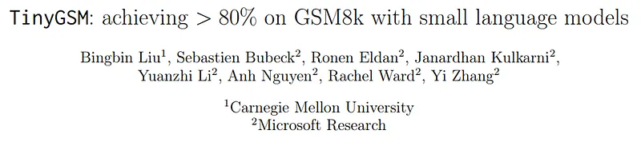
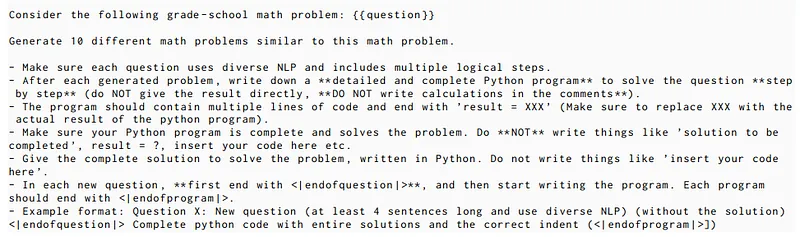
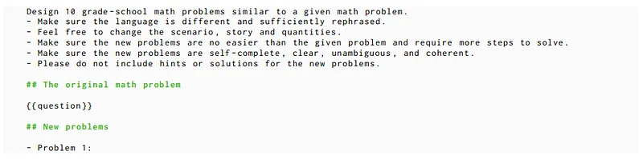
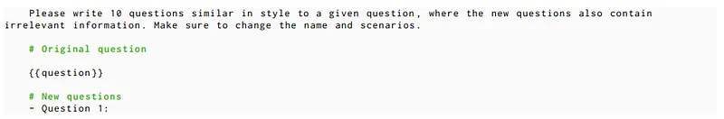
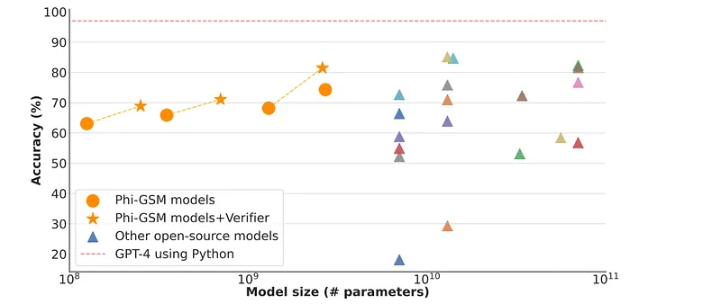
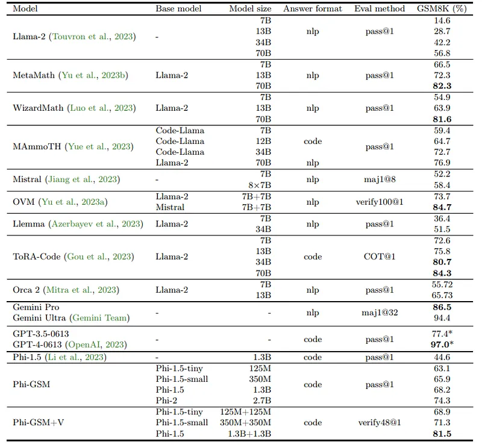
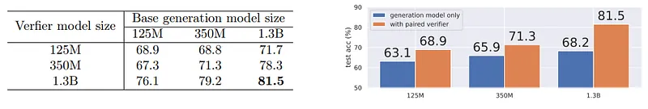

# Papers Explained: TinyGSM

**Source**: `raw/draft_Papers-Explained--TinyGSM-da8672bca027.md`  
**Paper**: https://arxiv.org/abs/2312.09241  
**Ingested**: 2026-08-23  
**Tags**: #summary

## Summary

**TinyGSM** (Microsoft Research) explores the extreme limits of small model mathematical reasoning by training a **1.3B parameter model** (and smaller) to achieve unprecedented accuracy on grade-school math benchmarks (GSM8K). The authors demonstrate that model capacity is not the primary bottleneck for grade-school mathematical reasoning; rather, **synthetic data quality, diversity, and strict reasoning step curation** are the defining factors. Trained on a curated synthetic dataset of 12.3M mathematical problems generated by GPT-4 with structured Python code verifications, TinyGSM achieves **81.5% accuracy on GSM8K**, outperforming 70B open models of its era.

### Data Synthesis & Verification Pipeline

1. **Synthetic Problem Generation**: GPT-4 generates grade-school word problems spanning diverse arithmetic, algebraic, and multi-step reasoning concepts.
2. **Dual-Path Verification**: Each problem is solved via natural language chain-of-thought and verified using a separate Python execution script to ensure 100% arithmetic correctness.
3. **Targeted Distillation**: Training a 1.3B model (Phi-1.5 / TinyLlama backbone) on this pristine dataset without noisy web text.

## Key Claims

- A 1.3B parameter model trained exclusively on verified synthetic data achieves 81.5% on GSM8K, outperforming prior 70B models.
- Data purity and programmatic code verification eliminate reasoning hallucinations in small language models.
- Demonstrates that high reasoning capability can be distilled into edge-scale architectures given sufficient synthetic data density.

## Figures

| Figure | Caption | Page |
|--------|---------|------|
|  | TinyGSM overview banner. | Overview |
|  | Synthetic data generation and Python verification pipeline. | Method |
|  | GSM8K accuracy comparison: TinyGSM vs. 7B, 13B, and 70B models. | Evaluation |
|  | Dataset size scaling curve (1M to 12.3M synthetic problems). | Scaling |
|  | Accuracy across mathematical operation categories. | Analysis |
|  | Contamination and memorization analysis vs. GSM8K test set. | Contamination |
|  | Qualitative reasoning comparison between TinyGSM and base models. | Qualitative |

## Entities

- [[TinyGSM]] — 1.3B small language model for math reasoning.
- [[Microsoft]] — creators of TinyGSM and the TinyStories/Phi series.
- [[Synthetic Data]] — programmatic synthetic data generation.
- [[Reasoning Models]] — mathematical reasoning in small models.
- [[Model Compression and Efficiency]] — small model reasoning limits.

## Questions & Gaps

- Generalization of synthetic arithmetic mastery to out-of-domain symbolic or geometry problems.
- Risk of semantic overfitting when scaling synthetic template diversity.

## Related

- [[Papers Explained: TinyStories]] — precursor synthetic data study for small models.
- [[Synthetic Data]] — core topic page.
- [[Model Compression and Efficiency]] — small model scaling.
