# Papers Explained: TinyStories

**Source**: `raw/draft_Papers-Explained--TinyStories-0218b6d43763.md`  
**Paper**: https://arxiv.org/abs/2305.07759  
**Ingested**: 2026-08-23  
**Tags**: #summary

## Summary

**TinyStories** (Eldan & Li, Microsoft Research) is a landmark paper demonstrating that language models with fewer than 10M–33M parameters can generate fluent, coherent, and grammatically perfect English stories with logical consistency when trained on a carefully curated synthetic dataset restricted to the vocabulary and cognitive concepts of 3-to-4-year-old children. Prior wisdom held that emergence of coherent grammar and reasoning required billions of parameters. TinyStories proved that the massive scale of traditional LLMs is largely driven by the high entropy, complexity, and noise of web-scale datasets, rather than an inherent capacity minimum for linguistic reasoning.

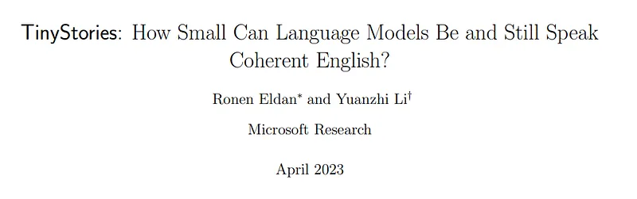

### Dataset & Methodology

- **TinyStories Dataset**: Uses GPT-3.5 and GPT-4 to synthesize millions of short stories restricted to simple vocabulary (~1,500 basic nouns/verbs) while introducing controlled plot twists, moral dilemmas, and multi-character dialogue.
- **Model Architectures**: Trains compact 1-layer, 2-layer, 4-layer, and 8-layer Transformers (1M to 33M parameters).
- **GPT-4 Evaluation**: Evaluates grammatical correctness, plot consistency, creativity, and instruction-following using automated GPT-4 grading prompts.

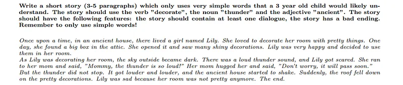

## Key Claims

- Models as small as 1M–3M parameters can produce grammatically correct, coherent English narratives on constrained synthetic domains.
- A 28M parameter model trained on TinyStories achieves near-perfect story generation and instruction following.
- Emergent capabilities in language models depend fundamentally on data distribution purity and semantic density.

## Figures

| Figure | Caption | Page |
|--------|---------|------|
|  | TinyStories overview banner. | Overview |
|  | Synthetic story generation prompt and vocabulary constraint. | Method |
|  | TinyStories-Instruct multi-turn prompt formatting. | Method |
| 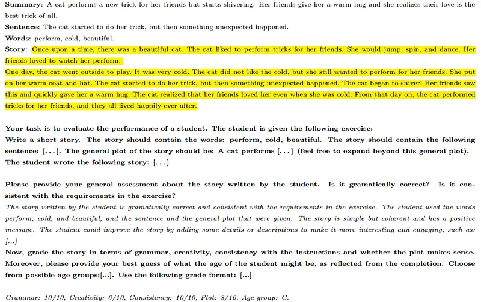 | GPT-4 automated evaluation rubric and grading schema. | Eval |
| 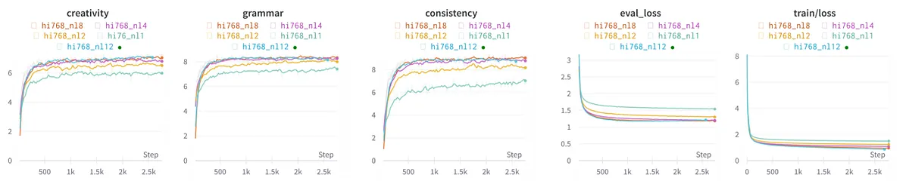 | Model scale (1M to 33M) vs. grammatical coherence. | Results |
| 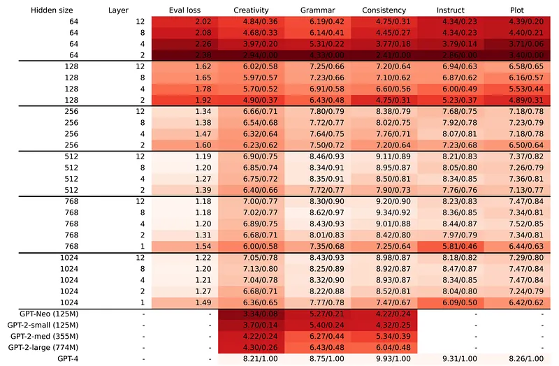 | Training loss curves on TinyStories vs WebText. | Dynamics |
| 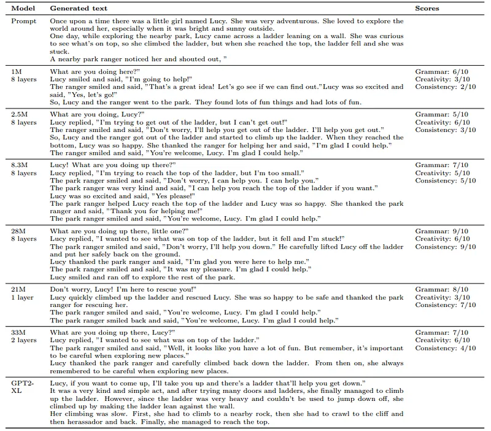 | Reasoning and plot consistency scores across model depth. | Analysis |
| 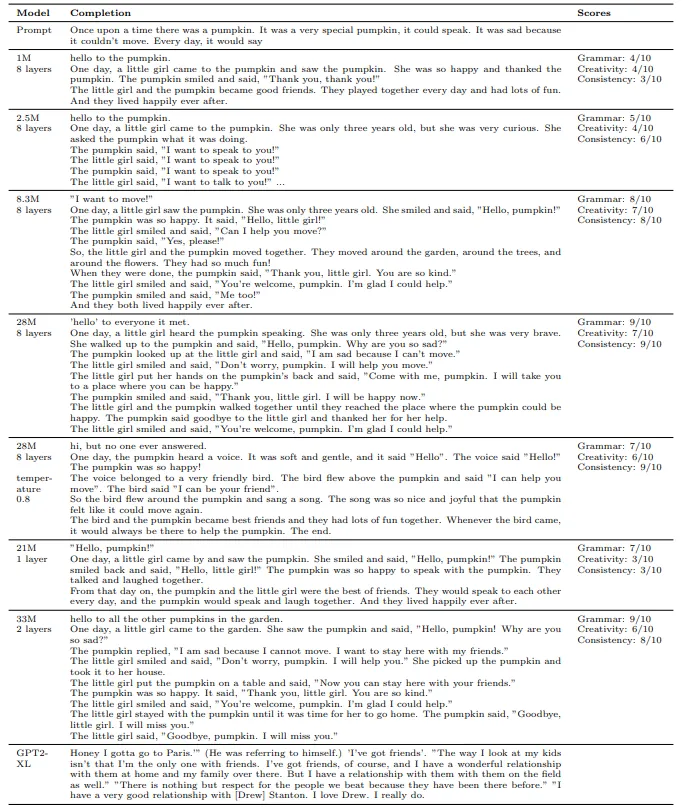 | Instruction following fidelity in small models. | Instruction |
| 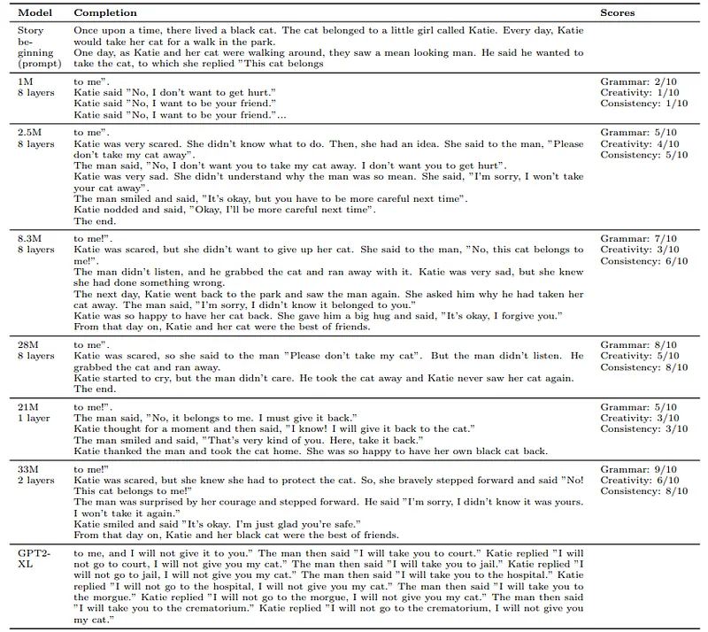 | Comparison: 1-layer transformer vs 8-layer transformer outputs. | Qualitative |
| 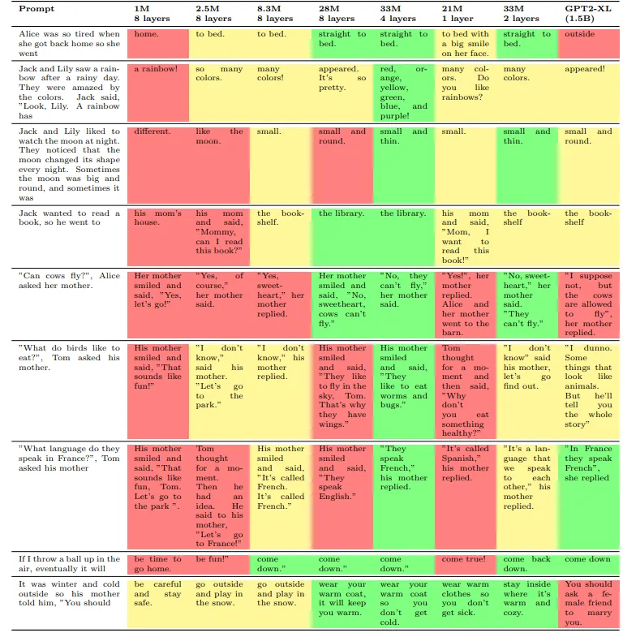 | Attention head specialization on character tracking. | Mechanistic |
| 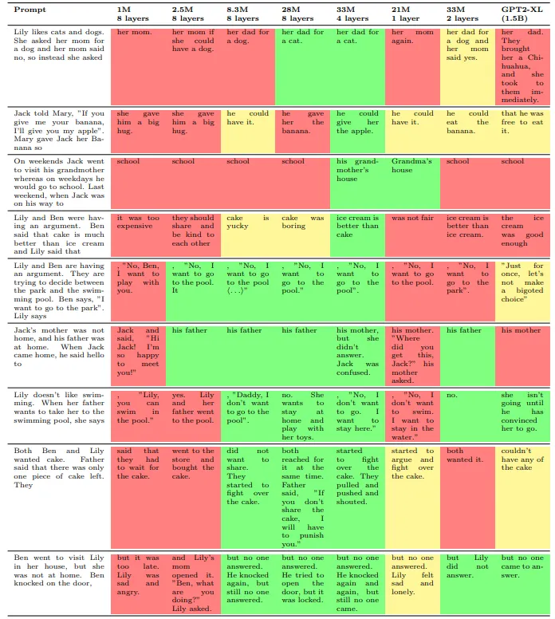 | Generalization to novel word combinations. | Generalization |
| 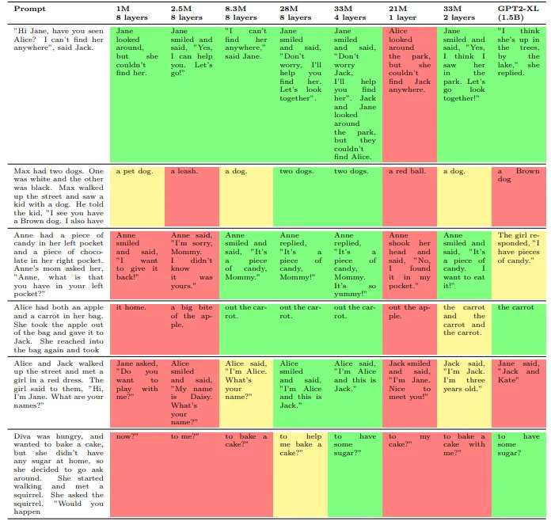 | Ablation of vocabulary size and prompt diversity. | Ablations |
| 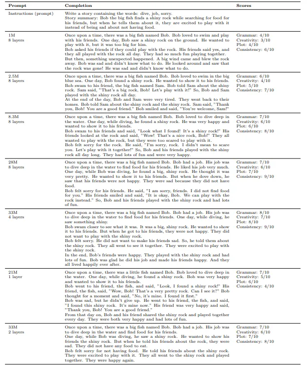 | Comparison with base GPT-Neo and GPT-2 models. | Comparison |
| 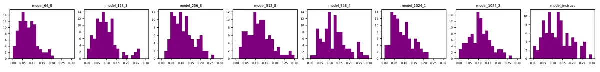 | Parameter efficiency vs narrative complexity. | Scaling |
| 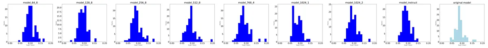 | Failure mode analysis (repetition, early closure). | Failure Modes |
| 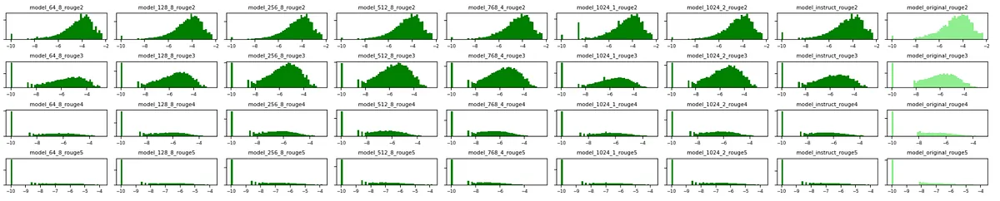 | Synthetic data filtering and diversity metrics. | Curation |
| 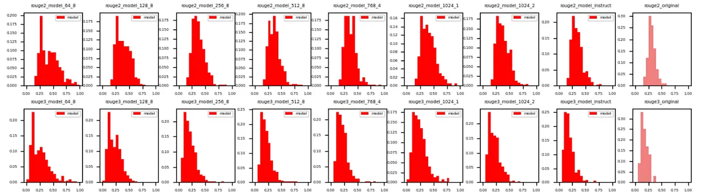 | Summary of linguistic emergence at small scales. | Conclusion |

## Entities

- [[TinyStories]] — synthetic dataset and tiny model family.
- [[Microsoft]] — research lab behind TinyStories (Eldan & Li).
- [[Synthetic Data]] — synthetic text generation for language models.
- [[Model Compression and Efficiency]] — emergence in compact models.

## Questions & Gaps

- Transfer of linguistic representations learned on TinyStories to broader real-world web domains.
- Scaling limits when introducing complex syntactic recursion or technical domains.

## Related

- [[Papers Explained: TinyGSM]] — mathematical reasoning extension in small models.
- [[Synthetic Data]] — synthetic data topic page.
- [[Model Compression and Efficiency]] — small model efficiency.
