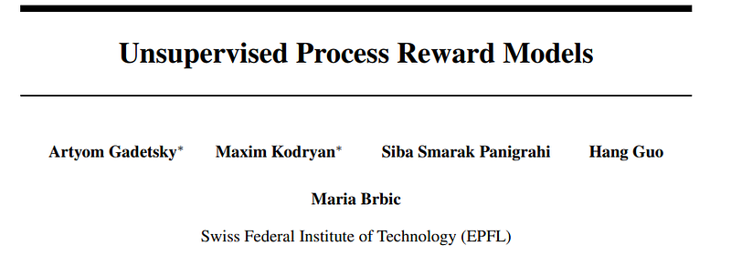
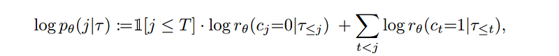
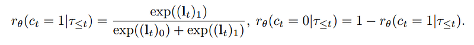
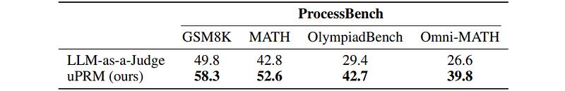
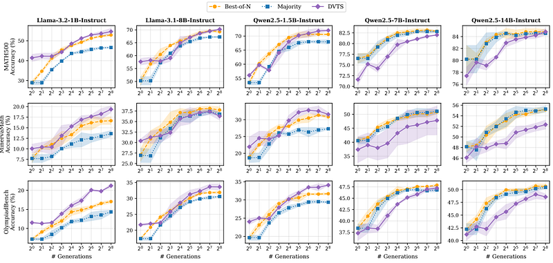
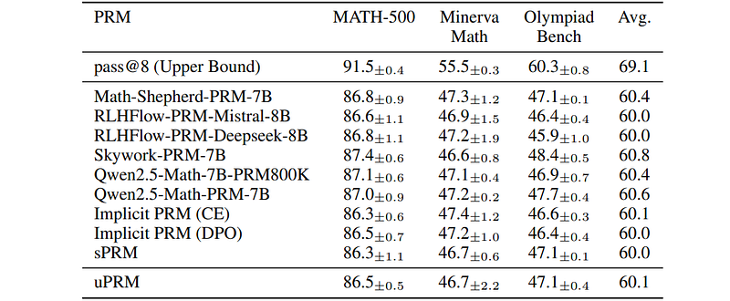
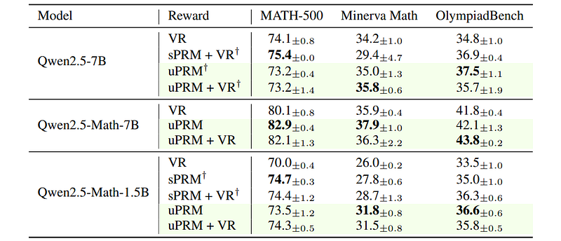

# Papers Explained: Unsupervised Process Reward Models

**Source**: `raw/draft_Papers-Explained--Unsupervised-Process-Reward-Models-7ee981eb13c4.html`  
**Paper**: https://arxiv.org/abs/2605.10158  
**Ingested**: 2026-08-23  
**Tags**: #summary

## Summary

**Unsupervised Process Reward Models (uPRM)** introduces a method for training dense, step-level **Process Reward Models (PRMs)** for mathematical reasoning *without* requiring expensive human step-level annotations (like PRM800K) or heuristic Monte Carlo rollouts. uPRM formulates step-level error detection as an unsupervised probabilistic scoring problem: an off-the-shelf LLM scores the first erroneous position across candidate reasoning chains by evaluating multiple trajectories jointly, generating pseudo-labels to train a lightweight PRM via entropy-regularized joint likelihood optimization.

### Methodology & Training Objective

1. **Scoring First Erroneous Position**: Given a trajectory $\tau = (x, y_1, \dots, y_T)$, candidate error points $j \in \{1, \dots, T+1\}$ are evaluated by querying the LLM on sequence strings with $+$ and $-$ step tags.
2. **Joint Multi-Trajectory Scoring**: Evaluating multiple candidate trajectories jointly leverages the LLM's comparative ranking capability, producing significantly more reliable error localization than independent evaluation.
3. **PRM Training**: Parameterized via LoRA with a step-level classification head, optimized via an entropy-regularized objective:
$$\mathcal{L}(\theta) = -\sum_{\tau} \log p_\theta(\tau) - \gamma H(p_\theta)$$
preventing premature policy collapse while aligning step predictions with joint consensus.

### Key Results

- **Matches Supervised PRMs**: uPRM matches or outperforms supervised PRMs (trained on PRM800K) across OlympiadBench, Omni-MATH, and GSM8K.
- **Drop-in RLVR Reward**: Serving uPRM rewards during PURE and RLOO training produces reasoning policies superior to ground-truth outcome rewards alone.

## Key Claims

- Process reward models can be trained fully unsupervised using joint multi-trajectory LLM scoring.
- Matches supervised PRMs on step-level error localization benchmarks (ProcessBench).
- Serves as an effective dense reward signal for RL reasoning without human step annotation costs.

## Figures

| Figure | Caption | Page |
|--------|---------|------|
|  | uPRM overview banner. | Overview |
|  | Supervised vs. Unsupervised PRM comparison. | Introduction |
|  | Scoring first erroneous step formulation with LLM tags. | Method |
|  | Joint multi-trajectory scoring mechanism. | Method |
|  | Training objective with Shannon entropy regularization. | Method |
|  | ProcessBench evaluation across math difficulty datasets. | Results |
|  | Test-time compute scaling with uPRM verifier search. | Test-Time Compute |
|  | uPRM-guided RL policy improvement (PURE, RLOO). | RL |
|  | Step error detection accuracy: uPRM vs Supervised PRM800K. | Comparison |
|  | Entropy regularization weight gamma ablation. | Ablations |
|  | Number of jointly evaluated trajectories ablation. | Ablations |
|  | Qualitative step-by-step credit assignment on geometry proofs. | Qualitative |
|  | False positive step error rate comparison. | Analysis |
|  | Out-of-distribution reasoning benchmark generalization. | Generalization |
|  | Summary of unsupervised process verification dynamics. | Summary |

## Entities

- [[Unsupervised Process Reward Models]] — uPRM framework.
- [[Process Reward Models]] — step-level verification and credit assignment.
- [[Reasoning Models]] — mathematical reasoning verification.
- [[Reinforcement Learning Topic]] — dense step rewards in RL.

## Questions & Gaps

- Label noise propagation on extremely difficult mathematical proofs where all candidate trajectories fail simultaneously.
- Compute scaling of joint multi-trajectory prompting during active online RL.

## Related

- [[Process Reward Models]] — core PRM topic page.
- [[Papers Explained 588: LLM-as-a-Verifier]] — logprob expectation verifier.
- [[Papers Explained 368 - ThinkPRM]] — PRM reasoning architectures.
- [[Reasoning Models]] — reasoning verification.
