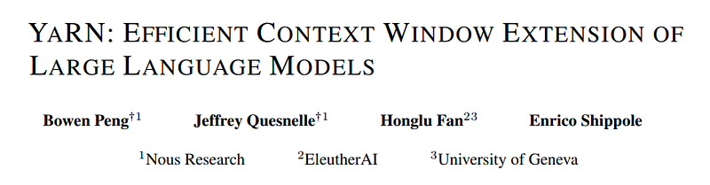
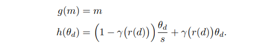
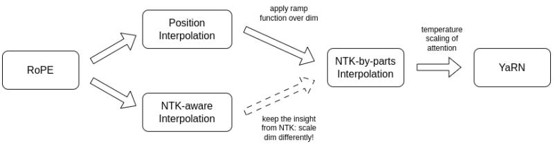
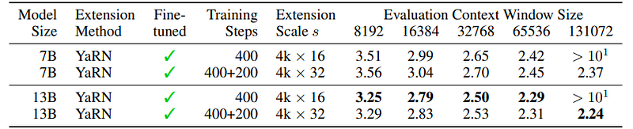
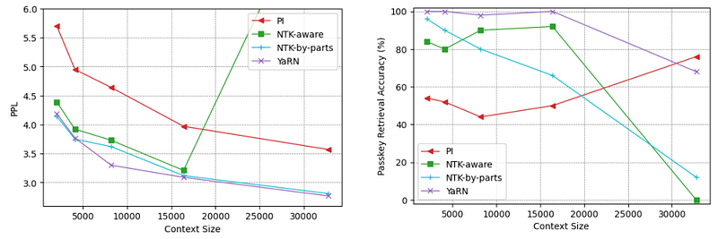
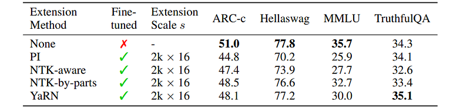
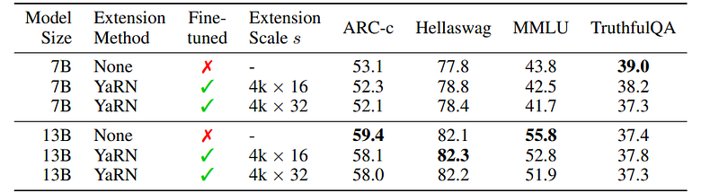

# Papers Explained: Yet another RoPE extensioN method (YaRN)

**Source**: `raw/draft_Papers-Explained--Yet-another-RoPE-extensioN-method--YaRN--3eb0225c90db.html`  
**Paper**: https://arxiv.org/abs/2309.00071  
**Ingested**: 2026-08-23  
**Tags**: #summary

## Summary

**YaRN (Yet another RoPE extensioN method)** (Peng et al., 2023) is a compute-efficient technique for extending the context window of language models trained with **Rotary Position Embeddings (RoPE)**. While linear Positional Interpolation (PI) compresses all RoPE frequency dimensions equally (destroying high-frequency local information), YaRN combines **NTK-by-Parts frequency interpolation** with **Attention Temperature Scaling** to extend context windows (e.g. from 4k to 64k or 128k tokens) using as little as $0.1\%$ of the original pretraining compute and fewer than 400 fine-tuning steps.

### NTK-by-Parts & Temperature Scaling

1. **Wavelength Analysis & Dimension Partitioning**:
   - Each RoPE dimension $d$ has wavelength $\lambda_d = 2\pi \cdot 10000^{2d/|D|}$.
   - **High-frequency dimensions ($\lambda_d \ll L$)**: Rotate many times within the context window; they encode local relative position. **Do not interpolate**.
   - **Low-frequency dimensions ($\lambda_d \gg L$)**: Barely rotate during pretraining, behaving like absolute position. **Fully interpolate** by scale factor $s$.
   - **Mid-frequency dimensions ($\lambda_d \approx L$)**: Interpolated smoothly using a piecewise ramp function $\gamma(r) \in [0, 1]$.
2. **Attention Temperature Scaling**:
   - As sequence length scales up by $s$, the entropy of the attention distribution increases, flattening attention weights. YaRN applies a temperature multiplier $t$ (implemented via length scaling factor $1/\sqrt{t}$ on $q$ and $k$), sharpening attention back to pretraining dynamics.
3. **Dynamic Scaling**:
   - Computes $s = \max(1, l'/L)$ dynamically per forward-pass, allowing graceful zero-shot extrapolation to variable sequence lengths without short-context degradation.

## Key Claims

- Extends RoPE context windows up to 128k tokens with less than 0.1% original pretraining compute.
- NTK-by-parts preserves local high-frequency relative positional signals while interpolating global dimensions.
- Attention temperature scaling corrects for attention entropy dilution at extreme sequence lengths.
- Maintains short-context benchmark performance with zero degradation on standard MMLU and ARC tasks.

## Figures

| Figure | Caption | Page |
|--------|---------|------|
|  | YaRN overview banner. | Overview |
|  | RoPE wavelength spectrum across hidden dimensions. | Background |
|  | Linear Positional Interpolation (PI) vs. NTK-Aware scaling. | Method |
|  | NTK-by-Parts piecewise ramp function and dimension split. | Method |
|  | Attention temperature scaling formulation and entropy correction. | Method |
|  | Dynamic context scaling for variable-length inference. | Dynamic |
|  | Perplexity curves on long-context extrapolation up to 128k. | Evaluation |
|  | Passkey retrieval accuracy across extended context depths. | Retrieval |
|  | Short-context benchmark performance preservation (MMLU, GSM8K). | Evaluation |
|  | Comparison: YaRN vs PI vs NTK-Aware vs CodeLLaMA frequency scaling. | Comparison |
|  | Fine-tuning step convergence curves (converges in <400 steps). | Efficiency |
|  | Attention score distribution before and after temperature scaling. | Analysis |
|  | Zero-shot non-finetuned YaRN extrapolation results. | Zero-Shot |
|  | Multi-scale evaluation on LLaMA-2 7B and 13B. | Scaling |
|  | Summary of RoPE context extension techniques. | Taxonomy |

## Entities

- [[YaRN]] — Yet another RoPE extensioN method.
- [[RoPE]] — Rotary Position Embedding.
- [[Long Context]] — context window scaling.
- [[Model Compression and Efficiency]] — compute-efficient context extension.

## Questions & Gaps

- Extension to billion-token context lengths and interaction with linear attention hybrids.
- Hardware kernel optimizations for dynamic per-token temperature scaling in FlashAttention.

## Related

- [[Papers Explained: Rotary Position Embedding (RoPE)]] — foundational RoPE paper.
- [[Papers Explained Review 06 - Position Encodings]] — position encodings survey.
- [[Long Context]] — long-context topic page.
