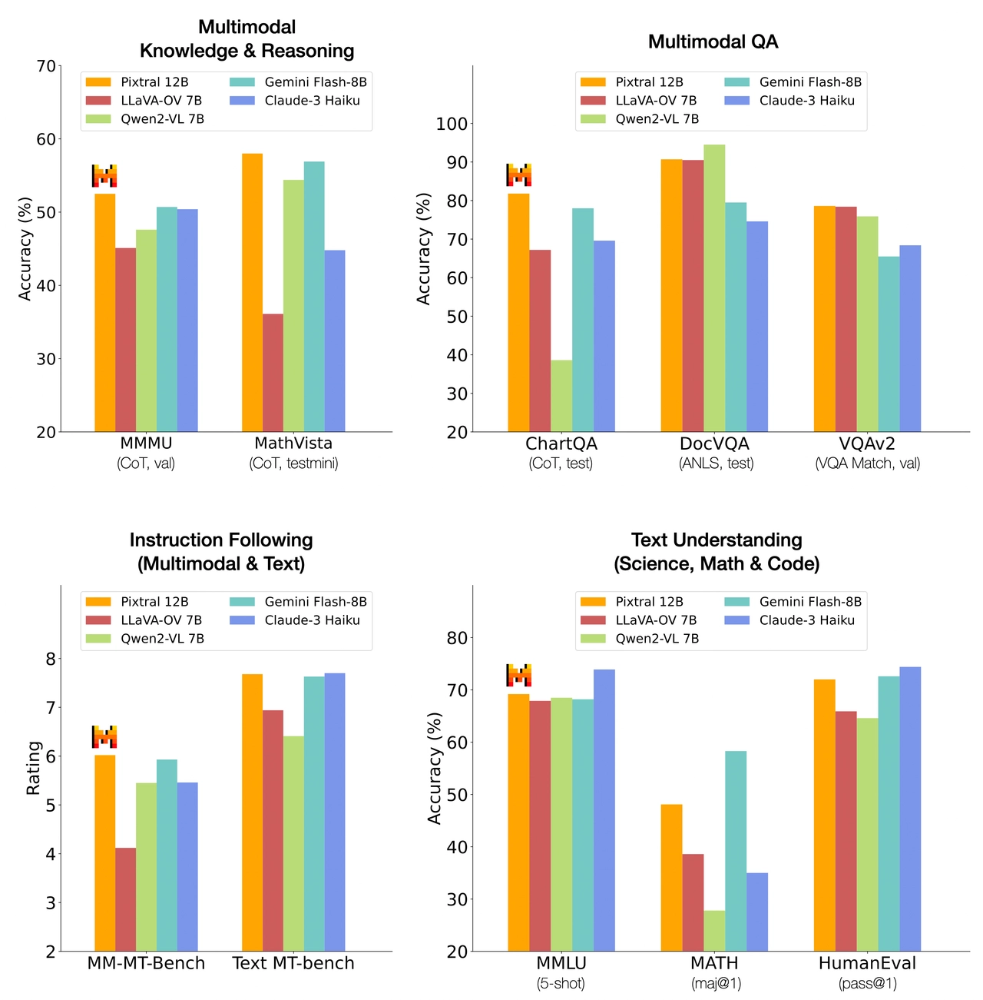
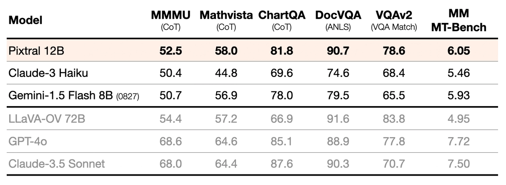
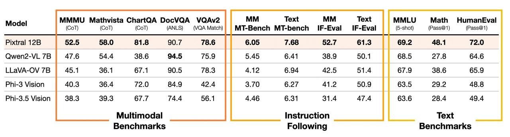
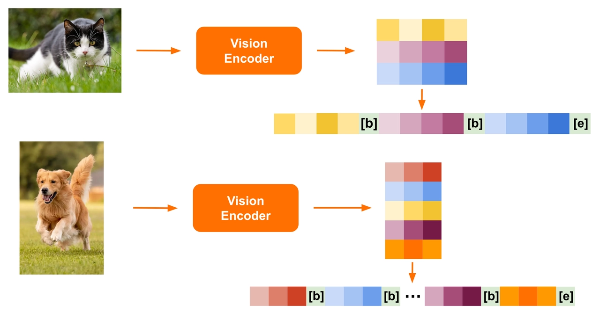
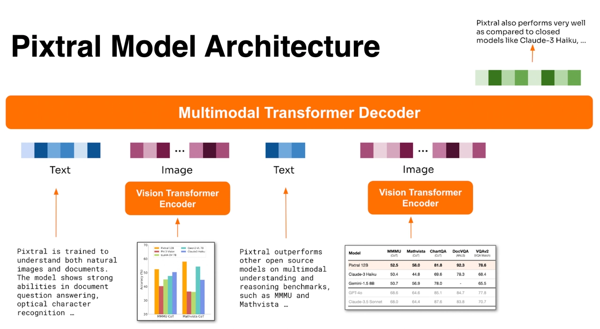
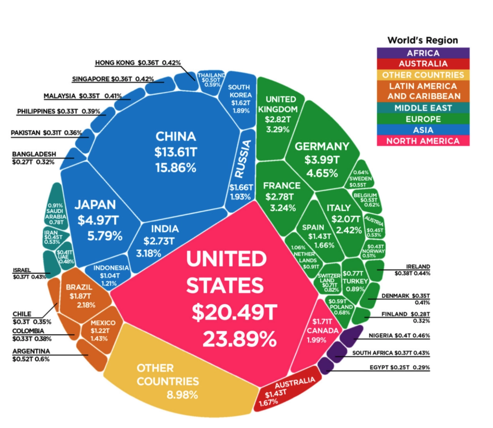
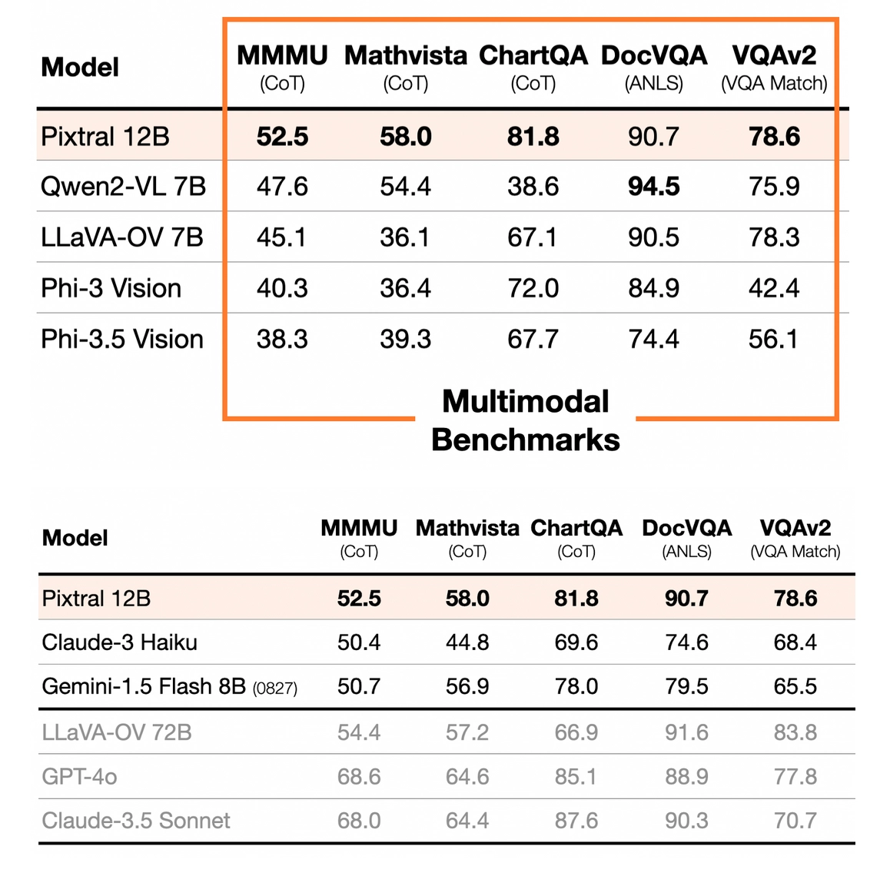
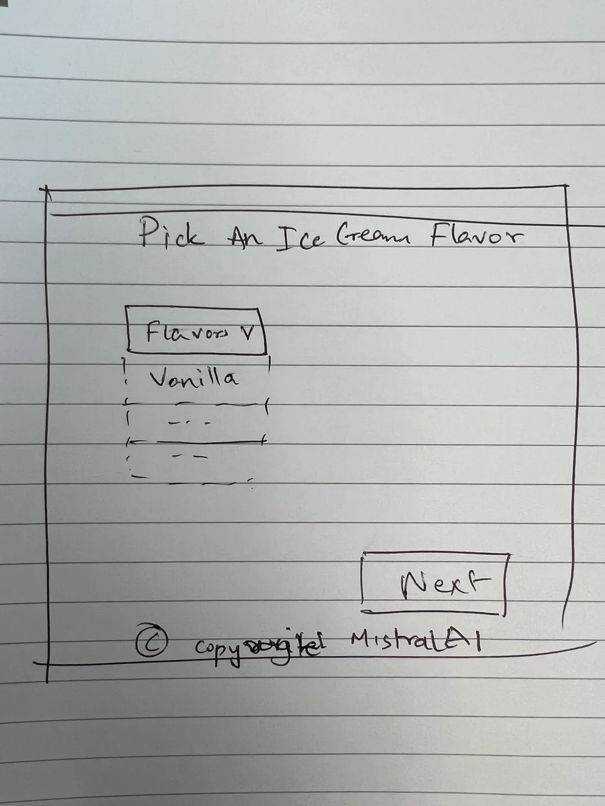
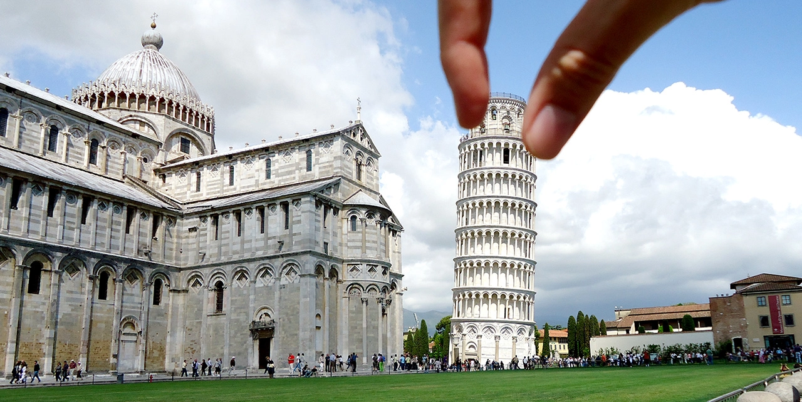

# Announcing Pixtral 12B

**Source**: `raw/pixtral-12b/full-article.html` (270 KB), `raw/pixtral-12b/full-article.md` (markdown view)  
**URL**: https://mistral.ai/news/pixtral-12b/  
**Ingested**: 2026-06-06  
**Tags**: #summary

## Summary

Mistral AI announces **Pixtral 12B**, a natively multimodal vision-language model built on **Mistral Nemo 12B** with a new **400M-parameter Pixtral-ViT** encoder trained from scratch. The blog positions Pixtral as a drop-in Nemo replacement that delivers strong multimodal reasoning—charts, documents, multi-image tasks—without sacrificing text-only performance on instruction following, coding, and math. Key specs: variable native-resolution images, `[IMG BREAK]` / `[IMG END]` row delimiters, **128K** context, Apache 2.0 license, and availability on La Plateforme, Le Chat, Hugging Face (`mistralai/Pixtral-12B-2409`), `mistral-inference`, and vLLM.

On benchmarks under a unified harness, Pixtral reaches **52.5% MMMU**, outperforms open models at similar scale, and often matches or beats larger models (e.g., LLaVA-OneVision 72B). Instruction-following gains include ~20% relative improvement over the nearest OSS multimodal model on text IF-Eval/MT-Bench; Mistral introduces **MM-IF-Eval** and **MM-MT-Bench** for multimodal IF evaluation. Qualitative demos cover GDP table reasoning, training-loss chart analysis, multi-image table merging, image-to-HTML generation, and scene understanding.

> **Deprecation note (current page):** Mistral's live blog now marks Pixtral 12B as deprecated in favor of newer vision models. Architectural and eval detail is expanded in [[Papers Explained 219 - Pixtral]].

## Key Claims

- 12B multimodal decoder on Mistral Nemo + 400M vision encoder trained from scratch with variable image sizes.
- 52.5% on MMMU; strong on chart/figure understanding, DocVQA-style tasks, and multi-image instruction following.
- Does not compromise text benchmarks while excelling at multimodal tasks (vs. prior open VLMs).
- 128K context supports many images at native resolution and aspect ratio.
- Outperforms Qwen2-VL 7B, LLaVA-OneVision 7B, Phi-3.5 Vision on instruction-following benchmarks.
- Apache 2.0; available on La Plateforme (`pixtral-12b-2409`), Le Chat, Hugging Face, mistral-inference, and vLLM.

## Figures

| Figure | Caption | Page |
|--------|---------|------|
|  | Deprecation notice icon (decorative) | — |
|  | Multimodal benchmark comparison vs. closed and larger models (unified harness) | — |
|  | Instruction-following benchmark comparison vs. open multimodal models | — |
|  | Variable image-size architecture: native resolution patches and break tokens | — |
|  | Qualitative example: reasoning over European GDP table figure | — |
|  | Qualitative example: chart understanding (training loss for dark-dragon-50) | — |
|  | Qualitative example: multi-image table merge into markdown | — |
|  | Qualitative example: image-to-HTML website generation | — |
|  | Generated website preview from image prompt | — |
|  | Qualitative example: natural scene optical-illusion reasoning | — |
|  | Le Chat interface for trying Pixtral | — |
|  | La Plateforme API usage screenshot | — |

## Entities

- [[Vision Language Models]] — 12B open-weights VLM with interleaved image-text training and 128K context.
- [[Large Language Models]] — Mistral Nemo-based decoder; drop-in text replacement claim.

## Questions & Gaps

- Live blog page is marked deprecated; successor vision lineup not detailed in this post.
- Full architecture ablations, training data, and eval prompts deferred to technical report ([[Papers Explained 219 - Pixtral]]).
- fig-1 is a 23×23 decorative deprecation icon, not a content figure.

## Related

- [[Papers Explained 219 - Pixtral]] — detailed explainer of Pixtral-ViT architecture, eval protocol, and benchmark tables.
- [[Vision Language Models]] — topic hub for multimodal systems and native-resolution VLMs.
- [[Document AI]] — document and chart understanding capabilities highlighted in demos and benchmarks.
