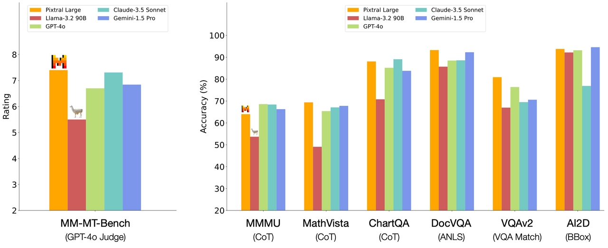
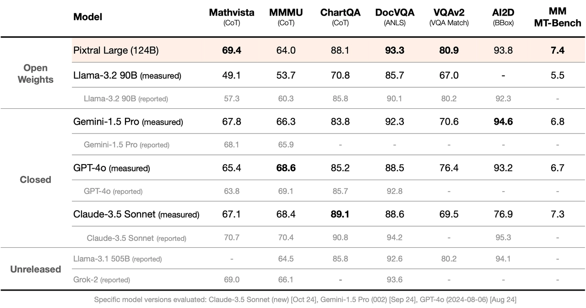
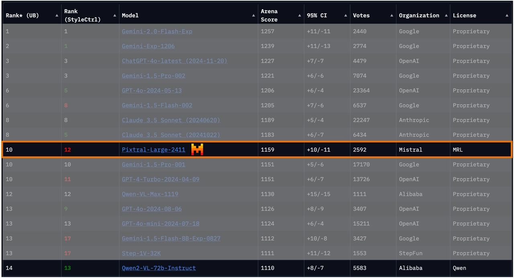
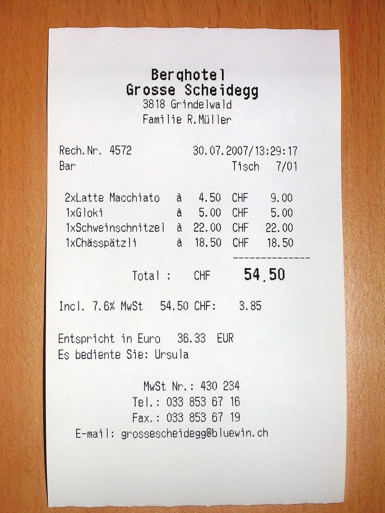
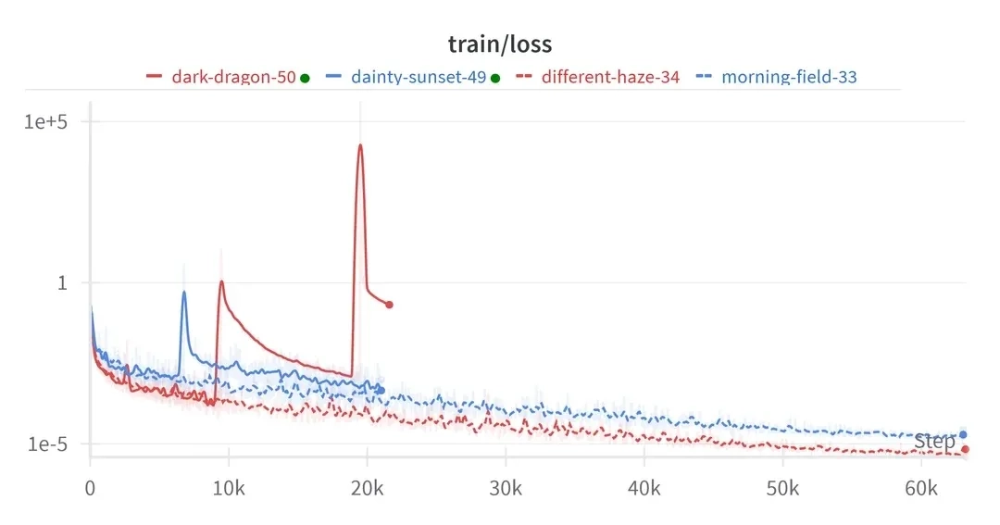
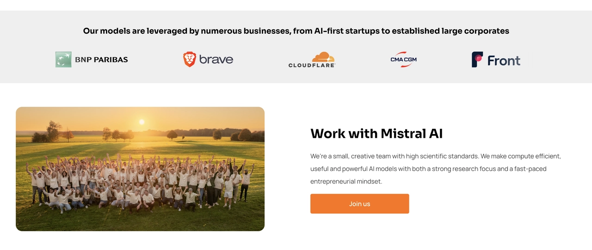

# Pixtral Large

**Source**: `raw/pixtral-large/full-article.md` (223 KB), `raw/pixtral-large/full-article.md` (markdown view)  
**URL**: https://mistral.ai/news/pixtral-large/  
**Ingested**: 2026-06-06  
**Tags**: #summary

## Summary

Mistral AI announces **Pixtral Large**, a **124B** open-weights multimodal model (123B decoder + 1B vision encoder) extending **Mistral Large 2** with frontier-class image understanding for documents, charts, and natural images—without degrading text performance. The model ships under Mistral Research License (research/education) and Mistral Commercial License; API id **`pixtral-large-latest`**; also on Le Chat. **128K** context fits at least 30 high-resolution images.

Benchmark claims under a common harness: **69.4% MathVista** (best among compared models), ChartQA and DocVQA ahead of GPT-4o and Gemini-1.5 Pro, MM-MT-Bench ahead of Claude-3.5 Sonnet, Gemini-1.5 Pro, and GPT-4o, and top open-weights on LMSys Vision Leaderboard (~50 ELO over nearest OSS competitor; also beats GPT-4o Aug '24). Qualitative demos include multilingual receipt OCR with tip math, training-loss chart reasoning, and company-logo identification.

The post also announces **Mistral Large 24.11**—improved long-context understanding, system prompt, and function calling for RAG/agentic enterprise workflows—available via API and Hugging Face self-deployment, with Google Cloud and Azure availability within a week.

> **Deprecation note (current page):** Mistral's live blog now marks Pixtral Large as deprecated in favor of newer vision models.

## Key Claims

- 124B open-weights VLM: 123B multimodal decoder + 1B vision encoder on Mistral Large 2.
- 69.4% MathVista; SOTA claims on DocVQA, VQAv2, ChartQA vs. GPT-4o / Gemini-1.5 Pro.
- Best open-weights on LMSys Vision Leaderboard by ~50 ELO; beats several proprietary models.
- 128K context (≥30 high-res images); document, chart, and natural-image understanding.
- Mistral Large 24.11 update: better long context, function calling, RAG/agentic suitability.
- Licenses: MRL (research) and commercial license; `pixtral-large-latest` on API.

## Figures

| Figure | Caption | Page |
|--------|---------|------|
|  | Deprecation notice icon (decorative) | — |
|  | Multimodal benchmark comparison vs. frontier models | — |
|  | LMSys Vision Leaderboard placement | — |
|  | Qualitative sample: multilingual receipt OCR and tip calculation | — |
|  | Qualitative sample: chart understanding (training-loss instability) | — |
|  | Qualitative sample: company logo / customer identification | — |
|  | Mistral Large 24.11 update summary | — |

## Entities

- [[Vision Language Models]] — frontier-scale open-weights VLM built on Mistral Large 2.
- [[Large Language Models]] — Mistral Large 24.11 text-model refresh bundled with release.

## Questions & Gaps

- Live blog page is marked deprecated; successor models not specified here.
- Benchmark harness details and per-task breakdowns are summary-level only.
- fig-1 is a 23×23 decorative deprecation icon, not a content figure.

## Related

- [[Papers Explained 219 - Pixtral]] — Pixtral family architecture and eval methodology (12B line; Large extends same multimodal stack).
- [[Vision Language Models]] — topic hub; Pixtral Large as frontier open-weights VLM release.
- [[Document AI]] — DocVQA and document/chart understanding positioning.
