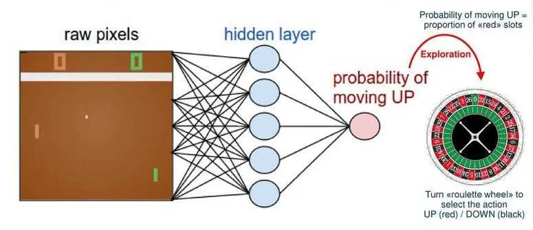

# Unravel Policy Gradients and REINFORCE

**Source**: `raw/policy-gradients/full-article.md` (335 KB), `raw/policy-gradients/full-article.md` (markdown view)  
**URL**: https://theaisummer.com/Policy-Gradients/  
**Author**: Sergios Karagiannakos (AI Summer), 2018-11-01  
**Ingested**: 2026-06-06  
**Tags**: #summary

## Summary

This AI Summer tutorial introduces **policy-based** model-free [[Reinforcement Learning]] as the complement to value-based methods like [[Q-learning]] and Deep Q Networks. Where value-based control learns (or approximates) a value function and derives a policy indirectly, policy-based methods optimize a parameterized policy π_θ(a|s) directly — a probability distribution over actions given state. The article positions this as an **optimization problem**: find parameters θ that maximize expected cumulative discounted return J(θ) = E_πθ[∑ γr].

Policy-based methods are motivated by three practical advantages over pure value learning: easier convergence without the oscillation common in value-based control, effectiveness in **high-dimensional and continuous** action spaces, and the ability to represent **stochastic policies** (needed in partially observable or inherently stochastic environments). The author frames the search over θ as **policy search**, split into gradient-free methods (hill climbing, simplex, simulated annealing, evolutionary algorithms) and gradient-based methods that perform gradient **ascent** on J(θ).

The core mathematical result is the policy gradient estimator using the log-derivative trick on full trajectories τ: ∇_θ J(θ) = E_π[∇_θ(log π(τ|θ)) R(τ)]. The practical algorithm **[[REINFORCE]]** (Monte Carlo policy gradient) replaces the expectation with sampled episode returns and performs stochastic gradient updates after each episode — the intuitive rule being: increase the log-probability of actions that led to positive returns, decrease those that led to negative returns.

The second half connects REINFORCE to deep learning: a neural network (softmax output for discrete actions) parameterizes the policy. Karpathy's Pong-playing agent is cited as the canonical visual example; the article walks through a full Keras implementation on OpenAI Gym's CartPole-v1, including discounted return computation, per-episode mean/std reward normalization, and one-epoch `fit` on advantage targets. The piece closes by noting policy gradients' main weakness — **high variance** and training instability — and teases [[Actor-Critic Methods]] as the standard remedy, linking forward to TRPO/PPO in AI Summer's RL article series.

This 2018 primer complements [[Reinforcement Learning: An Introduction]] (Chapter 13 policy gradient theory) and the wiki's LLM-focused [[Policy Gradient]] / [[GRPO++: Tricks for Making RL Actually Work]] coverage with accessible intuition and runnable code.

## Key Claims

- Model-free RL splits into value-based (learn V or Q, extract policy) and policy-based (learn π directly).
- Policy-based methods converge more easily, handle continuous action spaces, and can learn stochastic policies for POMDP-like settings.
- Policy optimization maximizes J(θ) = E_πθ[∑ γr]; objective form differs for episodic vs continuing tasks.
- Brute-force policy-space search is impractical; **policy search** uses gradient-free or gradient-based optimization.
- Gradient-free options include hill climbing, simplex, simulated annealing, and evolutionary algorithms.
- Differentiable policies enable analytical gradients via log π(τ|θ) weighted by trajectory return R(τ).
- **REINFORCE** = Monte Carlo policy gradient with SGD replacing the expectation over returns.
- Intuitive essence: reinforce actions from high-return episodes, suppress actions from low-return episodes.
- Neural networks (CNN for Pong, MLP+softmax for CartPole) can parameterize π_θ; actions sampled stochastically from network output.
- CartPole REINFORCE demo: discount rewards backward, normalize returns (subtract mean, divide by std), train with categorical cross-entropy on one-hot advantage targets.
- CartPole uses a −100 terminal penalty when pole falls before score 499 to encourage survival.
- Policy gradients suffer from **high variance** and parameter instability; actor-critic methods reduce variance (article's cliffhanger).

## Figures

| Figure | Caption | Page |
|--------|---------|------|
|  | Karpathy Pong agent: CNN policy network outputs up/down probabilities from game frames ([karpathy.github.io](http://karpathy.github.io/2016/05/31/rl/)) | — |

A convolutional network maps Pong frames to action probabilities; REINFORCE updates weights from episode returns — the canonical deep policy-gradient visual.

## Entities

- [[AI Summer]] — published this 2018 policy-gradient primer in the RL tutorial series.
- [[Sergios Karagiannakos]] — author; also wrote autoencoder and diffusion tutorials in this wiki.
- [[Policy Gradient]] — core concept: direct policy optimization via reward-weighted log-probability gradients.
- [[REINFORCE]] — Monte Carlo policy gradient algorithm demonstrated with CartPole code.
- [[Actor-Critic Methods]] — variance-reduction successor teased at article end.
- [[Q-learning]] — value-based counterpart referenced from prior AI Summer DQN articles.
- [[Markov Decision Process]] — problem framing: find optimal policy mapping states to actions.
- [[Monte Carlo Methods]] — REINFORCE uses full-episode Monte Carlo returns for updates.

## Questions & Gaps

- Article does not derive the policy gradient theorem step-by-step (assumes log-trick result).
- No baseline/critic variance reduction in the CartPole code despite mentioning actor-critic as the fix.
- Does not cover continuous-action Gaussian policies, trust-region methods (TRPO/PPO), or importance sampling.
- Affiliate links to Udemy course; no primary paper citations (Williams 1992 REINFORCE, Sutton et al. policy gradient theorem).

## Related

- [[The Idea behind Actor-Critics and How A2C and A3C Improve Them]] — direct follow-up in AI Summer RL series.
- [[Trust Region and Proximal Policy Optimization (TRPO and PPO)]] — third article: stabilizes policy updates after actor–critic.
- [[Reinforcement Learning: An Introduction]] — canonical policy gradient, REINFORCE, and baseline theory (Chapter 13).
- [[Policy Gradient]] — wiki concept page linking LLM RL optimizers to classical policy gradients.
- [[GRPO++: Tricks for Making RL Actually Work]] — modern variance/stability tricks for policy-gradient training at LLM scale.
- [[Actor-Critic Methods]] — standard answer to REINFORCE's high-variance problem.
- [[Exploration Strategies in Deep Reinforcement Learning]] — complementary Lilian Weng survey on exploration in deep RL.
- [[Reinforcement Learning Topic]] — topic hub for RL papers and tutorials in this wiki.
