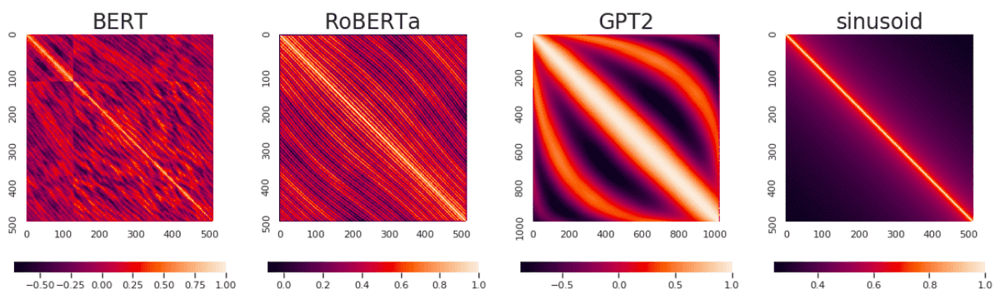
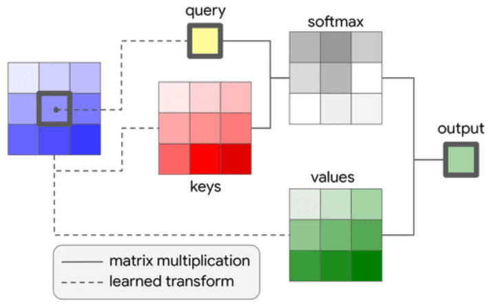
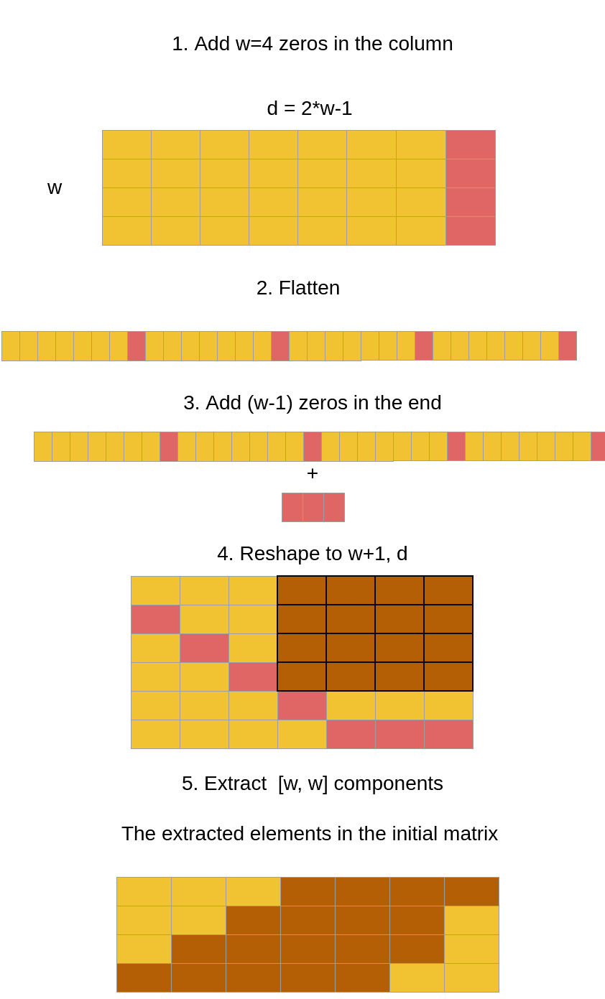
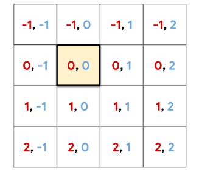

# How Positional Embeddings Work in Self-Attention (Code in PyTorch)

**Source**: `raw/positional-embeddings/full-article.html` (439 KB), `raw/positional-embeddings/full-article.md` (markdown view)  
**URL**: https://theaisummer.com/positional-embeddings/  
**Author**: Nikolas Adaloglou (AI Summer), 2021-02-25  
**Ingested**: 2026-06-06  
**Tags**: #summary

## Summary

This AI Summer tutorial clarifies a common transformer confusion: **positional encodings** (fixed sinusoidal vectors added to input embeddings, as in the original Transformer) versus **positional embeddings** (trainable position vectors, often injected **inside** multi-head self-attention). Nikolas Adaloglou argues sinusoidal [[Positional Encoding]] suffices for NLP but is insufficient for vision, where images are highly structured and MHSA is permutation equivariant without explicit position signals.

The article walks through why PE inside MHSA matters: input-added position is only available once, while in-block PE re-enforces order at every layer. Self-attention scores \(\epsilon_{ij} = x_i W^Q (x_j W^K)^T / \sqrt{d}\) form a fully connected directed graph; PE adds a position-distance term \(x_i W^Q (p_{ij}^K)^T\) to encode query–key offsets. Shared PE across heads reduces complexity from \(O(h n^2 d)\) to \(O(n^2 d)\).

Two families are covered with PyTorch/einsum implementations: **absolute PE** — trainable matrix \(R \in \mathbb{R}^{tokens \times dim}\) added to \(QK^T\) via \(QR\); and **relative PE** — \(2n{-}1\) distance buckets (Shaw et al. 2018) with a `relative_to_absolute` indexing trick (from lucidrains) to map relative distances to an \(n \times n\) attention bias, yielding **translation equivariance** like convolutions. The piece closes with **2D relative PE** for vision (Ramachandran et al. 2019): separate row and column offset embeddings factorized over an \(h \times w\) grid.

## Key Claims

- **Positional encodings** (sinusoidal) ≠ **positional embeddings** (trainable); embeddings are analogous to word/patch embeddings but encode position index.
- Input-level PE: `input_embedding + pos_emb[:seq_len]` before transformer; only applied once at the start.
- MHSA without position is permutation equivariant — problematic for structured data (especially images).
- In-MHSA PE injects position into attention scores at every layer, not only at input.
- Attention weight \(\epsilon_{ij}\) links query index \(i\) to key/value index \(j\); PE term encodes distance from query to key position.
- Shared PE across heads: space complexity \(O(n^2 d)\) vs \(O(h n^2 d)\) for per-head PE.
- **Absolute PE**: \(\text{att} = \text{softmax}((QK^T + QR)/\sqrt{dim})\); \(R\) shape \([tokens, dim]\).
- **Relative PE**: \(R_{rel}\) shape \([2 \cdot tokens - 1, dim]\) for distances \(-(n{-}1)\) to \(+(n{-}1)\); gains translation equivariance.
- Relative-to-absolute conversion reshapes \([b, h, l, 2l{-}1]\) → \([b, h, l, l]\) via padding/rearrange (lucidrains).
- **2D relative PE**: factorize \(h \times w\) tokens into row offsets (red) and column offsets (blue); sum expanded biases for full token×token matrix.
- Wang & Chen (2020): learned position embeddings show structured position-wise similarity patterns (e.g. GPT-2).

## Figures

| Figure | Caption | Page |
|--------|---------|------|
|  | Position-wise similarity of learned PE across NLP models (Wang & Chen 2020) | — |
|  | Self-attention as fully connected directed graph over tokens | — |
|  | Query index \(i\) attends to all key/value positions \(j\) (Ramachandran et al.) | — |
|  | Relative-to-absolute PE indexing for \(w=4\) tokens | — |
|  | 2D relative PE: row (red) and column (blue) offsets from reference pixel | — |

Brighter cells indicate higher position-wise similarity in pretrained models (GPT-2, BERT, etc.).

Converts \(2n{-}1\) relative distance buckets into an \(n \times n\) attention bias matrix.

Vision PE decomposes offsets into independent row and column distances on a 2D grid.

## Entities

- [[AI Summer]] — educational blog publishing this PE tutorial with PyTorch code (2021).
- [[Nikolas Adaloglou]] — primary author; implementations in self-attention-cv repo.
- [[Positional Encoding]] — fixed sinusoidal variant (vanilla Transformer); contrasted here with trainable embeddings.
- [[Positional Embeddings]] — trainable in-MHSA position signals (absolute and relative).
- [[Self-Attention]] — permutation equivariant without position; PE restores order sensitivity.
- [[Multi-Head Attention]] — PE can be shared across heads for efficiency.
- Shaw, Uszkoreit, Vaswani (2018) — relative position representations in self-attention.
- Ramachandran et al. (2019) — stand-alone self-attention and 2D relative PE for vision.
- Wang & Chen (2020) — empirical study of what position embeddings learn.

## Questions & Gaps

- Does not cover RoPE, ALiBi, or other modern long-context position schemes.
- PyTorch implementations are 1D-focused; 2D code references external `self_attention_cv` package.
- Relative-to-absolute trick is borrowed from lucidrains; limited theoretical justification in-article.
- No benchmarks comparing absolute vs relative PE on vision tasks.
- BibTeX block incorrectly cites "Transformers in Computer Vision" (copy-paste from related articles).

## Related

- [[How Transformers Work in Deep Learning and NLP: An Intuitive Introduction]] — sinusoidal positional encoding at input.
- [[Why Multi-Head Self Attention Works: Math, Intuitions and 10+1 Hidden Insights]] — self-attention as directed graph; head analysis.
- [[Papers Explained Review 06 - Position Encodings]] — position-encoding survey in Papers Explained corpus.
- [[Computer Vision]] — motivation for 2D relative PE in vision transformers.
- [[Papers Explained 25 - Vision Transformers]] — ViT applies transformers to image patches.
