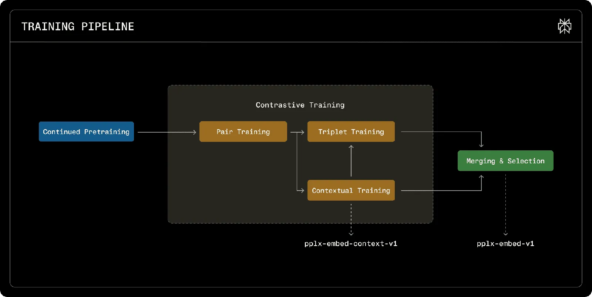
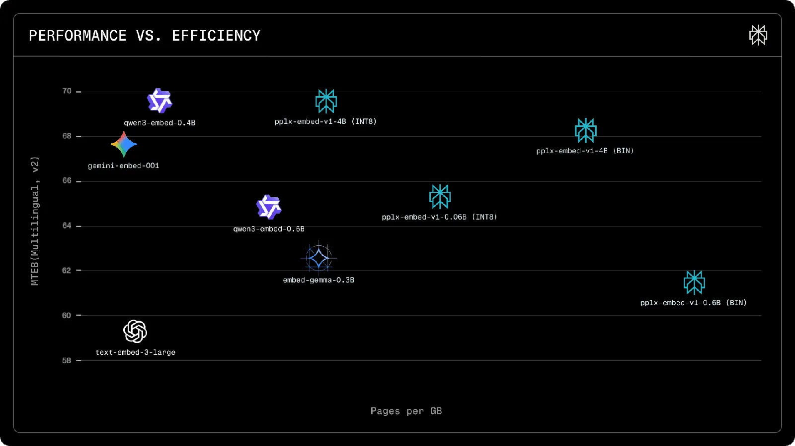
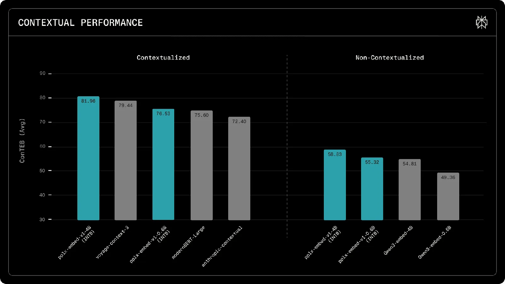
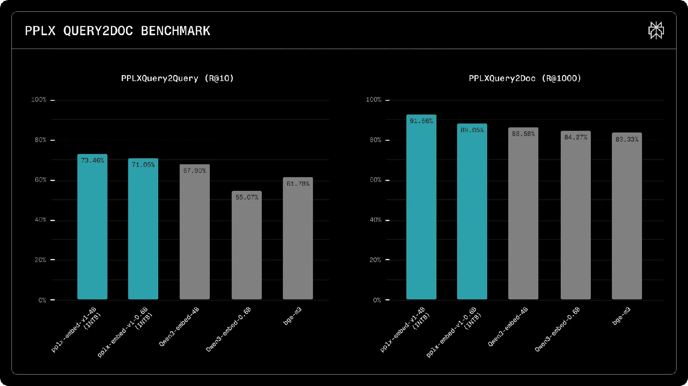

# pplx-embed: State-of-the-Art Embedding Models for Web-Scale Retrieval

**Source**: `raw/pplx-embed-state-of-the-art-embedding-models-for-web-scale-retrieval/full-article.md` (355 KB), `raw/pplx-embed-state-of-the-art-embedding-models-for-web-scale-retrieval/full-article.md` (markdown view)  
**URL**: https://research.perplexity.ai/articles/pplx-embed-state-of-the-art-embedding-models-for-web-scale-retrieval  
**Ingested**: 2026-06-06  
**Tags**: #summary

## Summary

Perplexity releases **pplx-embed-v1** (standard dense retrieval) and **pplx-embed-context-v1** (passage embeddings informed by full document context), each at **0.6B** and **4B** scales. Embeddings are the first stage of Perplexity's retrieval pipeline over billions of web pages; the models target production constraints: bidirectional passage understanding, native low-precision storage, and **no instruction prefixes** at index or query time.

The backbone starts from [[Qwen]]3 base models converted from causal decoders into bidirectional encoders via **diffusion-based continued pretraining** (~250B multilingual tokens, 30 languages). Contrastive training proceeds in phases: pair training (InfoNCE with false-negative masking), contextual training (chunk + document dual contrast for context-v1), and triplet training with mined hard negatives. Final pplx-embed-v1 merges contextual and triplet checkpoints via spherical linear interpolation (SLERP). **Quantization-aware training** produces native INT8 embeddings (4× storage savings vs FP32) and robust binary variants (32× savings; &lt;1.6 pt drop at 4B).

On MTEB(Multilingual, v2) retrieval, pplx-embed-v1-4B (INT8) reaches **69.66% nDCG@10**, matching Qwen3-Embedding-4B. pplx-embed-context-v1-4B sets **81.96%** on ConTEB, beating voyage-context-3 (79.45%) and Anthropic Contextual (72.4%). Internal benchmarks on real search traffic show large Recall@10 gains on PPLXQuery2Query (73.5% vs 67.9% for Qwen3-Embedding-4B) and strong Recall@1000 on a 30M-page PPLXQuery2Doc corpus (91.7%).

## Key Claims

- Causal decoder-only embeddings are a fundamental retrieval limitation; diffusion pretraining enables bidirectional attention, mean pooling, and late chunking for contextual embeddings.
- Native INT8/binary quantization during contrastive training avoids post-hoc compression loss; 4B binary drops under 1.6 points vs INT8.
- No instruction prefixes removes index/query mismatch risk that silently degrades retrieval in production.
- pplx-embed-context-v1 trains chunk representations with document-level semantics via dual in-sequence and in-batch contrast.
- Public benchmarks (MTEB, ConTEB, BERGEN, ToolRet) and internal PPLXQuery2Query / PPLXQuery2Doc validate web-scale recall at 2.4M–30M corpus sizes.
- Models ship on Hugging Face (MIT), Perplexity API, Transformers, SentenceTransformers, TEI, and ONNX.

## Figures

| Figure | Caption | Page |
|--------|---------|------|
|  | Multi-stage curriculum training pipeline (diffusion pretrain → contrastive branches → merge) | — |
|  | MTEB(Multilingual, v2) retrieval — INT8 and binary precision variants | — |
|  | ConTEB contextual retrieval — contextualized vs non-contextualized models | — |
|  | PPLXQuery2Query multilingual retrieval benchmark | — |
|  | PPLXQuery2Doc retrieval at 30M corpus scale | — |

## Entities

- [[Perplexity AI]] — authors; deploys embeddings as first-stage web retrieval.
- [[pplx-embed]] — embedding model family (v1 and context-v1, 0.6B/4B).
- [[Qwen]] — base pretrained backbones for diffusion conversion.
- [[Contrastive Learning]] — InfoNCE pair, contextual, and triplet training stages.

## Questions & Gaps

- Full BERGEN and ToolRet numbers are in the technical report (arXiv:2602.11151), not fully tabulated in the blog text.
- Late-chunking inference details and API latency benchmarks are deferred to Hugging Face / API docs.

## Related

- [[Papers Explained 550 - PPLX Embedding]] — independent Medium explainer of the same model family; complements this official release post.
- [[Embedding and Retrieval]] — dense retrieval, RAG, and reranking topic.
- [[Cosine Similarity in High-Dimensional Embedding Spaces]] — geometry of embedding retrieval spaces.
- [[Contrastive Representation Learning]] — contrastive pretraining lineage.
- [[Encoder-Only Language Models]] — bidirectional encoder design for retrieval.
