# Understanding the Receptive Field of Deep Convolutional Networks

**Source**: `raw/receptive-field/full-article.html` (356 KB), `raw/receptive-field/full-article.md` (markdown view)  
**URL**: https://theaisummer.com/receptive-field/  
**Author**: Nikolas Adaloglou (AI Summer), 2020-07-02  
**Ingested**: 2026-06-06  
**Tags**: #summary

## Summary

This AI Summer article explains the [[Receptive Field]] of deep [[Convolutional Neural Networks]] from biological intuition through closed-form math and practical design tradeoffs. The concept originates in neuroscience: a neuron's receptive field is the sensory patch that can elicit a response. In CNNs, the RF is the input region that influences an output feature — but only for **local operations** ([[Convolution]], [[Pooling]]); fully connected layers see the entire input.

The author motivates RF awareness with dense prediction tasks: semantic segmentation needs each output pixel to "see" enough context to label object boundaries; object detection needs RF large enough for big objects; optical flow needs RF exceeding the largest motion magnitudes in the dataset. Araujo et al.'s ImageNet analysis shows a **logarithmic** relationship between classification accuracy and RF size — large fields help high-level recognition with diminishing returns, but RF alone does not determine accuracy.

For single-path networks (no skip connections), Araujo et al. derive a recursive and closed-form RF formula from kernel sizes and strides. To **increase RF**: (1) add conv layers → linear growth; (2) pooling / strided conv → multiplicative growth; (3) **dilated convolutions** → exponential growth with linear parameter cost (replace kernel size with \(k' = r(k-1)+1\)); (4) depthwise convolutions → compact way to stack more layers within a parameter budget (MobileNet). Skip connections multiply paths (HighResNet: 29 paths, RF 3–87) but Luo et al. find they tend to **shrink** the [[Effective Receptive Field]].

The article also covers RF accounting for upsampling (k=1), separable convolutions (same as non-separable), and batch norm (whole-image during training). Luo et al.'s **effective receptive field** analysis shows central input pixels dominate output via many gradient paths; the ERF resembles a Gaussian but ReLU non-linearities distort it. Critically, **ERF grows slower than theory predicts**, though training closes part of the gap.

## Key Claims

- Biological receptive field: sensory patch that elicits neuronal firing; human vision processes ~10–12 distinct images/sec.
- CNN receptive field: input region producing an output feature; applies only to local ops (conv, pooling), not FC layers.
- Dense prediction (segmentation, flow) requires RF covering all relevant input context per output pixel.
- Object detection with small RF may miss large objects; multi-scale designs partly address this.
- ImageNet accuracy vs RF radius (Araujo et al.): logarithmic relationship — large RF necessary but with diminishing returns.
- Single-path RF recurrence: \(r_{i-1} = s_i \cdot r_i + (k_i - s_i)\); closed form sums over all layers' kernels and cumulative strides.
- **More conv layers**: RF grows linearly per added layer (by kernel size); theoretical RF ↑ but ERF ratio ↓ (Luo et al.).
- **Pooling / strided conv**: RF grows multiplicatively.
- **Dilated convolutions**: RF grows exponentially; 3×3 with dilation 2 ≡ 5×5 RF at 9 params; dilation 4 ≡ 9×9.
- Dilated convs often placed in late layers; pooling + dilation both enlarge ERF in practice.
- **Depthwise conv**: does not directly enlarge RF but enables more layers at same param count → larger effective RF.
- **Skip connections**: \(2^n\) paths with \(n\) residual blocks; HighResNet RF distribution is binomial (3–87 px); skip paths tend to shrink ERF.
- Upsampling for RF purposes: k=1; separable conv RF = equivalent standard conv; batch norm RF = full image in training.
- **Effective receptive field (ERF)**: subset of theoretical RF where pixels have non-negligible gradient impact; center-heavy, ~Gaussian.
- ReLU zeroing blocks gradient paths → ERF deviates from Gaussian.
- ERF grows much slower than theoretical RF; training increases ERF post-hoc.

## Figures

| Figure | Caption | Page |
|--------|---------|------|
| 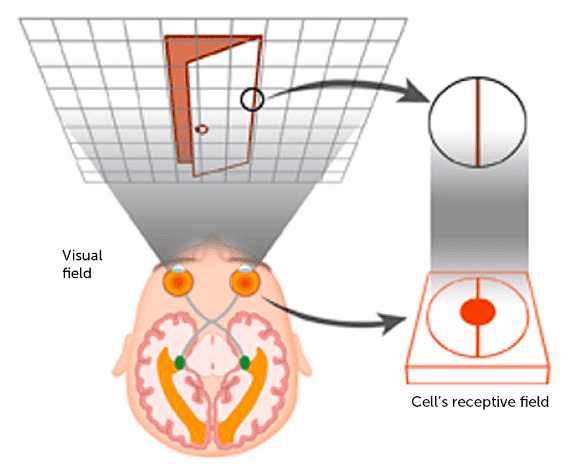 | Human visual system: field of view vs single-neuron receptive field patch | — |
| 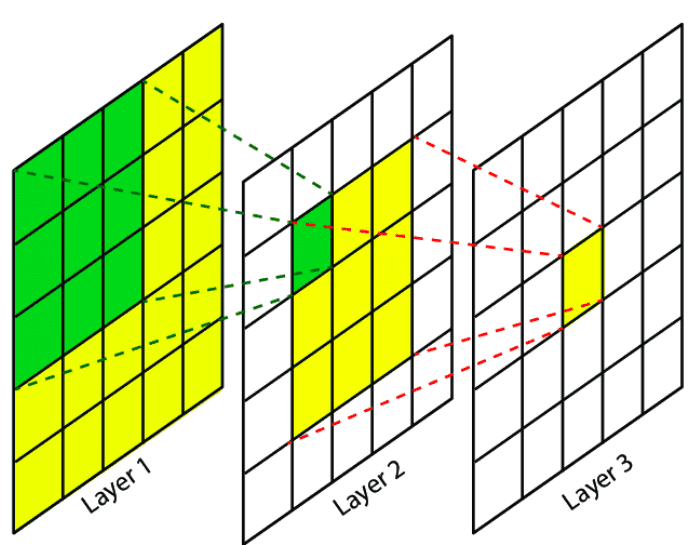 | CNN receptive field: input patch associated with an output feature | — |
| 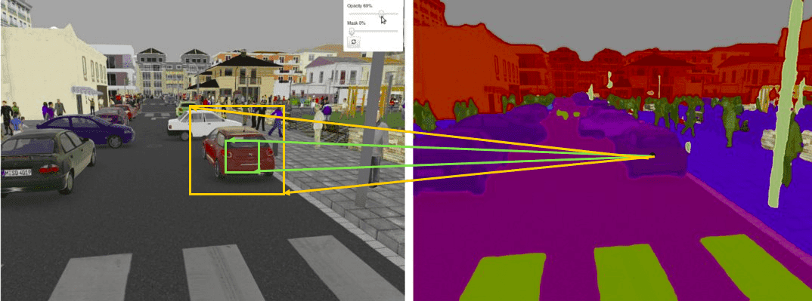 | Semantic segmentation: green vs orange receptive fields — larger context preferred | — |
| 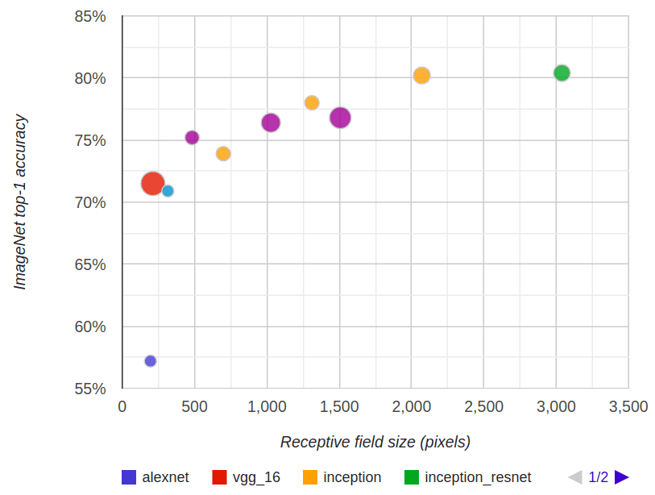 | ImageNet accuracy vs receptive field radius for ResNet, Inception, MobileNet families | — |
| 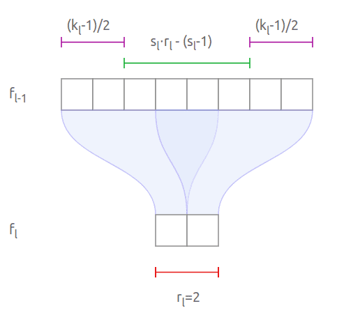 | 1D visualization of sequential conv layers computing RF backward from output (Araujo et al.) | — |
| 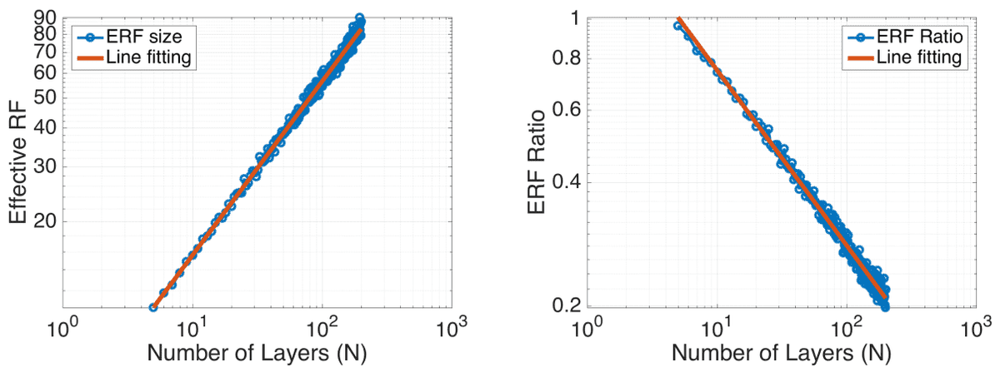 | More layers increase theoretical RF but decrease ERF ratio (Luo et al.) | — |
| 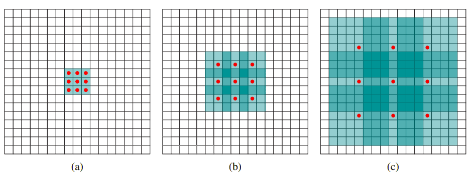 | Dilated convolutions: RF grows 3×3 → 7×7 → 15×15 across three layers (Yu & Koltun) | — |
| 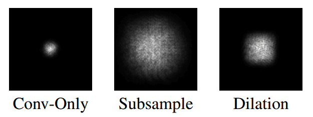 | Effective receptive field with pooling vs dilation (Luo et al.) | — |
| 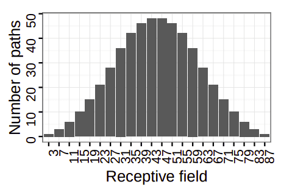 | HighResNet: binomial distribution of receptive fields across skip paths | — |
| 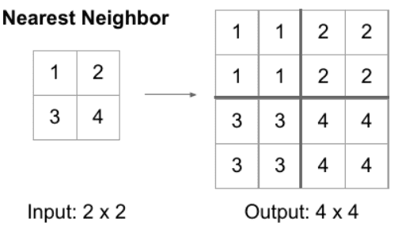 | Nearest-neighbor upsampling: k=1 for RF computation when doubling resolution | — |
| 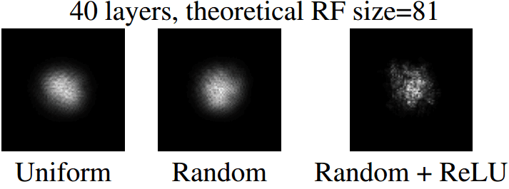 | ERF Gaussian distribution with and without non-linearities (Luo et al.) | — |

The article opens by grounding CNN terminology in neuroscience: each neuron sees only a patch of the visual field.

Dense prediction tasks illustrate why RF size matters — boundary pixels need context from the full object.

Three stacked dilated convolutions expand receptive field exponentially while parameter count grows only linearly.

## Entities

- [[AI Summer]] — educational ML blog that published this receptive-field survey.
- [[Nikolas Adaloglou]] — author of the article.
- [[Convolutional Neural Networks]] — primary architecture class where RF analysis applies.
- [[Computer Vision]] — application domain (segmentation, detection, flow).

## Questions & Gaps

- Article predates Vision Transformers; ViT patch embeddings and attention have different "receptive field" semantics not covered here.
- No PyTorch/TensorFlow toolkit walkthrough despite mentioning one in additional material.
- Skip-connection ERF shrinkage vs path multiplicity is noted but not deeply reconciled.
- Does not discuss modern large-kernel convs (ConvNeXt, RepLKNet) or global attention hybrids.

## Related

- [[Convolutional Neural Networks]] — local filtering architecture whose layers compose receptive fields.
- [[Pooling]] — multiplicatively increases RF via downsampling.
- [[Dilated Convolution]] — exponential RF expansion without resolution loss.
- [[Effective Receptive Field]] — gradient-based measure of which input pixels actually matter.
- [[Best Deep CNN Architectures and Their Principles: from AlexNet to EfficientNet]] — companion AI Summer survey of CNN architecture families (same author).
- [[A Journey into Optimization Algorithms for Deep Neural Networks]] — companion AI Summer training survey.
- [[Regularization Techniques for Training Deep Neural Networks]] — companion AI Summer training survey.
- [[Computer Vision]] — topic hub for segmentation, detection, and flow tasks cited as RF motivation.
