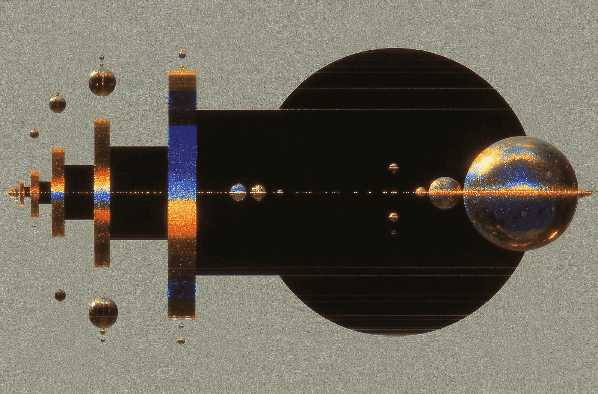
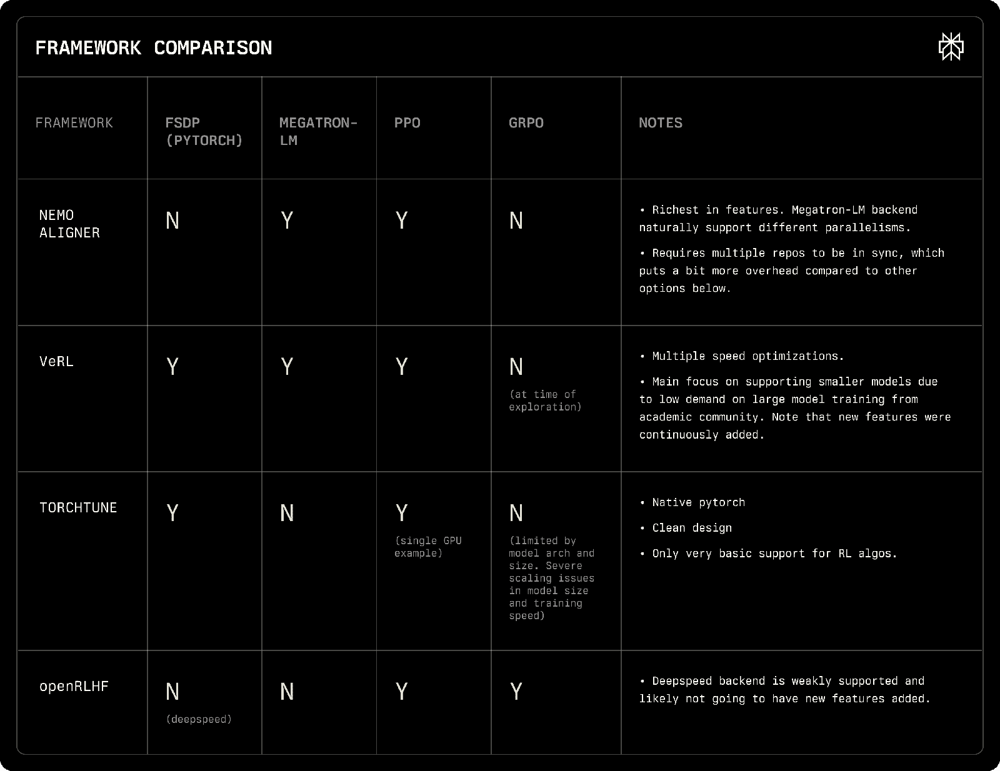
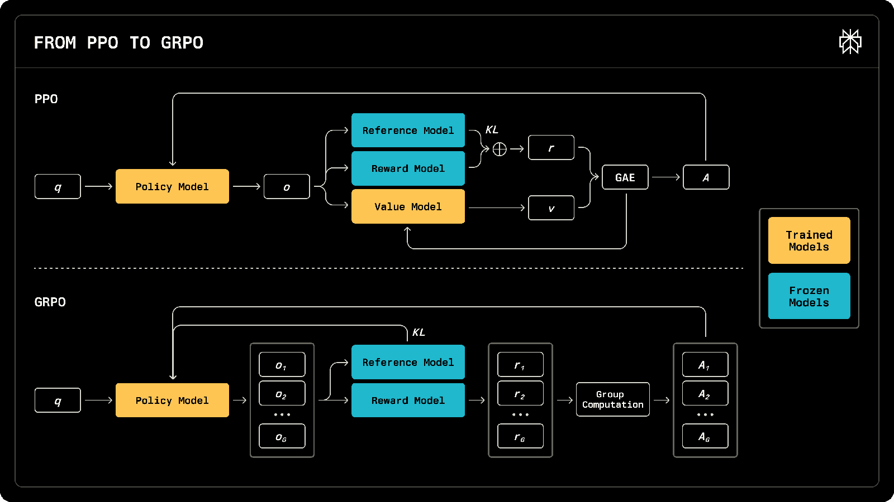
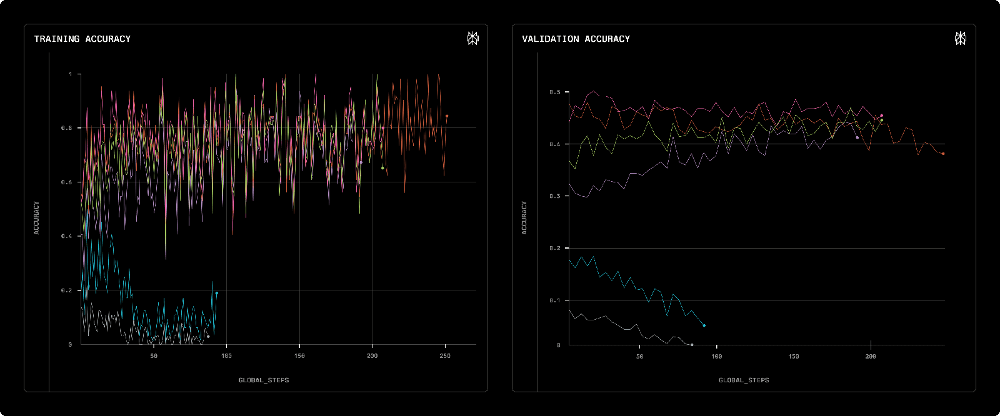
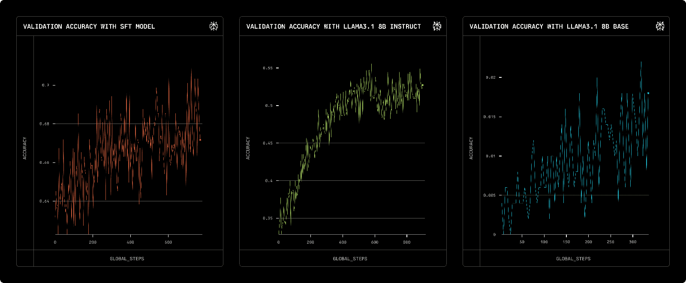
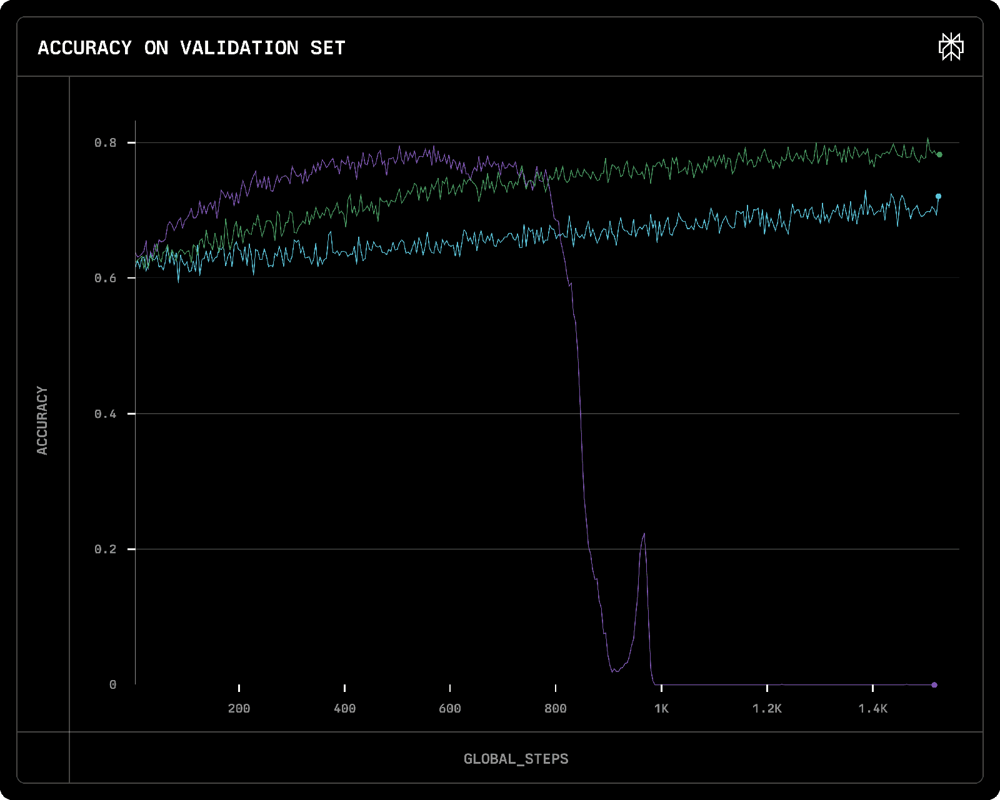
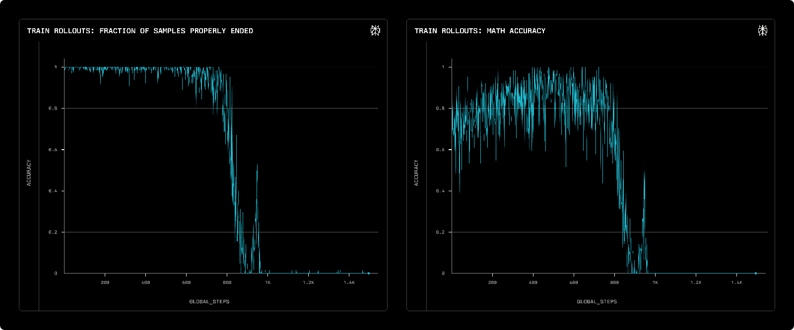
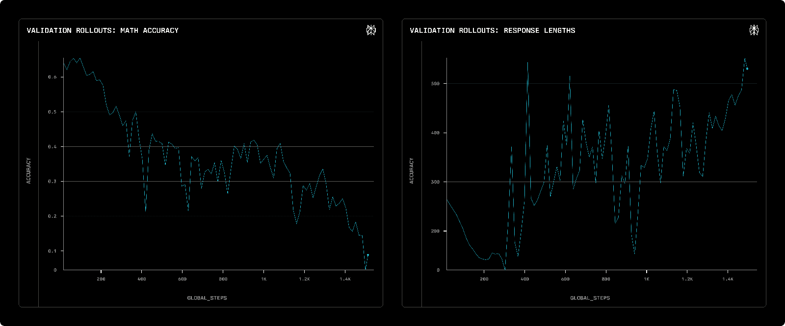

# RL Training For Math Reasoning

**Source**: `raw/rl-training-for-math-reasoning/full-article.html` (551 KB), `raw/rl-training-for-math-reasoning/full-article.md` (markdown view)  
**URL**: https://research.perplexity.ai/articles/rl-training-for-math-reasoning  
**Ingested**: 2026-06-06  
**Tags**: #summary

## Summary

Perplexity Research shares engineering lessons from building **GRPO** infrastructure and training **math-reasoning** models. Short-term RL training runs on **NeMo Aligner** with vLLM rollouts (+30% rollout efficiency vs TensorRT-LLM); long-term direction is an in-house **torchtune** GRPO stack unified with SFT. The most time-consuming integration step was **log-probability alignment** between NeMo and HuggingFace forward passes (metric must stay in [1, 1.05]).

Experiments use Llama 3.1 8B Base/Instruct on GSM8K, MATH, NuminaMath, Open Reasoning Zero (ORZ), and MATH-500 eval. Key findings: **data difficulty mixture matters**; RL improves reasoning beyond SFT when the base model already supports long chain-of-thought; **light SFT warmup** on ORZ-labeled CoT data prevents self-repetition collapse when RL scales response length. Best MATH-500 pass@1 (~0.70) comes from RL on ORZ initialized from an ORZ-SFT checkpoint (epoch 4), vs ~0.38 instruct and ~0.60 SFT-only baselines.

Hyperparameter lessons: **LR 3e-7** balances speed and stability; **KL coefficient 0** worked best after alignment fixes; **temperature 1.0** balances convergence and validation accuracy (1.2+ causes instability). **Format rewards** often trigger self-repetition collapse; accuracy-only reward is safer but risks **end-of-sequence collapse** when all rollouts hit max length (zero advantage). GRPO advantage normalization by group std biases learning toward easy prompts with low reward variance.

## Key Claims

- NeMo Aligner chosen short-term for feature completeness and Nvidia support; torchtune targeted long-term for simpler, self-contained RL+SFT unification.
- GRPO implementation required robust KL estimator, format+accuracy rewards, vLLM rollout integration, and exhaustive log-prob alignment validation.
- RL on ORZ from CoT-warmed SFT reaches ~0.70 MATH-500 pass@1, matching published ORZ/R1-class results; vanilla instruct/base RL starts lower and converges slower.
- Long-CoT exposure in SFT teaches both length generation and reasoning priors that RL can refine; without it RL forces length growth and collapses via repetition.
- Learning rate 8e-7 converges fast then collapses; 1e-7 is too slow; 3e-7 is the stable sweet spot for 15k-step runs.
- Format rewards (loose or strict) correlate with tag-repetition collapse; removing format reward shifts failure mode to EOS/max-length cut-off collapse.
- SFT difficulty mixture (ORZ > MATH > GSM8K as warmup) improves subsequent ORZ RL efficiency vs single-difficulty SFT.
- RL adjusts rollout length toward task-appropriate length rather than monotonically increasing it when the base already over-generates.

## Figures

| Figure | Caption | Page |
|--------|---------|------|
|  | PPO vs GRPO comparison (group-relative advantages, no value model) | — |
|  | Framework comparison table (Feb 2025 snapshot) | — |
|  | LR vs KL coefficient grid on GSM8K | — |
|  | Temperature sweep: train vs validation accuracy | — |
|  | Main result: validation on three RL initialization setups | — |
|  | Learning-rate ablation: reward collapse at 8e-7 | — |
|  | SFT difficulty ablation before ORZ RL | — |
|  | Rollout length scaling: base vs SFT-warmed model | — |

19 figures total in `wiki/assets/rl-training-for-math-reasoning/` (training curves, collapse diagnostics, ablations).

## Entities

- [[Perplexity AI]] — authors; RL infra and math-reasoning training.
- [[GRPO]] — primary RL algorithm implemented and ablated.
- [[Reasoning Models]] — long-CoT math reasoning target capability class.

## Questions & Gaps

- VeRL and other frameworks evolved since the Feb 2025 comparison; revisit for large-model tensor parallelism.
- Proposed advantage fixes (no std normalization, uniform-reward handling) are listed as future work, not shipped.
- Results shown on 8B Llama; scaling laws to Perplexity production model sizes are not reported.

## Related

- [[GRPO++: Tricks for Making RL Actually Work]] — broader GRPO stabilization catalog.
- [[Reinforcement Learning with Verifiable Rewards]] — accuracy-only math rewards as verifiable RL.
- [[On SFT RL and On-Policy Distillation]] — SFT→RL staging and on-policy training context.
- [[Papers Explained 354 - Does RL Incentivize Reasoning Capacity in LLMs Beyond the Base Model]] — whether RL expands reasoning beyond the base model.
- [[Reinforcement Learning Topic]] — RL post-training landscape.
- [[Supervised Fine-Tuning]] — CoT warmup before RL.
