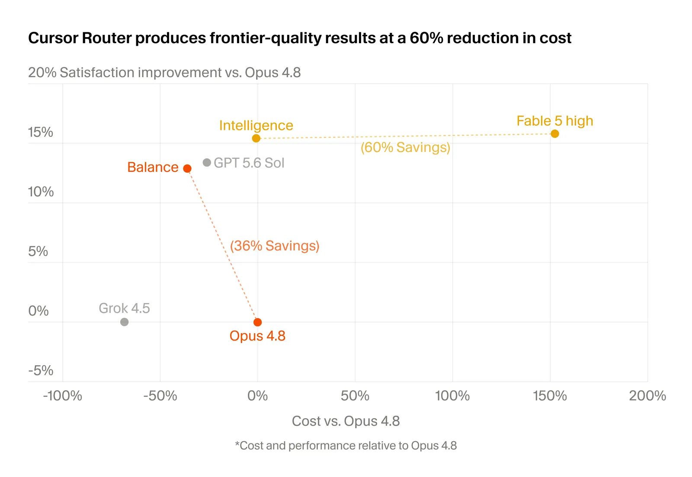
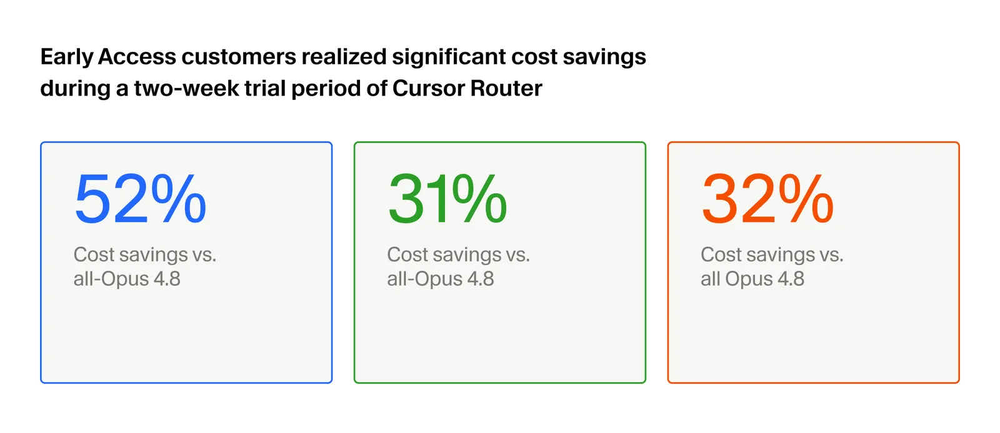
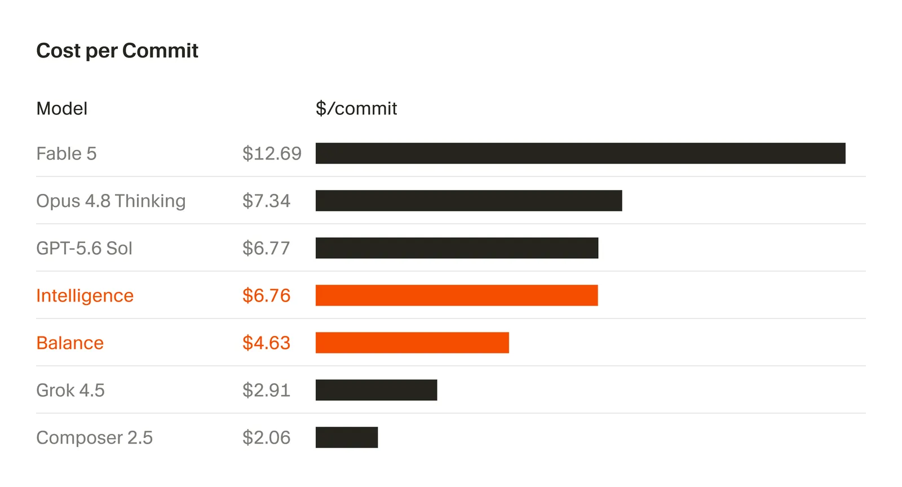

# Introducing Cursor Router

**Source**: `raw/router/full-article.md` (192 KB), `raw/router/full-article.md` (markdown view)  
**URL**: https://cursor.com/blog/router  
**Ingested**: 2026-07-23  
**Tags**: #summary

## Summary

Cursor's July 2026 product post launches **[[Cursor Router]]**, an intelligent per-request model router for Teams and Enterprise plans. The problem it targets is familiar: roughly 60% of Cursor developers pick a single model as a daily driver, so routine work gets billed at frontier prices while output quality does not scale proportionally. Cursor Router classifies each agent request before a model runs and routes it to the best option in the pool — simple edits to price-efficient models, UI work to models with strong taste, long-horizon problems to frontier reasoning models.

The router is a classifier trained on 600k+ live requests and evaluated in online A/B tests across millions of production requests, optimizing for user satisfaction (AFC) as the reward signal. It considers query text, context, task complexity, domain, and per-model behavioral profiles. Training and evaluation are **cache-aware**: the training set includes routing-induced cache misses, and reported cost savings account for cache-miss overhead from switching models mid-conversation.

Three **Auto modes** let teams choose their position on the cost–intelligence Pareto frontier: **Intelligence** (frontier quality), **Balance** (strong daily-driver quality), and **Cost** (maximize token efficiency). In online A/B tests, Auto Intelligence lands near [[Claude Models|Fable 5]] on user satisfaction at about 60% lower cost, while lifting satisfaction ~15% over Opus 4.8 at nearly the same cost. Auto Balance exceeds Opus 4.8 satisfaction at ~36% lower cost. Early-access enterprise accounts (thousands of users each) saved 30–50% versus routing everything to Opus 4.8 with no quality decrease.

Quality is measured the same way Cursor evaluates harness changes and model launches: **user satisfaction** (moving on to the next feature = positive; correcting the agent = negative) and **[[Keep Rate]]** (fraction of agent-generated code that survives in the codebase). Cost per commit reinforces the savings story: Intelligence mode at $6.76/commit, Balance at $4.63, versus Opus 4.8 at $7.34 and Fable 5 at $12.69. [[GPT-5.6|GPT-5.6 Sol]] matched Intelligence cost but with lower satisfaction.

Admins control rollout per team or group, set default modes, and allow or block specific models. The post also previews **[[Dynamic Tool Calling]]** — lazy-loading tool descriptions on first use, mirroring the existing MCP lookup pattern — and notes an expanding model pool ([[Grok Models|Grok 4.5]] for harder work, [[Introducing Composer 2.5|Composer]] improvements on the everyday path).

## Key Claims

- ~60% of Cursor developers use a single model as their daily driver, paying frontier prices for routine tasks.
- Cursor Router is a classifier trained on 600k+ live requests; production A/B tests span millions of requests with AFC (user satisfaction) as the reward.
- Routing inputs: query, context, task complexity, domain, and per-model behavior profiles.
- **Cache-aware** in training and evaluation; reported savings include cache-miss costs from model switching.
- Three Auto modes: **Intelligence**, **Balance**, **Cost** — adjustable cost–intelligence Pareto frontier.
- Auto Intelligence ≈ Fable 5 satisfaction at ~60% lower cost; ~15% higher satisfaction than Opus 4.8 at similar cost.
- Auto Balance > Opus 4.8 satisfaction at ~36% lower cost; comparable satisfaction to GPT-5.6 Sol at lower spend.
- Early access: three high-volume enterprise accounts saved 30–50% vs Opus 4.8 pricing with no quality drop.
- Cost per commit: Intelligence $6.76, Balance $4.63, Opus 4.8 $7.34, Fable 5 $12.69; GPT-5.6 Sol matched Intelligence cost but lower satisfaction.
- Quality metrics: user-response satisfaction classification and Keep Rate — same signals used for harness and model launch evaluation over the past nine months.
- Online A/B tests preferred over offline evals because offline evals miss cache-miss costs and real multi-turn routing dynamics.
- Admin controls: per-team rollout, mode defaults, allow/block specific models.
- **Dynamic tool calling** previewed: tool descriptions loaded on first use, not in every prompt.
- Available on Teams and Enterprise across desktop, web, iOS, CLI, and SDK.

## Figures

| Figure | Caption | Page |
|--------|---------|------|
|  | Auto Intelligence quality and cost vs Fable, Opus 4.8, and GPT-5.6 Sol | — |
|  | Early-access customer cost savings vs Opus 4.8 | — |
|  | Cost per commit: Balance, Auto Intelligence, Opus 4.8, and Fable | — |

Light and dark variants (`fig-N-dark.png`) are in `wiki/assets/router/`.

## Entities

- [[Cursor]] — authors and deployer of Cursor Router for Teams/Enterprise.
- [[Cursor Router]] — the intelligent per-request model router described in this post.
- [[Keep Rate]] — online quality metric reused as a router evaluation signal.
- [[Dynamic Tool Calling]] — harness optimization previewed alongside the router launch.

## Questions & Gaps

- AFC (user satisfaction) reward is named but not formally defined beyond user-response classification heuristics.
- No classifier architecture, feature set, or per-model routing breakdown is published.
- Teams and Enterprise only — individual plan availability not mentioned.
- Cost-per-commit figures lack sample size, time window, or account composition detail.

## Related

- [[Cursor Router]] — concept page for the router product feature.
- [[Agent Harness]] — router extends per-model harness customization; dynamic tool calling reduces prompt bloat.
- [[Continually Improving Our Agent Harness]] — introduces Keep Rate and user-response classification used to evaluate the router.
- [[Keep Rate]] — code-survival metric for online quality evaluation.
- [[CursorBench]] — offline eval complement to the router's online A/B methodology.
- [[Evaluation and Benchmarks]] — online A/B testing and cost-per-commit as evaluation methodology.
- [[Code Models]] — product-level model routing for coding agents.
- [[Claude Models]] — Opus 4.8 and Fable 5 used as comparison baselines.
- [[GPT-5.6]] — GPT-5.6 Sol compared on cost and satisfaction.
- [[Grok Models]] — Grok 4.5 noted as expanding the router's hard-task pool.
- [[Introducing Composer 2.5]] — Composer improvements on the everyday routing path.
- [[Dynamic Tool Calling]] — lazy tool-description loading previewed in "What's next."
