# Why Multi-Head Self Attention Works: Math, Intuitions and 10+1 Hidden Insights

**Source**: `raw/self-attention/full-article.html` (482 KB), `raw/self-attention/full-article.md` (markdown view)  
**URL**: https://theaisummer.com/self-attention/  
**Author**: Nikolas Adaloglou (AI Summer), 2021-03-25  
**Ingested**: 2026-06-06  
**Tags**: #summary

## Summary

This AI Summer deep-dive complements [[How Attention Works in Deep Learning: Understanding the Attention Mechanism in Sequence Models]] and [[How Transformers Work in Deep Learning and NLP: An Intuitive Introduction]] by explaining **why** scaled dot-product [[Self-Attention]] and [[Multi-Head Attention]] work, not just what they compute. Nikolas Adaloglou frames attention as **two matrix multiplications** — \(QK^T\) for dot-score similarities, then softmax-weighted multiplication with \(V\) — with parallelism from (1) batching all queries into one matmul and (2) independent multi-head subspaces (\(d_k = d_{model}/h\)).

The article's **11 insights** synthesize research findings: self-attention is **not symmetric** (\(QK^T \neq KQ^T\) unless \(W_Q = W_K\)); attention acts as **information routing** preserving nearly full state content (Schlag et al.); Voita et al. classify heads as positional, syntactic, or rare-word specialists and show ~2/3 of encoder heads can be pruned with minimal BLEU loss; Cordonnier et al. find heads **share common projections** despite appearing independent; cross-attention heads are far harder to prune than encoder self-attention (Michel et al.); post-softmax attention matrices are **low-rank** (Linformer); attention without softmax resembles **fast-weight memory** (Schmidhuber/Schlag); pure attention suffers **rank collapse** without skip connections and MLP (Dong et al.); layer-norm γ/β alone suffice for transfer learning on small datasets (Lu et al.); and quadratic complexity motivates sparse/linear variants (Long Range Arena, BigBird).

## Key Claims

- Self-attention decomposes into two matmuls: dot-scores \(QK^T/\sqrt{d_k}\), then weighted sum with \(V\); batching queries enables free parallelization.
- Q = search, K = index/bridge, V = retrieved content; keys guide where to look, values provide information.
- Cross-attention applies the same two-matmul pattern with encoder-derived K/V and decoder Q.
- Multi-head attention = multiple independent "linear views" of the same sequence; heads concatenated and projected by \(W^O\).
- GPU parallelization: ideally one thread per (batch, head) pair; concatenation overhead is minimal.
- **Insight 0**: Self-attention is **not symmetric**; attention matrix is a directed graph; symmetry requires shared \(W_Q = W_K\).
- **Insight 1**: Attention routes multiple local information sources into a global tree; heads preserve almost all content (Schlag et al.).
- **Insight 2**: Voita et al. — positional/syntactic/rare-word head types; encoder heads prunable (~17/48 retained); decoder early layers do language modeling, late layers condition on source.
- **Insight 3**: Cordonnier et al. — per-head projection products are full-rank, but concatenated head product is low-rank; heads learn overlapping subspaces.
- **Insight 4**: Michel et al. — pruning >60% cross-attention heads degrades BLEU sharply; encoder-decoder attention most dependent on multi-head decomposition.
- **Insight 5**: Wang et al. (Linformer) — post-softmax attention \(P\) is low-rank; top singular values capture most information.
- **Insight 6**: Without softmax, \(V K^T\) acts as context-dependent fast weights; orthogonal keys prevent interference (Schlag et al.).
- **Insight 7**: Dong et al. — pure attention converges to rank-1 exponentially; skip connections and MLP counteract; layer norm does not prevent rank collapse.
- **Insight 8**: Lu et al. — fine-tuning only layer-norm γ/β (0.1% params) matches full fine-tune on low-data regimes after large NLP pretraining.
- **Insight 9**: Massive NLP pretraining yields transferable Q/K/V computational primitives.
- **Insight 10**: Fine-tuning attention layers on small datasets can cause performance divergence.
- Efficient attention splits into math approximations (Linformer) and sparsification (windowed, BigBird); [[DeepSpeed]] implements sparse transformers at scale.

## Figures

| Figure | Caption | Page |
|--------|---------|------|
| 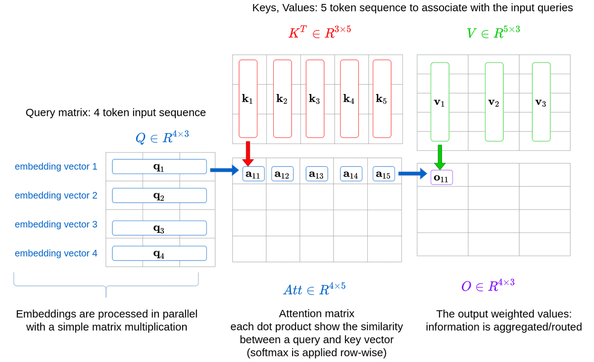 | Self-attention as two matrix multiplications (QKᵀ then weighted V) | — |
| 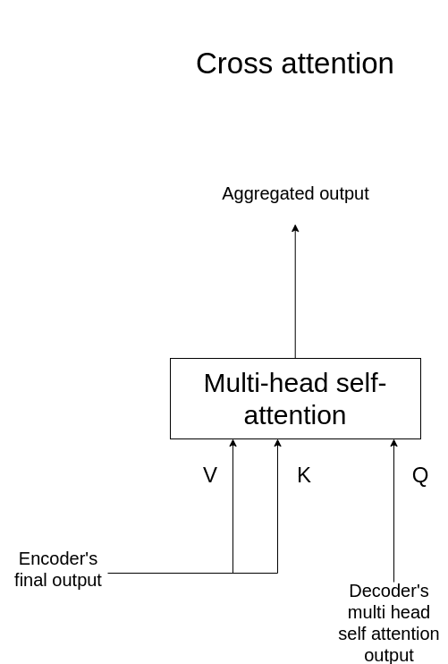 | Cross-attention: encoder K/V with decoder Q | — |
| 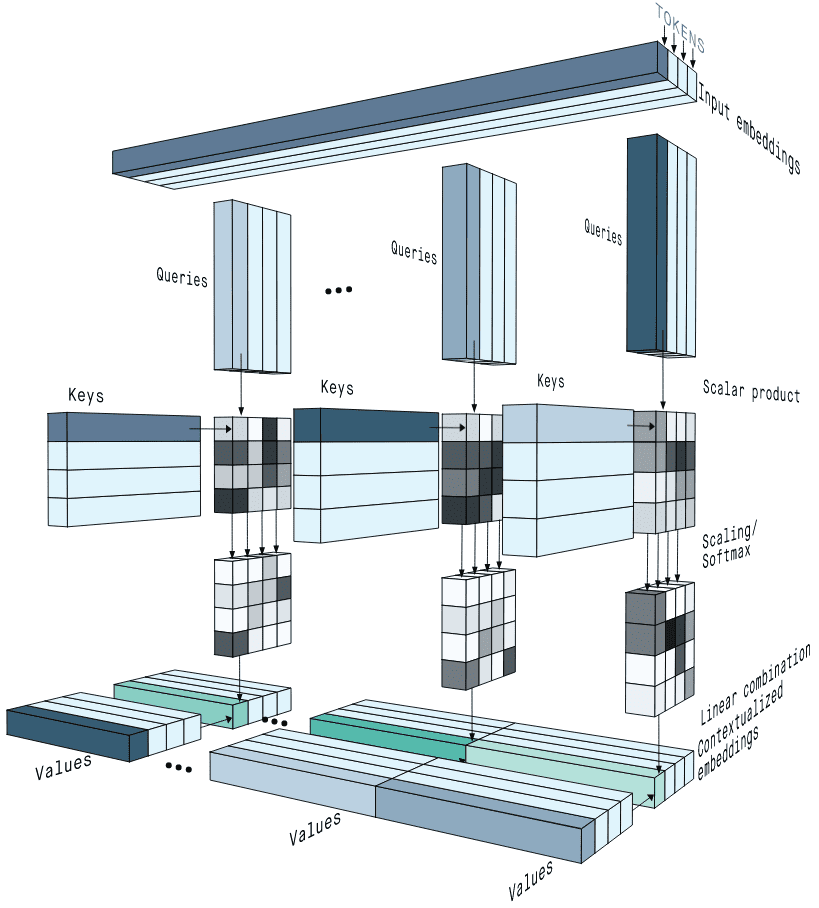 | Multi-head attention step-by-step (Peltarion) | — |
| 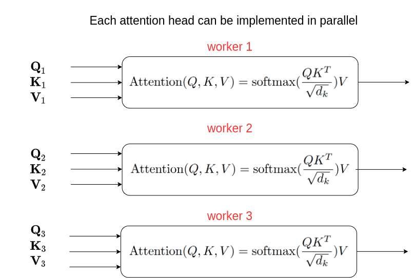 | Multi-head self-attention block I/O diagram | — |
| 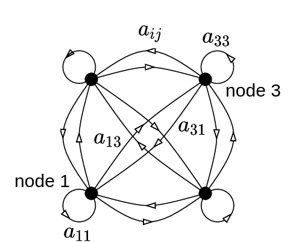 | Attention matrix as directed graph (not symmetric) | — |
| 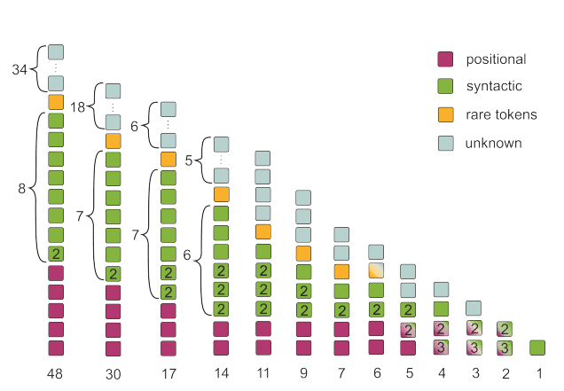 | Voita et al.: head classification by function (positional/syntactic/rare) | — |
| 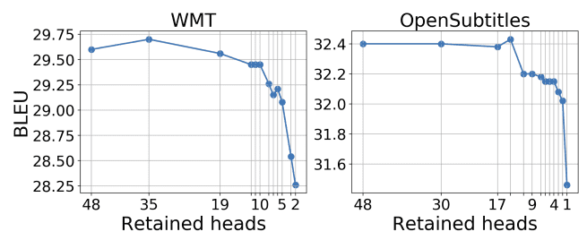 | Encoder head pruning BLEU results (Voita et al.) | — |
| 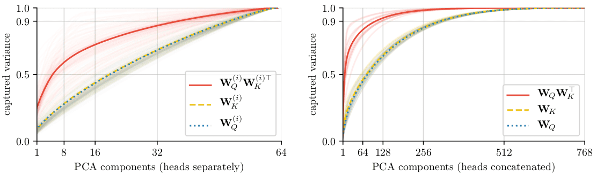 | BERT projection product ranks per head vs concatenated (Cordonnier et al.) | — |
| 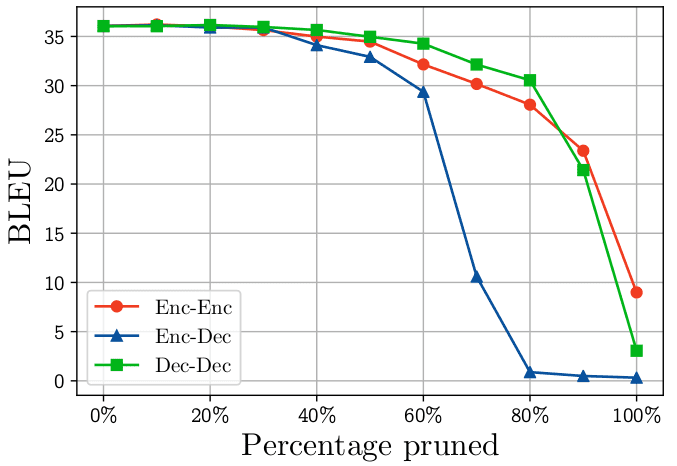 | Cross-attention head pruning impact (Michel et al.) | — |
| 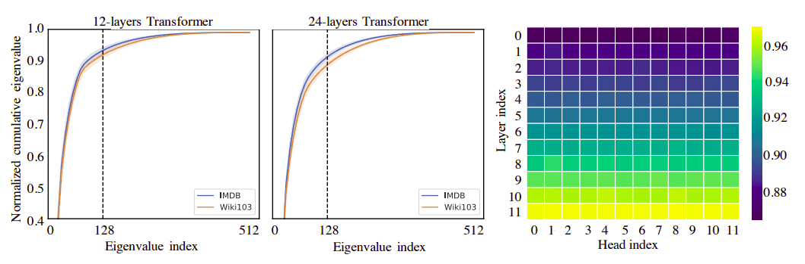 | Post-softmax attention low-rank spectrum (Linformer) | — |
| 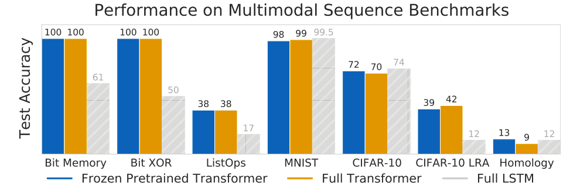 | Long Range Arena efficient-transformer taxonomy | — |
| 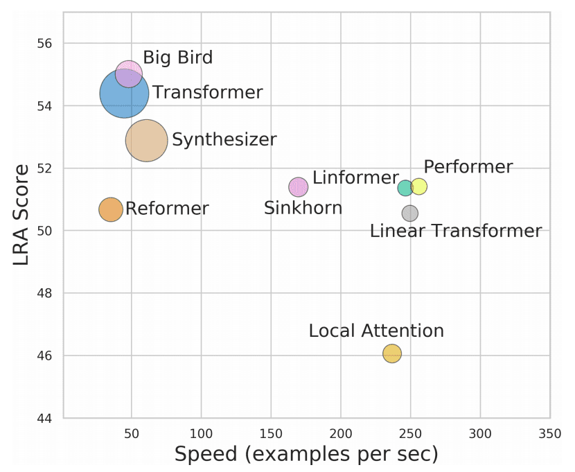 | Overview of efficient transformer architecture families | — |
| 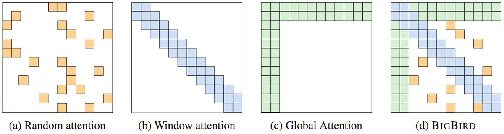 | BigBird sparse attention patterns (global + window + random) | — |

Attention = dot-product scoring matrix \(QK^T\), then softmax-weighted aggregation of values.

Because \(W_Q \neq W_K\) in general, the attention matrix forms a directed graph, not an undirected one.

Voita et al. identify positional, syntactic, and rare-word heads; most encoder heads are prunable.

## Entities

- [[AI Summer]] — educational blog publishing this self-attention analysis (2021).
- [[Nikolas Adaloglou]] — primary author.
- [[Self-Attention]] — core mechanism analyzed in depth.
- [[Multi-Head Attention]] — parallel head decomposition and research insights.
- [[Skip Connections]] — prevent rank collapse in deep transformers (Dong et al.).
- [[DeepSpeed]] — sparse transformer implementations cited for production use.
- [[Papers Explained 01 - Transformer]] — original architecture referenced throughout.
- [[Papers Explained 38 - Longformer]] — long-context efficient attention (related sparse methods).
- [[Papers Explained 122 - Sparse Transformer]] — sparse attention factorizations in corpus.
- Vaswani et al. (2017) — original attention formula.
- Voita, Michel, Cordonnier, Schlag, Dong, Wang (Linformer) — head analysis and efficient-attention papers synthesized.

## Questions & Gaps

- Does not implement attention from scratch (points to separate einsum tutorial).
- Head-pruning results are MT-specific (BLEU); generalization to decoder-only LLMs unclear.
- Rank-collapse analysis assumes attention-only stacks without full transformer block ablations in one place.
- Efficient-attention survey is snapshot from 2020–2021; many newer methods omitted.
- Layer-norm transfer-learning insight tested on MNIST/CIFAR vs NLP pretrain — domain gap noted but not fully resolved.

## Related

- [[How Positional Embeddings Work in Self-Attention (Code in PyTorch)]] — trainable PE inside MHSA; complements permutation-equivariance discussion.
- [[How Transformers Work in Deep Learning and NLP: An Intuitive Introduction]] — architecture primer this article deepens.
- [[How Attention Works in Deep Learning: Understanding the Attention Mechanism in Sequence Models]] — seq2seq and Bahdanau attention foundation.
- [[Positional Encoding]] — order injection before self-attention.
- [[Rank Collapse]] — pure-attention degeneracy and mitigations (Dong et al.).
- [[Papers Explained Review 09 - Attention Layers]] — scaled dot-product in Papers Explained corpus.
- [[Long Context]] — efficient/sparse attention motivation.
- [[Model Compression and Efficiency]] — head pruning as compression strategy.
