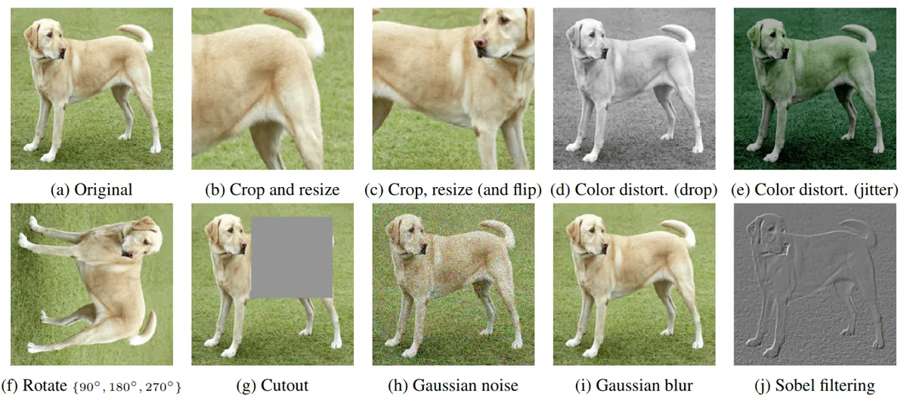
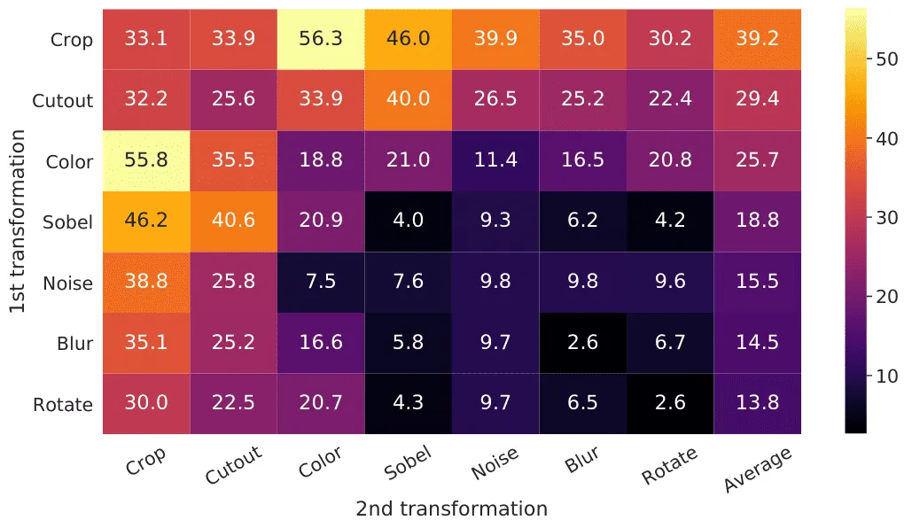
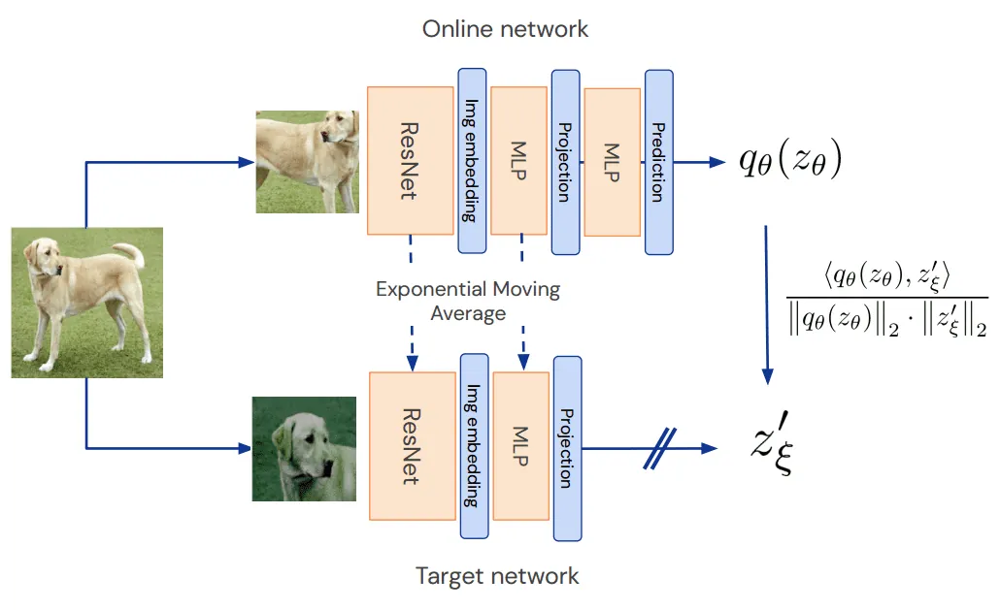

# Grokking Self-Supervised (Representation) Learning: How It Works in Computer Vision and Why

**Source**: `raw/self-supervised-representation-learning-computer-vision/full-article.md` (markdown view: `raw/self-supervised-representation-learning-computer-vision/full-article.md`)  
**URL**: https://theaisummer.com/self-supervised-representation-learning-computer-vision/  
**Author**: Nikolas Adaloglou (AI Summer), 2021-07-01  
**Ingested**: 2026-06-06  
**Tags**: #summary

## Summary

Nikolas Adaloglou's AI Summer tutorial explains **self-supervised representation learning (SSL)** in computer vision as a pre-training alternative to supervised transfer learning when human labels are scarce. The field evolved from hand-crafted **pretext tasks** (rotation prediction, jigsaw puzzles, video ordering) toward **representation learning in feature space**: the objective is not pretext accuracy but robust embeddings that transfer to downstream tasks via a small MLP head or fine-tuning.

The article presents a seven-step SSL workflow (unlabeled data → objective → augmentations → long pre-training → feature extractor → downstream fine-tune → baseline comparison) and centers on **contrastive learning**: align augmented views of the same image while pushing apart views from different images. Augmentations encode human prior knowledge — SimCLR's ablation shows **color distortion** and **cropping** dominate on ImageNet — but must preserve semantics, match the downstream task, and remain challenging enough to avoid trivial solutions.

The loss-function section demystifies SSL objectives through log-softmax algebra: contrastive losses maximize positive-pair similarity while a scalar **c** (from batch negatives, running averages, or batch-norm mean subtraction) provides implicit repulsion. **Mode collapse** — uniform or single-dimension dominated outputs — parallels GAN failure; mitigations include **EMA teacher networks** (stop-gradient targets), predictor heads ([[BYOL]]), heavy regularization (weight decay, LARS, warmup/decay, batch norm), and implicit contrast via BN statistics. The article closes with practical tips (Adam before LARS, normalize after augmentations, ResNet-18 for 300+ epochs, linear evaluation or k-NN monitoring).

## Key Claims

- SSL minimizes loss in **feature space** (latent/embedding space), not on hand-crafted pretext labels; downstream transfer is the real objective.
- **Contrastive learning** aligns positive feature pairs (two augmented views of one image) and repels negatives (views from other images); GANs are an early contrastive example.
- **Augmentation choice is critical in vision** (unlike NLP masked-token pretexts): SimCLR ablations rank color distortion + random crop highest on ImageNet; dataset diversity and downstream semantics govern the pipeline.
- Augmentation principles: task-relevant transforms, **semantic preservation**, sufficient difficulty, and dataset-dependent tuning (e.g., avoid blur on small CIFAR images).
- Temperature-scaled softmax sharpens distributions; low τ discourages uniform collapse; τ is a sensitive hyperparameter shared with knowledge distillation.
- SimCLR NT-Xent loss follows log-softmax decomposition: maximize positive similarity, subtract log-sum of negative similarities (batch negatives).
- **Mode collapse in SSL** (per DINO): (1) uniform outputs across dimensions → random predictions; (2) one dominant dimension → zero entropy — both ignore input.
- **EMA / stop-gradient**: teacher weights updated as $w_{teacher} \leftarrow k\, w_{teacher} + (1-k)\, w_{student}$ with $k > 0.95$; no gradients through teacher.
- **BYOL** avoids explicit batch negatives; **predictor MLP** breaks symmetry; BN mean subtraction acts as **implicit contrastive learning** (Fetterman & Albrecht experiments).
- **DINO** uses cross-entropy over soft clusters (>60K) on ViT features — surprisingly effective vs pure feature alignment; low temperature forces soft class assignment.
- Practical recipe: Adam first, global ImageNet normalize **after** augmentations, ResNet-18 ≥300 epochs, same-domain unlabeled data at scale, k-NN or linear-probe eval during pre-training.

## Figures

| Figure | Caption | Page |
|--------|---------|------|
|  | Examples of image augmentations used in contrastive SSL (SimCLR) | — |
|  | SimCLR augmentation ablation: ImageNet Top-1 after pre-training per augmentation combo | — |
|  | BYOL architecture: online network, target EMA network, and predictor MLP | — |

Color distortion and cropping yield the strongest linear-probe accuracy among tested augmentation combinations on ImageNet.

BYOL's predictor breaks symmetry between online and EMA target networks without explicit negative pairs.

## Entities

- [[AI Summer]] — published this SSL pedagogy article (2021).
- [[Nikolas Adaloglou]] — author.
- [[SimCLR]] — first major in-batch contrastive visual SSL framework; NT-Xent loss and augmentation ablations referenced throughout.
- [[BYOL]] — negative-free SSL with predictor + EMA teacher; BN provides implicit contrast.
- [[Papers Explained 249 - DINO]] — ViT self-supervision via cross-entropy over soft clusters; two SSL collapse modes cited.
- [[Contrastive Learning]] — positive/negative pair alignment paradigm underlying SimCLR and GAN comparisons.
- [[Mode Collapse]] — extended here from GANs to SSL representation collapse (uniform or low-entropy outputs).
- [[Representation Learning]] — David Marr framing: representations make entities explicit for downstream algorithms.
- [[Batch Normalization]] — implicit mean subtraction as contrastive signal; BYOL fails without it.
- [[Self-Supervised Representation Learning]] — Lilian Weng's broader pretext-task survey; this article focuses on contrastive CV representation learning.

## Questions & Gaps

- DINO architecture figure referenced as "Source: FAIR" but not embedded in the saved HTML export.
- Article predates SwAV, Barlow Twins, MAE, and modern multimodal contrastive stacks (CLIP, SigLIP).
- Promised follow-up (SimCLR on STL-10) is linked but not part of this ingest.
- LARS optimizer and linear-evaluation protocol mentioned without full implementation walkthrough.

## Related

- [[Self-Supervised Representation Learning]] — earlier unified survey of image/video/control pretext tasks and InfoNCE.
- [[Contrastive Representation Learning]] — detailed loss formulations and method comparison table (SimCLR, MoCo, BYOL, SwAV, CLIP).
- [[Papers Explained 200 - SimCLR]] — original SimCLR paper breakdown.
- [[GANs in Computer Vision: Introduction to Generative Learning]] — contrastive learning analogy via real vs fake discrimination.
- [[In-layer Normalization Techniques for Training Very Deep Neural Networks]] — BN mechanics underlying implicit SSL contrast.
- [[Computer Vision]] — topic hub for vision representation learning.
