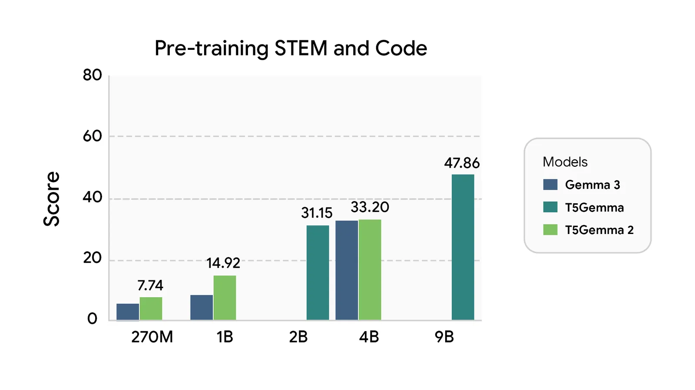
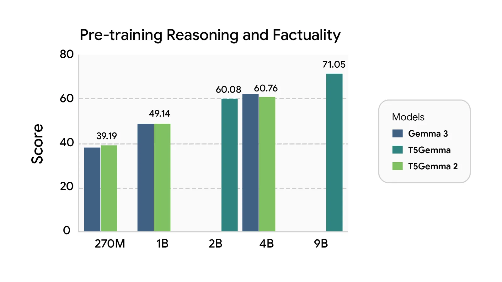
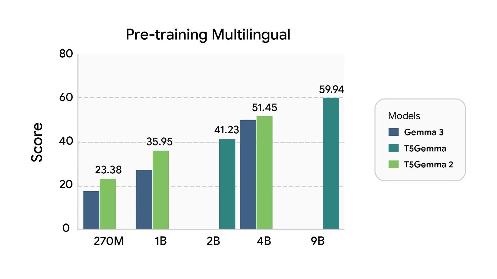
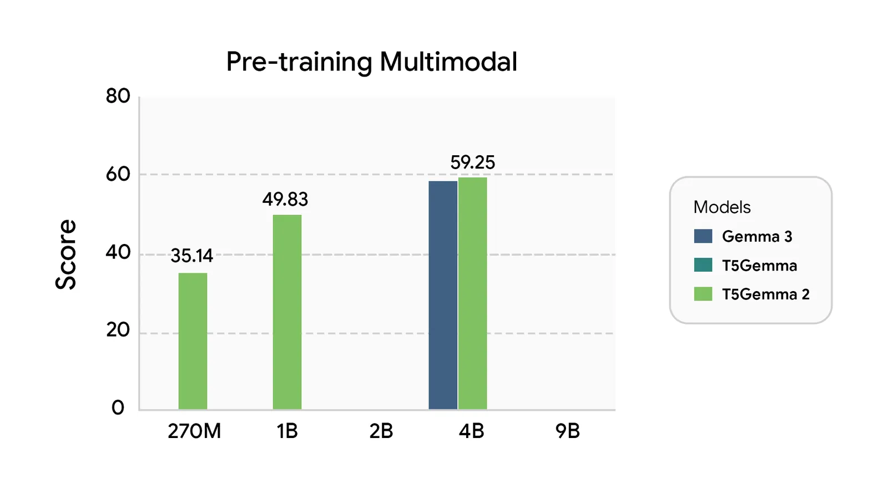
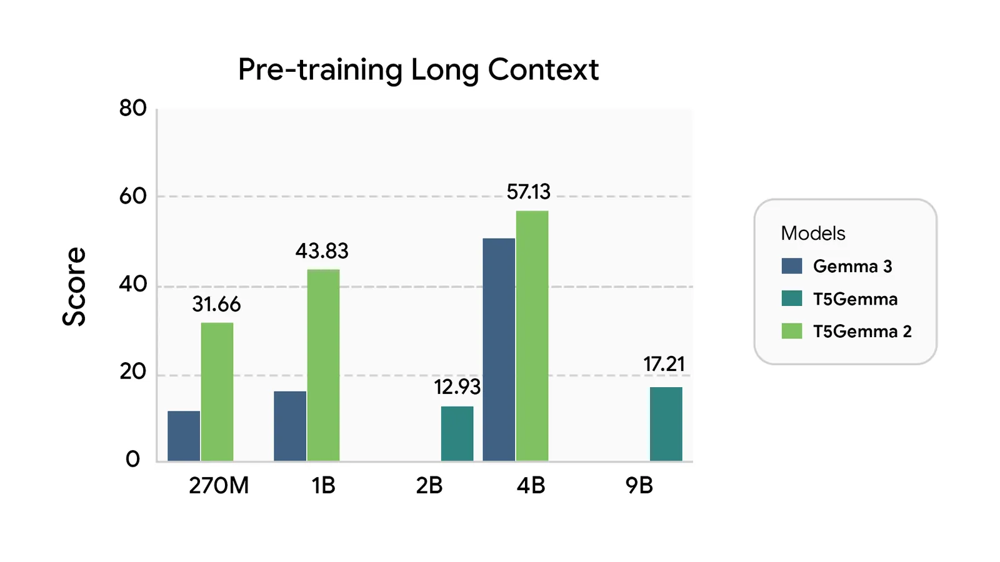

# T5Gemma 2

**Source**: `raw/t5gemma-2/full-article.md` (382 KB)  
**URL**: https://blog.google/innovation-and-ai/technology/developers-tools/t5gemma-2/  
**Published**: Dec 18, 2025  
**Ingested**: 2026-06-06  
**Tags**: #summary

## Summary

Google announces **T5Gemma 2**, the next generation of encoder-decoder models built on [[Papers Explained 329 - Gemma 3]]. Unlike the original T5Gemma line, T5Gemma 2 introduces tied word embeddings across encoder and decoder plus **merged decoder attention** that unifies self- and cross-attention into one layer — both aimed at [[Model Compression and Efficiency]] for compact deployment. Pre-trained sizes are 270M-270M (~370M total, excluding vision encoder), 1B-1B (~1.7B), and 4B-4B (~7B).

T5Gemma 2 is positioned as the first multimodal and long-context encoder-decoder family: it inherits Gemma 3's vision encoder for image+text tasks, supports context windows up to **128K tokens** via alternating local/global attention, and covers **140+ languages**. The blog frames these models for rapid experimentation and on-device use while setting a new bar for compact encoder-decoder capability across STEM, reasoning, multilingual, multimodal, and long-context benchmarks. Technical architecture detail is in [[Papers Explained 507 - T5Gemma 2]] and the [arxiv report](https://arxiv.org/abs/2512.14856).

## Key Claims

- Encoder-decoder family initialized from Gemma 3 with tied embeddings and merged decoder attention to cut parameters and simplify inference.
- Three compact pre-trained tiers: 270M-270M, 1B-1B, 4B-4B (total params ~370M, ~1.7B, ~7B excluding vision encoder).
- First multimodal encoder-decoder models: visual question answering and multimodal reasoning via an efficient vision encoder.
- Up to 128K-token context using Gemma 3's interleaved local/global attention.
- 140+ languages supported out of the box.
- Strong benchmark performance across STEM/code, reasoning/factuality, multilingual, multimodal, and long-context evaluation areas.

## Figures

| Figure | Caption | Page |
|--------|---------|------|
|  | STEM and code benchmark comparison (carousel 1) | — |
|  | Reasoning and factuality benchmark comparison (carousel 1) | — |
|  | Multilingual benchmark comparison (carousel 1) | — |
|  | Multimodal benchmark comparison (carousel 1) | — |
|  | Long-context benchmark comparison (carousel 1) | — |

## Entities

- [[Google DeepMind]] — Gemma/T5Gemma research org behind the release.
- [[Multilingual Models]] — 140+ language encoder-decoder line.
- [[Model Compression and Efficiency]] — tied embeddings and merged attention for smaller footprints.

## Questions & Gaps

- Blog is a launch post; full training recipe, data mix, and ablations are in the paper and [[Papers Explained 507 - T5Gemma 2]].
- Carousel 2 benchmark slides (model-size comparisons) not extracted; see the HTML source for the full set.
- No standalone architecture diagram in the blog; structural detail is textual plus the technical report.

## Related

- [[Papers Explained 507 - T5Gemma 2]] — deeper architecture, GQA, RoPE, and benchmark methodology.
- [[Papers Explained 408 - Encoder-Decoder Gemma]] — prior work adapting decoder-only Gemma to encoder-decoder.
- [[Papers Explained 329 - Gemma 3]] — base model family supplying multimodal and long-context features.
- [[Multilingual Models]] — topic hub for cross-lingual and translation-oriented model work.
- [[Model Compression and Efficiency]] — compact encoder-decoder efficiency techniques.
- [[Code Models]] — STEM and code benchmark focus for compact encoder-decoder models.
- [[Google DeepMind]] — Gemma encoder-decoder model releases.
