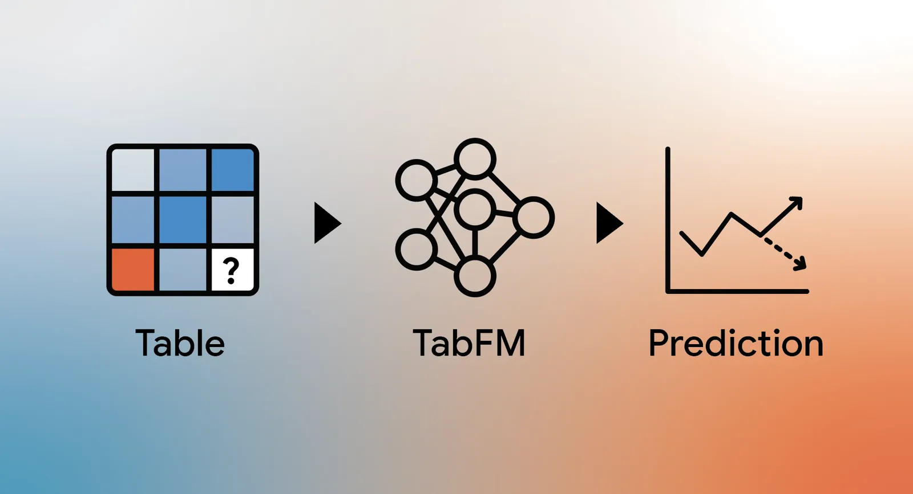
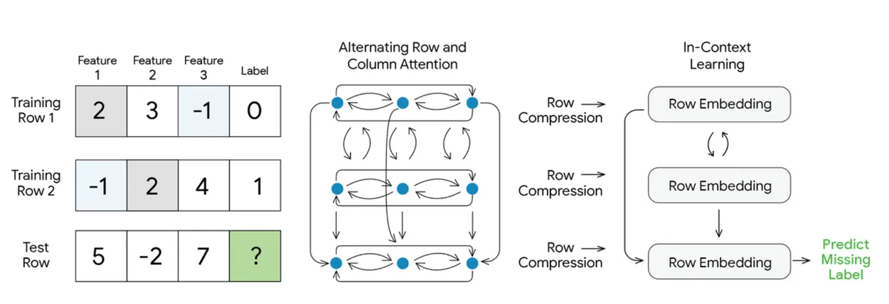
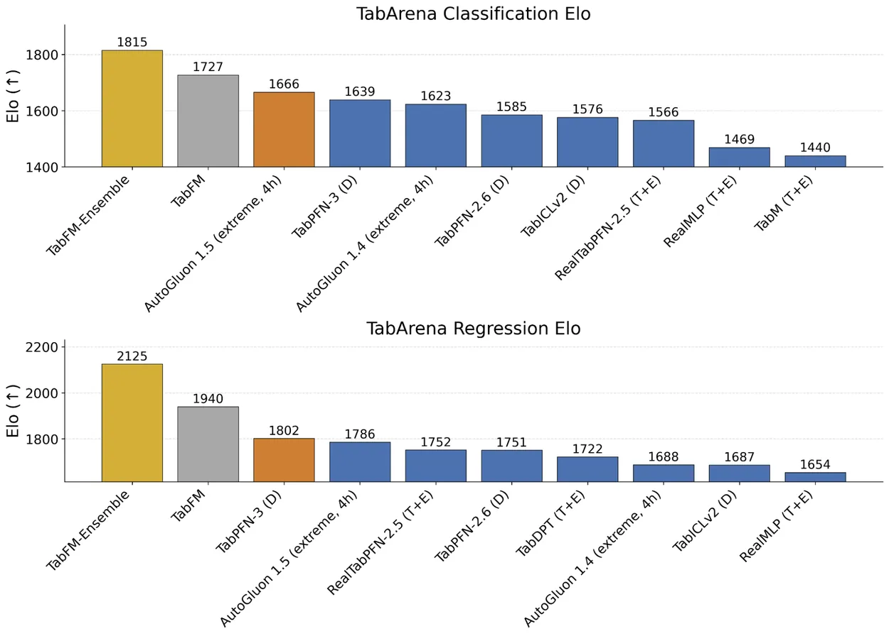

# TabFM

**Source**: `raw/tabfm/full-article.md`, `raw/tabfm/full-article.md`  
**Ingested**: 2026-07-12  
**Tags**: #summary

## Summary

**TabFM** is a Google Research zero-shot tabular foundation model that treats classification and regression as [[Tabular In-Context Learning]]. Instead of training a new model per dataset, TabFM takes the full table (training rows plus test rows) as one prompt and predicts labels in a single forward pass with no hyperparameter search.

The architecture combines TabPFN-style alternating row and column attention with TabICL-style row compression and an in-context transformer over compressed row vectors. Tables are orderless: row and column permutations should not change predictions, so the model uses attention patterns that respect that symmetry before compressing each row into a dense vector.

Pre-training runs entirely on hundreds of millions of synthetic datasets from structural causal models with varied random functions. Real industrial tables are scarce and often proprietary, so synthetic SCM data is the only practical path to this scale.

On [[Papers Explained 418 - TabArena|TabArena]] (38 classification and 13 regression datasets, 700 to 150,000 samples), TabFM and TabFM-Ensemble lead Elo ratings. TabFM-Ensemble adds light cross-validation and ensembling on top of the base zero-shot model. Google plans BigQuery integration via `AI.PREDICT` for SQL-native tabular prediction.

## Key Claims

- Tabular prediction reframed as ICL: one forward pass, no per-dataset training or tuning.
- Hybrid architecture: row/column attention, row compression, then ICL transformer (TabPFN + TabICL lineage).
- Pre-trained only on synthetic SCM-generated tables at hundreds-of-millions scale.
- TabFM and TabFM-Ensemble top TabArena Elo on both classification and regression splits.
- Planned BigQuery `AI.PREDICT` integration for enterprise tabular workflows.

## Figures

| Figure | Caption |
|--------|---------|
|  | TabFM hero illustration |
|  | TabFM model architecture (row/column attention, compression, ICL transformer) |
|  | TabArena Elo ratings: TabFM and TabFM-Ensemble vs. tuned baselines |

## Entities

- [[Google Research]] — blog publisher and model developer.
- [[Tabular In-Context Learning]] — prediction paradigm shared with TabPFN, TabICL, and TabFM.

## Questions & Gaps

- Synthetic-only pre-training may miss proprietary schema quirks and domain-specific missingness patterns.
- TabFM-Ensemble adds tuning cost that partially breaks the pure zero-shot story.
- BigQuery integration timeline is "coming weeks" with no public API details yet.

## Related

- [[Papers Explained 418 - TabArena]] — benchmark used for head-to-head Elo evaluation.
- [[Papers Explained Review 04 - Tabular Deep Learning]] — prior wiki survey of tabular neural methods.
- [[Tabular In-Context Learning]] — concept page for the ICL-as-tabular-prediction paradigm.
- [[Google Research]] — org page.
