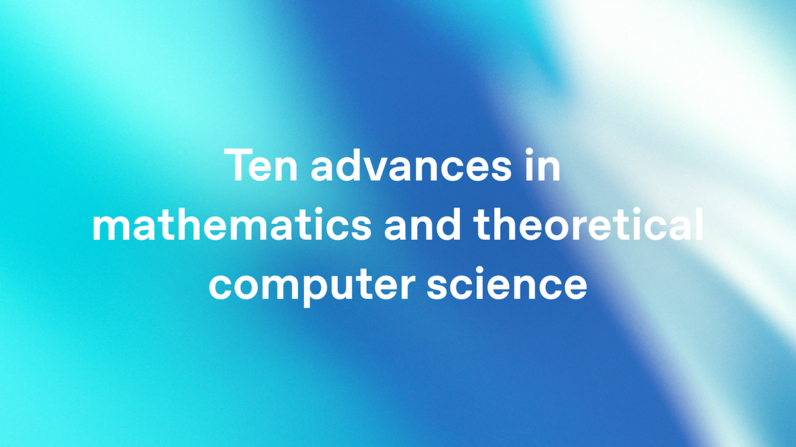

# Ten Advances in Mathematics and Theoretical Computer Science

**Source**: `raw/ten-advances-in-mathematics/full-article.html`, `raw/ten-advances-in-mathematics/full-article.md`, `raw/ten-advances-in-mathematics/ten-proofs-oai.pdf`  
**URLs**: https://openai.com/index/ten-advances-in-mathematics/ · https://cdn.openai.com/pdf/ten-proofs-oai.pdf  
**Ingested**: 2026-08-01  
**Tags**: #summary

## Summary

On August 1, 2026, OpenAI announced that an internal version of **Astra** produced new results on ten open problems in mathematics and theoretical computer science, each without main-result progress for at least a decade. The company reports roughly **$2,000** total inference cost at Sol API rates across all ten problems. Human researchers prepared manuscripts from the model's arguments; each proof was then formalized into a **Lean certificate** and published on GitHub. A companion formal manuscript (`ten-proofs-oai.pdf`) and proof-discovery narratives ([[How the Ideas Came Together]]) were released alongside the announcement.

The results span high-dimensional geometry, coding theory, group theory, operator algebras, arithmetic circuit complexity, quantum information, lattice cryptography, discrete geometry, Ramsey theory, and extremal graph theory. OpenAI credits the mathematical arguments to Astra, takes responsibility for manuscript preparation and Lean formalization, and references the Leiden declaration on AI and Mathematics. The announcement extends OpenAI's prior math-research posts ([[Model Disproves Discrete Geometry Conjecture]], [[New Result in Theoretical Physics]]) but uses different model branding (Astra rather than GPT-5.x) and broader scope (ten problems rather than one).

The downloaded blog HTML is a Next.js client-rendered shell without the article body; `full-article.md` is a readability reconstruction from page metadata, companion PDFs, and public reporting.

## Key Claims

- An internal **Astra** reasoning model generated proofs for ten long-standing open problems across math and TCS.
- Total inference cost across all ten problems: approximately **$2,000** at Sol API rates.
- Each argument was formalized into a **Lean certificate**; manuscripts and GitHub artifacts published.
- OpenAI states AI-generated proofs should not be credited as human-authored work; human role was manuscript preparation and formalization.
- **Sphere packing**: exact asymptotic Cohn–Elkies LP rate \(\mathrm{LP}_d^{1/d} \to \sqrt{e/(2\pi)}\); first improvement to the general sphere-packing exponent since 1978.
- **Binary/spherical codes**: exponential improvements to classical upper bounds for all parameters.
- **Non-sofic groups**: explicit construction disproving the soficity conjecture via property-(T) expanders and the binary Leavitt algebra.
- **Connes rigidity**: infinitely many non-isomorphic property-(T) groups with the same group von Neumann algebra.
- **Permanent lower bounds**: division-free circuits require \(\Omega(n^2 \log\log n)\) gates; formulas require \(\Omega(n^4/\log n)\) leaves.
- **Quantum parallel repetition**: exponential parallel repetition for every finite two-player entangled game.
- **Closest vector problem**: \(n^{1/400}\)-factor GapCVP hardness from 3SAT; consequences for lattice norms and binary decoding.
- **Ehrhart volume**: sharp \((n+1)^n/n!\) bound in every dimension for bodies with barycenter as sole interior lattice point.
- **Multicolor Ramsey**: \(R_k(3) = k^{\Theta(k)}\); resolves Erdős problem 183.
- **Extremal graph theory**: counterexamples to Erdős–Simonovits compactness (Erdős problem 146) and a 2-degeneracy exponent conjecture (Erdős problem 180).

## Results

| Area | Result | Prior status |
|------|--------|--------------|
| Sphere packing | \(\lim_{d\to\infty} \mathrm{LP}_d^{1/d} = \sqrt{e/(2\pi)}\); Fourier sign-uncertainty radii \((1/\pi+o(1))\sqrt{d}\) | High-dimensional Cohn–Elkies rate conjectured but open |
| Binary/spherical codes | Exponential-factor improvements to classical bounds; spherical construction recovers Ch. 1 packing exponent | Kabatianskii–Levenshtein and related bounds unchanged for decades |
| Non-sofic groups | Explicit non-sofic countable group | Soficity conjecture open since Gromov (1999) |
| Connes rigidity | Infinite fiber of non-isomorphic property-(T) groups with same \(L(G)\) | Connes's rigidity conjecture (1980) |
| Permanent circuits | \(\Omega(n^2\log\log n)\) division-free gates; \(\Omega(n^4/\log n)\) formula leaves | Prior bounds far weaker |
| Quantum parallel repetition | Exponential decay for arbitrary finite entangled two-player games | Known results required extra structure or gave polynomial decay |
| Closest vector problem | GapCVP\(_{M^{1/400}}^{(2)}\) NP-hard deterministically | Best prior almost-polynomial factors \(n^{\Omega(1/\log\log n)}\) |
| Ehrhart volume | \(\mathrm{vol}(K) \le (n+1)^n/n!\) when barycenter is sole interior lattice point | Ehrhart's conjecture open in general dimension |
| Multicolor Ramsey | \(R_k(3) \ge (ck^{1/3}/\log k)^k\); hence \(R_k(3)=k^{\Theta(k)}\) | Fixed-product constructions could not make base diverge |
| Extremal graphs | Compactness counterexample: \(\mathrm{ex}(n,\mathcal{F})=O(n^{21/16})\) but some \(H\in\mathcal{F}\) has \(\mathrm{ex}(n,H)=\Omega(n^{4/3})\) | Erdős–Simonovits compactness conjecture for cyclic families |
| Extremal graphs | 2-degenerate bipartite \(H\) with \(\mathrm{ex}(n,H)=\Omega(n^{3/2+\varepsilon})\) | Erdős–Simonovits conjectured \(O(n^{3/2})\) for 2-degenerate \(H\) |

## Figures

| Figure | Caption | Page |
|--------|---------|------|
|  | OpenAI announcement preview image (OG/Twitter card) | — |

No raster figures were embedded in the PDF manuscripts (typeset math only); one blog preview image saved from the page metadata.

## Entities

- [[Astra]] — internal OpenAI reasoning model that generated the proofs.
- [[OpenAI]] — announced results, prepared manuscripts, published Lean certificates.
- Erdős problems 146, 180, 183 — three Erdős problems explicitly resolved among the ten results.

## Questions & Gaps

- External mathematician review status for all ten results is unclear (unlike the discrete-geometry companion paper with nine external authors).
- Astra remains unreleased; relationship to GPT-5.6 Sol/Terra/Luna family undecided publicly.
- Blog HTML is a client-rendered shell; announcement details reconstructed from metadata and companion PDFs.
- Whether "first autonomous math solve" framing from [[Model Disproves Discrete Geometry Conjecture]] still applies uniformly across all ten results, or only to subsets, is not resolved in the source.

## Related

- [[How the Ideas Came Together]] — proof-discovery narratives for all ten results.
- [[Model Disproves Discrete Geometry Conjecture]] — prior OpenAI math result with external verification.
- [[New Result in Theoretical Physics]] — prior OpenAI-assisted research result.
- [[OpenAI]]
- [[Reasoning Models]]
- [[Evaluation and Benchmarks]]
