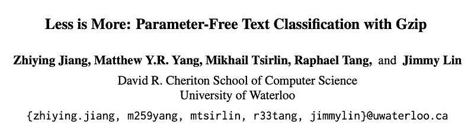
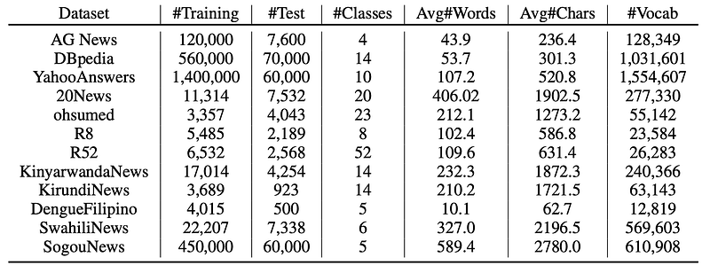
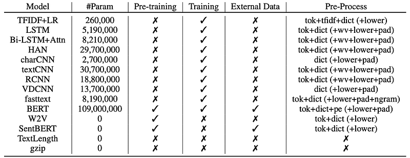
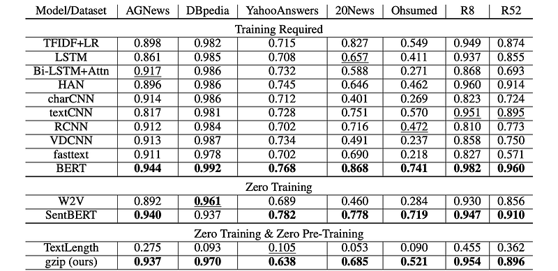
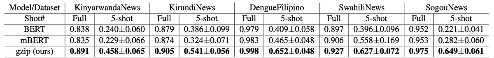

# Papers Explained: Text Classification with Gzip

**Source**: `raw/text-classification-gzip/full-article.html`  
**Ingested**: 2026-05-12  
**Tags**: #summary

## Summary

This article explains the paper "Less is More: Parameter-Free Text Classification with Gzip" ([arXiv 2212.09410](https://arxiv.org/abs/2212.09410)), which introduces a surprisingly competitive approach to text classification that requires no neural network, no training, no preprocessing, and no hyperparameter tuning. The method combines a standard lossless compressor (gzip) with a k-nearest-neighbor classifier, using [[Normalized Compression Distance]] (NCD) as the similarity measure.

The theoretical grounding is [[Kolmogorov Complexity]], which defines the information content of an object as the length of the shortest program that can generate it. Because Kolmogorov complexity is uncomputable in practice, NCD approximates it using real compression algorithms: the NCD between two texts x and y is computed by compressing each alone and then concatenating them — the smaller the joint compressed size relative to the individual sizes, the more similar the texts are in informational terms.

On standard in-distribution benchmarks (AG News, R8, R52), gzip+kNN performs within a narrow margin of non-pretrained deep models and beats them on several medium/small datasets. The method's real strength emerges in out-of-distribution (OOD) settings — particularly on low-resource languages (Filipino, Swahili) and domains underrepresented in BERT's pretraining data — where it consistently outperforms both BERT and mBERT without any fine-tuning.

The main weakness is on large-vocabulary datasets like YahooAnswers, where performance drops ~7% below neural methods, likely because compression becomes less effective at capturing similarity when the vocabulary is vast and sparse.

## Key Claims

- NCD approximates [[Kolmogorov Complexity]] using compressors like gzip: `NCD(x,y) = [C(xy) − min{C(x),C(y)}] / max{C(x),C(y)}`.
- The method requires **no training, no preprocessing, and no hyperparameter tuning**.
- Achieves results competitive with non-pretrained deep neural networks on in-distribution datasets.
- **Outperforms BERT and mBERT on all five OOD datasets tested**, including low-resource and non-English settings.
- Particularly effective on datasets that are easily compressible (short texts, repetitive patterns).
- Performance degrades on large-vocabulary datasets (~7% below neural methods on YahooAnswers).
- mBERT can underperform English BERT on languages it was trained on (Kinyarwanda, Kirundi, Pinyin) in few-shot settings; gzip+kNN beats both in those cases.
- The TextLength baseline performs near random chance, confirming that compression length alone (without concatenation) carries little class signal.

## Figures

| Figure | Caption |
|--------|---------|
|  | Article header / visual banner for the gzip+kNN text classification method. |
|  | Datasets used for evaluation: in-distribution and OOD benchmarks spanning multiple languages and domains. |
|  | Baseline models used for comparison (BERT, mBERT, character-based, word-based, TFIDF-LR, etc.). |
|  | Accuracy on in-distribution datasets. Gzip+kNN is competitive with non-pretrained deep models, especially on medium/small datasets. |
|  | Out-of-distribution results. Gzip+kNN outperforms BERT and mBERT by a large margin across all five OOD datasets. |

The in-distribution results  show gzip+kNN particularly shining on R8 and R52 (smaller datasets) while lagging on YahooAnswers. The OOD results  are where the method's bias-free design pays off most clearly.

## Entities

- [[Normalized Compression Distance]] — the core similarity metric that drives the kNN classifier.
- [[Kolmogorov Complexity]] — theoretical foundation; NCD approximates it using real compressors.
- [[k-Nearest Neighbors]] — the classifier used once NCD distances are computed.
- [[Embedding and Retrieval]] — related category; NCD provides a non-embedding, compression-based similarity measure.
- [[Model Compression and Efficiency]] — gzip is used here as a similarity tool, not for model compression, but the conceptual overlap is relevant.
- [[Evaluation and Benchmarks]] — the paper evaluates on AG News, DBpedia, YahooAnswers, R8, R52, SogouNews (in-distribution) and five OOD multilingual datasets.

## Questions & Gaps

- How does the method scale in inference time? Each test item requires computing NCD against every training item — O(n) compressions per prediction.
- Would a better compressor (e.g. bz2, zstd) consistently improve results, or is gzip near the practical ceiling for this approach?
- The paper does not explore ensemble approaches combining NCD with lightweight token-based features.
- Performance on very long documents (e.g., full papers) is not tested.

## Related

- [[Normalized Compression Distance]] — the key mathematical tool the method relies on.
- [[Kolmogorov Complexity]] — theoretical foundation for NCD.
- [[k-Nearest Neighbors]] — the classifier wrapped around the NCD similarity measure.
- [[Embedding and Retrieval]] — NCD is a non-embedding alternative to learned similarity.
- [[Model Compression and Efficiency]] — tangentially related through the use of compression algorithms.
- [[gzip Predicts Data-dependent Scaling Laws]] — companion paper also using gzip as an information-theoretic tool: there, compressibility characterizes data complexity to predict neural scaling law parameters rather than serving as a similarity metric.
