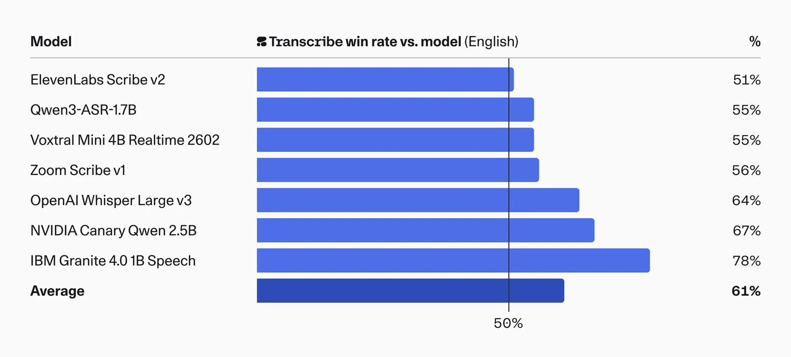
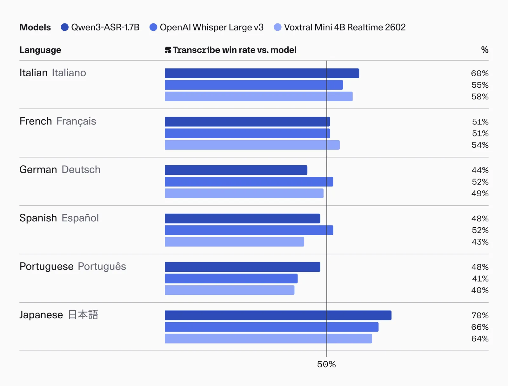
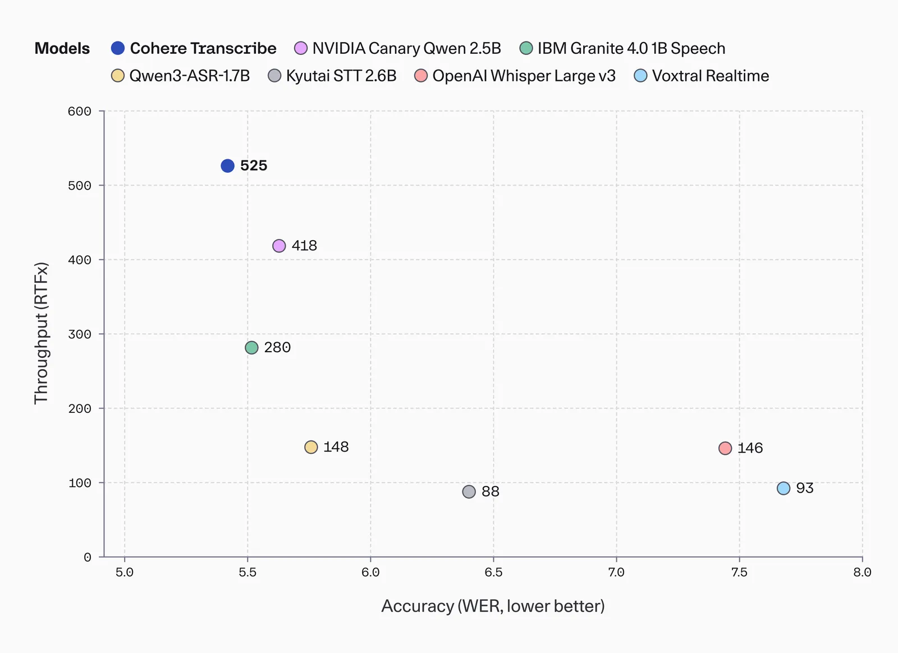

# Introducing Cohere Transcribe

**Source**: `raw/transcribe/full-article.md` (379 KB), `raw/transcribe/full-article.md` (markdown view)  
**URL**: https://cohere.com/blog/transcribe  
**Ingested**: 2026-06-06  
**Tags**: #summary

## Summary

Cohere announces **Transcribe** (`cohere-transcribe-03-2026`), an open-weights automatic speech recognition (ASR) model aimed at enterprise speech workloads—meeting transcription, speech analytics, and real-time support agents. The system is a **2B-parameter Conformer encoder–decoder** trained from scratch on log-Mel spectrograms with supervised cross-entropy, supporting **14 languages** under the **Apache 2.0** license.

The blog positions Transcribe as production-ready rather than a research artifact: manageable GPU/local inference footprint, strong serving efficiency, and availability via Hugging Face download, a rate-limited API, or Cohere's managed **Model Vault**. On the HuggingFace **Open ASR Leaderboard**, Transcribe ranks first with **5.42% average WER**, ahead of dedicated ASR systems including Whisper Large v3 and ElevenLabs Scribe v2. Human preference evaluations on English and multilingual audio reportedly align with benchmark gains. Throughput benchmarks claim a favorable accuracy–speed tradeoff (RTFx vs WER) among 1B+ models. Future work targets integration with **North**, Cohere's agent orchestration platform, toward broader enterprise speech intelligence.

## Key Claims

- `cohere-transcribe-03-2026` is a 2B Conformer encoder-decoder ASR model trained from scratch on 14 languages (Apache 2.0).
- **5.42% average WER** on the HuggingFace Open ASR Leaderboard—#1 among evaluated models as of Mar 26, 2026.
- Outperforms Whisper Large v3 (7.44% avg WER), ElevenLabs Scribe v2 (5.83%), Qwen3-ASR-1.7B (5.76%), and other leading dedicated ASR systems on the same benchmark suite.
- Strong results on challenging subsets: AMI multi-speaker (8.13% WER), Earnings 22 (10.86%), Voxpopuli accents (5.87%).
- Human preference evaluations show Transcribe preferred over competitors on English and selected multilingual audio.
- Best-in-class throughput (RTFx) among 1B+ models while maintaining lowest WER—extends the accuracy–speed Pareto frontier.
- Available open-weights on Hugging Face, via API (rate-limited), and Model Vault for production inference.

## Figures

| Figure | Caption | Page |
|--------|---------|------|
|  | Conformer ASR architecture: speech audio to text across 14 languages | — |
|  | HuggingFace Open ASR Leaderboard standings (Mar 26, 2026) | — |
|  | Human preference evaluation on English transcripts (pairwise) | — |
|  | Human evaluation of ASR accuracy across supported languages | — |
|  | Throughput (RTFx) vs accuracy (WER) for 1B+ ASR models | — |

## Entities

- [[Cohere]] — authors; open-weights ASR release and Model Vault serving.
- [[Audio Models]] — topic context for dedicated speech recognition systems.

## Questions & Gaps

- No detailed training data composition, compute budget, or data-cleaning methodology published in the blog.
- Human evaluation protocol details (pair count, audio domains, competitor set) are summarized but not fully specified.
- RTFx throughput numbers and hardware configs are shown graphically without tabulated values in the post.
- North integration timeline and API surface for speech intelligence remain future work.

## Related

- [[Audio Models]] — ASR, speech, and audio-language model landscape in the wiki.
- [[Large Language Models]] — adjacent modality expansion as speech becomes a core enterprise AI input.
