# How Transformers Work in Deep Learning and NLP: An Intuitive Introduction

**Source**: `raw/transformer/full-article.html` (472 KB), `raw/transformer/full-article.md` (markdown view)  
**URL**: https://theaisummer.com/transformer/  
**Author**: Nikolas Adaloglou (AI Summer), 2020-12-24  
**Ingested**: 2026-06-06  
**Tags**: #summary

## Summary

This AI Summer tutorial is the sequel to [[How Attention Works in Deep Learning: Understanding the Attention Mechanism in Sequence Models]] and walks through the original Transformer architecture (Vaswani et al. 2017) from first principles. Nikolas Adaloglou argues transformers replace sequential [[Recurrent Neural Networks|RNN]] processing by feeding the **entire input at once** as a set of tokens: tokenization → [[Word Embedding|word embeddings]] → sinusoidal **positional encodings** restore order information transformers would otherwise lack (permutation invariance).

The core mechanism is scaled dot-product [[Self-Attention]] framed as a database lookup: **queries** search **keys** to weight **values**. \(\text{Attention}(Q,K,V) = \text{softmax}(QK^T / \sqrt{d_k}) V\) computes data-dependent dynamic weights (contrast with slowly learned linear layers). Each encoder block stacks multi-head self-attention, [[Skip Connections|residual connections]], layer normalization, and a 4×-expanded MLP (two linear layers + ReLU + dropout). **Multi-head attention** runs \(h\) parallel attention subspaces (e.g. 8 heads × 64 dims = \(d_{model}=512\)), concatenated and projected — allowing different representation subspaces at different positions.

The decoder adds **masked** self-attention (causal mask prevents peeking at future tokens) and **encoder–decoder (cross) attention** where encoder outputs supply keys/values and decoder states supply queries — the learned English–French alignment layer. Adaloglou explains why transformers succeed: distributed contextual representations at every block, global pairwise associations (no locality bias), depth stacking abstract pair-of-pairs structure, and skip connections enabling top-down gradient flow. Self-attention weights are **fast weights** (input-dependent); linear/conv weights are **slow weights** (SGD-updated).

## Key Claims

- Transformers eliminate sequential RNN dependencies by processing all tokens in parallel after embedding.
- Tokenization treats input as a **set** (order-agnostic); positional encodings inject position via sinusoids added to embeddings.
- Sinusoidal PE: \(PE_{(pos,2i)} = \sin(pos / 10000^{2i/d_{model}})\); even/odd dims use sin/cos pairs.
- Q/K/V analogy: query = search; keys = index; values = retrieved content (from information retrieval).
- Scaled dot-product attention: \(\text{softmax}(QK^T/\sqrt{d_k})V\); \(\sqrt{d_k}\) scaling prevents gradient explosion.
- Attention matrix = **where** to look; Value matrix = **what** to retrieve.
- Encoder block order: multi-head self-attention → LN → residual → MLP (512→2048→512) → LN → residual; stacked \(N=6\) times in the original paper.
- Practice often uses **pre-norm** (LN before residual) vs paper's post-norm description.
- Multi-head attention: \(h\) independent heads in parallel; concatenated and projected by \(W^O\); captures different contextual/positional segments.
- Decoder adds masked self-attention + cross-attention to encoder output + final linear + softmax for next-token prediction.
- Causal mask \(M\) sets future positions to \(-\infty\) before softmax in decoder self-attention.
- Cross-attention: encoder output → K,V; masked-decoder output → Q; learns input–output word alignment.
- Self-attention weights are **data-dependent** (fast); linear/conv weights change slowly via SGD.
- Original model trained on WMT 2014 En–Fr: 36M sentences, 32k tokens.
- Transformers extend beyond NLP to vision (ViT) by 2020; article cites multiple parallel attention paths as analogous to conv feature maps.

## Figures

| Figure | Caption | Page |
|--------|---------|------|
| 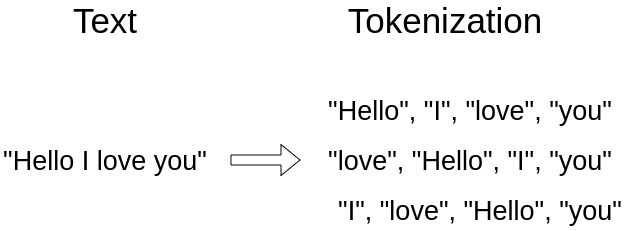 | Tokenization: sentence split into discrete tokens | — |
| 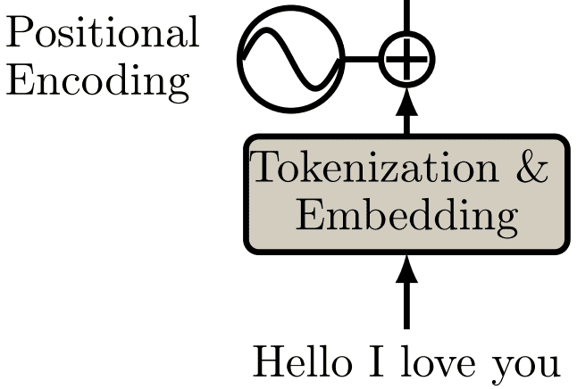 | Input pipeline: tokenization, embedding, positional encoding | — |
| 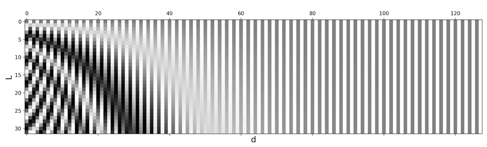 | Sinusoidal positional encoding visualization (Lil'Log) | — |
| 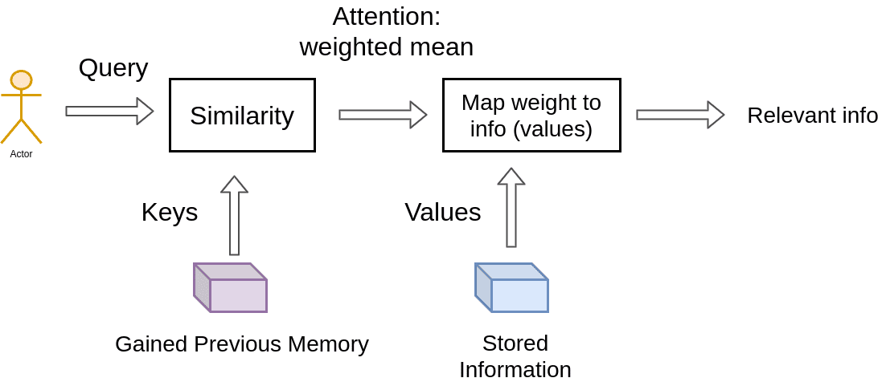 | Attention as database query: Q/K/V retrieval analogy | — |
| 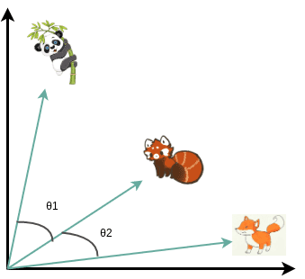 | Vector similarity via normalized inner product (cosine) | — |
| 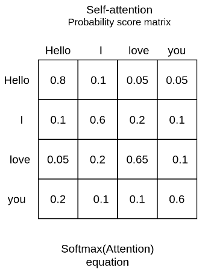 | Self-attention probability score matrix for "Hello I love you" | — |
| 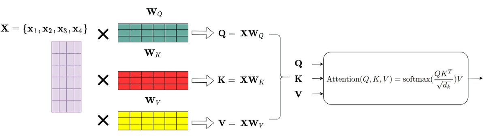 | Q, K, V matrix projections from input embeddings | — |
| 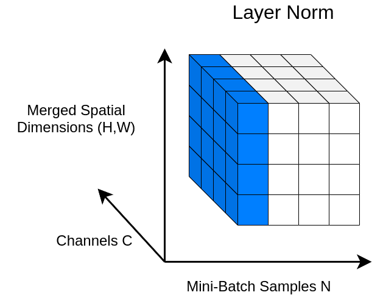 | Layer normalization across feature dimensions | — |
| 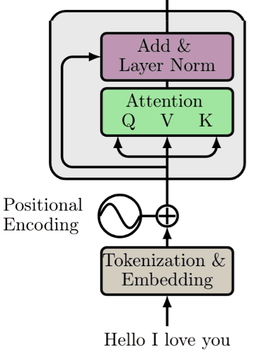 | Encoder sublayer: self-attention + LN + residual | — |
| 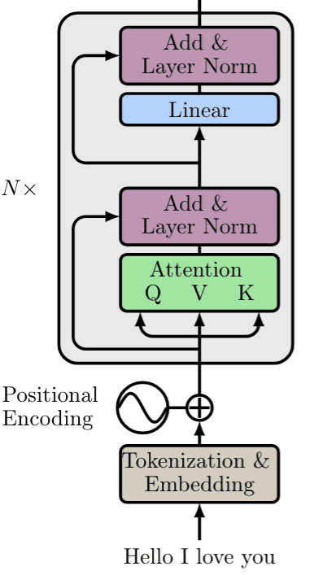 | Full encoder block without multi-head (single attention path) | — |
| 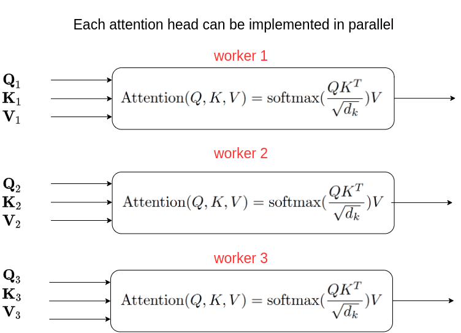 | Parallel multi-head attention computation | — |
| 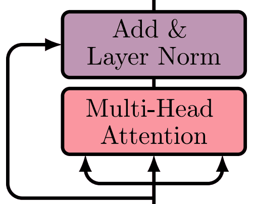 | Multi-head attention diagram (concatenated heads) | — |
| 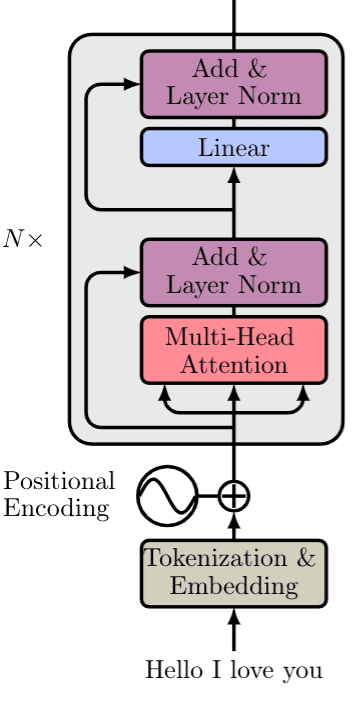 | Complete Transformer encoder stack (6 blocks) | — |
| 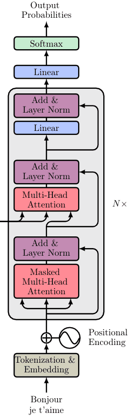 | Transformer decoder with masked and cross-attention | — |

Three-step input prep: tokenize, embed, add positional encodings before the first attention layer.

Input \(X\) is linearly projected into query, key, and value matrices for attention scoring.

Multiple parallel attention heads attend to different subspaces; outputs are concatenated and projected.

Decoder blocks add causal masking and encoder–decoder cross-attention for seq2seq generation.

## Entities

- [[AI Summer]] — educational blog publishing this transformer tutorial (2020).
- [[Nikolas Adaloglou]] — primary author.
- [[Self-Attention]] — fundamental transformer building block; scaled dot-product formulation detailed here.
- [[Multi-Head Attention]] — parallel attention subspaces; core encoder/decoder component.
- [[Positional Encoding]] — sinusoidal position signals added to embeddings.
- [[Attention Mechanism]] — prior article establishes seq2seq attention; this article extends to full transformer.
- [[Word Embedding]] — continuous token representations before positional encoding.
- [[Encoder-Decoder Architecture]] — transformer retains encoder–decoder structure with cross-attention.
- [[Skip Connections]] — residual paths around attention and MLP sublayers.
- [[Papers Explained 01 - Transformer]] — primary paper ingested in the Papers Explained corpus.
- [[Lilian Weng]] — cited for positional-encoding visualization (Transformer Family post).
- Vaswani et al. (2017) — "Attention Is All You Need"; original architecture.

## Questions & Gaps

- Does not implement transformer from scratch (points to separate einsum tutorial).
- Pre-norm vs post-norm noted but not benchmarked.
- No discussion of modern variants (RoPE, ALiBi, RMSNorm, SwiGLU FFN).
- Training details (warmup, label smoothing) omitted beyond dataset size.
- Citation block incorrectly titles "Transformers in Computer Vision" (likely copy-paste from a later article).
- BERT/GPT decoder-only vs encoder-only architectures mentioned only briefly in conclusion context.

## Related

- [[How Positional Embeddings Work in Self-Attention (Code in PyTorch)]] — trainable absolute/relative PE inside MHSA; extends sinusoidal input encoding with vision-oriented variants.
- [[Why Multi-Head Self Attention Works: Math, Intuitions and 10+1 Hidden Insights]] — deep-dive on why self-attention and multi-head work; research insights on head pruning, rank, and efficient variants.
- [[How Attention Works in Deep Learning: Understanding the Attention Mechanism in Sequence Models]] — direct prerequisite: seq2seq attention, self-attention introduction.
- [[Papers Explained 01 - Transformer]] — canonical paper summary in the wiki corpus.
- [[Papers Explained Review 09 - Attention Layers]] — scaled dot-product attention in Papers Explained review series.
- [[Recurrent Neural Networks: Building a Custom LSTM Cell]] — RNN foundation transformers replace for parallel training.
- [[Large Language Models]] — modern LLMs built on transformer blocks.
- [[How the Vision Transformer (ViT) Works in 10 Minutes: An Image Is Worth 16×16 Words]] — applies the encoder-only transformer stack to image patch sequences for classification.
- [[KV Cache]] — inference optimization for autoregressive transformer decoding.
- [[Learning Word Embedding]] — embedding theory underlying token representations.
