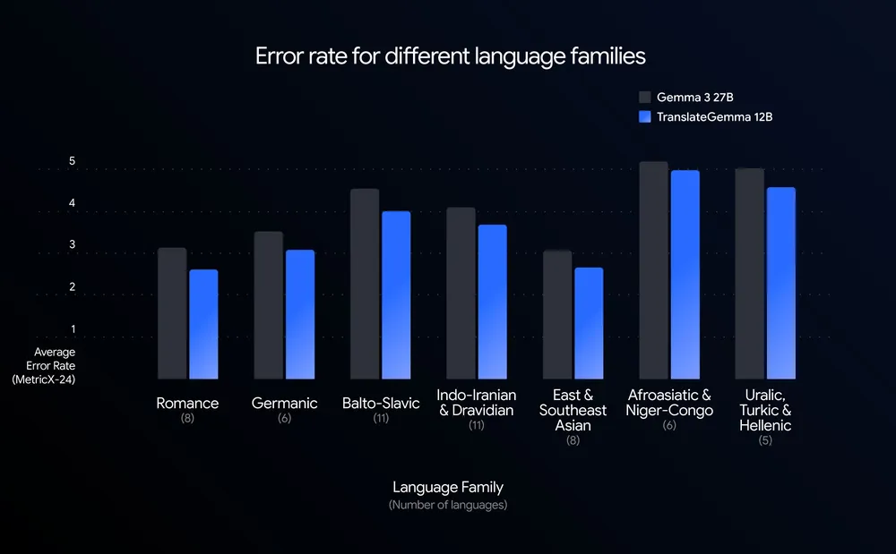

# TranslateGemma

**Source**: `raw/translategemma/full-article.html` (375 KB)  
**URL**: https://blog.google/innovation-and-ai/technology/developers-tools/translategemma/  
**Published**: Jan 15, 2026  
**Ingested**: 2026-06-06  
**Tags**: #summary

## Summary

Google introduces **TranslateGemma**, an open translation model family built on Gemma 3 in **4B, 12B, and 27B** sizes. The suite targets **55 evaluated language pairs** (high-, mid-, and low-resource families) with a two-stage post-training pipeline that **distills Gemini** knowledge: supervised fine-tuning on parallel human data plus synthetic Gemini translations, followed by reinforcement learning guided by MetricX-QE and AutoMQM reward models.

The headline efficiency result: **12B TranslateGemma beats Gemma 3 27B** on WMT24++ (MetricX), delivering research-grade quality at under half the baseline parameters. The 4B model rivals the 12B Gemma 3 baseline, positioning it for mobile inference. TranslateGemma retains Gemma 3 multimodal ability — Vistra image-translation benchmarks improve even without multimodal-specific fine-tuning. Models ship on Kaggle, Hugging Face, the Gemma Cookbook, and Vertex AI. Deeper training detail is in [[Papers Explained 527 - TranslateGemma]] and the [technical report](https://arxiv.org/pdf/2601.09012).

## Key Claims

- Open translation models on Gemma 3 at 4B, 12B, and 27B parameter sizes.
- 55 language pairs rigorously trained and evaluated on WMT24++; ~500 additional pairs for community fine-tuning.
- 12B model outperforms Gemma 3 27B baseline on WMT24++ (MetricX); 4B rivals 12B Gemma 3 baseline.
- Two-stage training: SFT on human + Gemini synthetic parallel data, then RL with MetricX-QE / AutoMQM rewards.
- Retains Gemma 3 multimodal capabilities; text-translation gains transfer to image text translation (Vistra).
- Deployment tiers: 4B for mobile/edge, 12B for consumer laptops, 27B for single H100/TPU cloud serving.

## Figures

| Figure | Caption | Page |
|--------|---------|------|
|  | Average translation error rate by language family vs Gemma 3 baseline (WMT24++) | — |

## Entities

- [[Google DeepMind]] — Gemma/TranslateGemma release org; Gemini distillation source.
- [[Multilingual Models]] — 55-language open translation suite.
- [[Model Compression and Efficiency]] — 12B beating 27B baseline on WMT24++.

## Questions & Gaps

- Extended ~500 language-pair training set lacks confirmed eval metrics in the blog.
- Per-language WMT24++ tables and human-eval protocol live in the technical report.
- Comparison to commercial MT systems (DeepL, etc.) not covered in this post.

## Related

- [[Papers Explained 527 - TranslateGemma]] — independent explainer of training and benchmarks.
- [[Papers Explained 329 - Gemma 3]] — base architecture and multimodal capabilities.
- [[Command A Translate: Secure Translation for Global Enterprises]] — complementary enterprise MT product from Cohere.
- [[Multilingual Models]] — topic hub for translation and cross-lingual model work.
- [[Model Compression and Efficiency]] — smaller models matching larger baselines.
- [[Google DeepMind]] — open translation model releases distilling Gemini.
