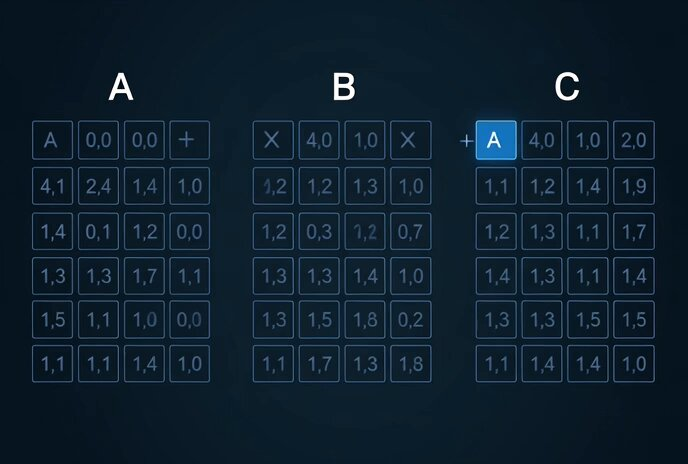
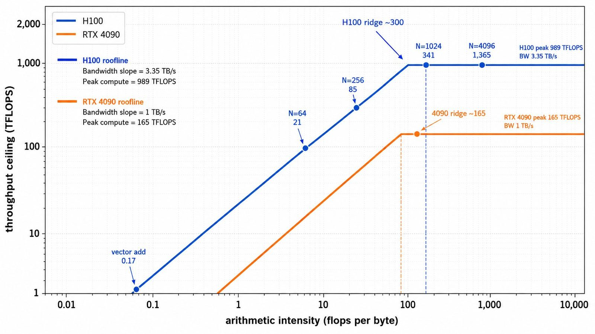
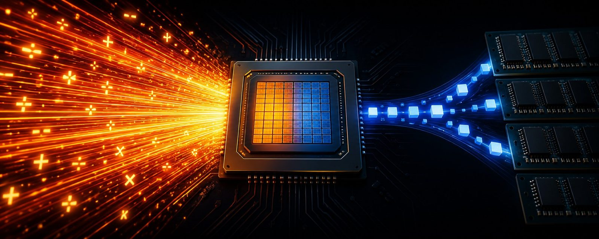

# Two Speeds of a GPU

**Source**: `raw/two-speeds-of-a-gpu/full-article.html`, `raw/two-speeds-of-a-gpu/full-article.md`  
**Ingested**: 2026-08-23  
**Tags**: #summary

## Summary

A tutorial article by Adam Mainz (@MainzOnX) establishing a mental model for GPU performance limits through arithmetic intensity and the Roofline Model. Mainz explains that modern GPUs operate under two independent throughput ceilings that are severely imbalanced: peak arithmetic compute throughput (measured in TFLOPS) and peak memory bandwidth (measured in GB/s or TB/s). Over the last decade, compute hardware grew much faster than memory bus bandwidth. On modern accelerators like the NVIDIA H100 SXM5, peak BF16 compute reaches 989 TFLOPS while HBM3 memory bandwidth reaches 3.35 TB/s, yielding a hardware balance ratio of ~295 (roughly 300) FLOPs per byte moved.

The article illustrates this imbalance using a kitchen analogy: a chef who can chop 100 vegetables per minute is paired with a runner who takes a full minute to retrieve an ingredient from the storeroom. Because each vegetable requires only a split-second chop, the kitchen's output is capped at 1 vegetable per minute by the runner, leaving the chef idle for 59 seconds (a memory-bound workload). However, if the recipe changes such that each vegetable requires a full minute of intricate dicing, the chef works continuously while the runner travels, flipping the bottleneck entirely to the chef (a compute-bound workload).

This distinction directly mirrors tensor operations. For a 1M-element BF16 vector add (`c = a + b`), the operation performs 1 million FLOPs but moves 6 MB of data, yielding an arithmetic intensity of ~0.17 FLOPs/byte; on an H100, the math takes ~1 ns while memory movement takes ~1.8 &mu;s, leaving the chip compute cores ~1,800&times; underutilized (memory-bound). In contrast, an $N \times N$ matrix multiplication performs $\sim 2N^3$ FLOPs while moving $\sim 6N^2$ bytes, giving an arithmetic intensity of $N/3$ FLOPs/byte that scales with $N$. For a $4096 \times 4096$ BF16 matmul, arithmetic intensity reaches ~1,365 FLOPs/byte; on an H100, compute takes 138 &mu;s while memory movement takes 29 &mu;s, making the operation compute-bound.

Plotting these constraints creates the Roofline Model: a slanted ceiling governed by memory bandwidth ($y = \text{Bandwidth} \times I$) and a flat ceiling governed by peak arithmetic capacity ($y = \text{Peak Compute}$). The intersection represents the machine's ridge point (e.g., ~300 FLOPs/byte on H100, ~165 FLOPs/byte on RTX 4090). Workloads with arithmetic intensity below the ridge point are memory-bound (benefiting from kernel fusion, reduced precision/quantization, and caching), while workloads above the ridge point are compute-bound (benefiting from higher clock speeds, tensor cores, and algorithmic FLOP reduction).

## Key Claims

- Modern GPUs possess two independent throughput ceilings: compute capacity (TFLOPS) and memory bandwidth (TB/s), which are heavily tilted toward compute.
- On an NVIDIA H100 SXM5, peak BF16 compute is 989 TFLOPS and HBM3 bandwidth is 3.35 TB/s, establishing a hardware ridge point of ~300 FLOPs per byte; on an RTX 4090, the ridge point is ~165 FLOPs per byte.
- Arithmetic intensity is the ratio of total arithmetic operations (FLOPs) to total bytes moved across GPU global memory ($\text{FLOPs} / \text{Byte}$).
- Elementwise operations (vector add, ReLU, standalone activations) have very low arithmetic intensity (e.g., 0.17 FLOPs/byte for 1M vector add) and are heavily memory-bound, leaving compute units >99% idle.
- Matrix multiplication has arithmetic intensity scaling as $O(N)$ (specifically $\approx N/3$ FLOPs/byte for $N \times N$ BF16 matmul under optimal on-chip tile reuse); small matmuls ($N=64$, intensity ~21) are memory-bound, while large matmuls ($N=4096$, intensity ~1365) are compute-bound.
- The Roofline Model visually bounds attainable performance as $\text{Performance} = \min(\text{Peak Compute}, \text{Peak Bandwidth} \times \text{Arithmetic Intensity})$, where the ridge point separates memory-bound and compute-bound regimes.

## Figures

| Figure | Caption | File |
|--------|---------|------|
|  | Two speeds of a GPU header banner | `wiki/assets/two-speeds-of-a-gpu/fig-1.jpg` |
|  | The memory-bound kitchen: fast chef waiting for slow runner | `wiki/assets/two-speeds-of-a-gpu/fig-2.jpg` |
|  | The compute-bound kitchen: chef working continuously while runner fetches | `wiki/assets/two-speeds-of-a-gpu/fig-3.jpg` |
|  | Matrix multiplication arithmetic scaling ($2N^3$ FLOPs) vs memory scaling ($6N^2$ bytes) | `wiki/assets/two-speeds-of-a-gpu/fig-4.jpg` |
|  | The Roofline Model: Slanted memory roof, flat compute roof, and hardware ridge point | `wiki/assets/two-speeds-of-a-gpu/fig-5.jpg` |

## Entities

- [[Adam Mainz]] — author of the article; AI/ML performance engineer.
- [[NVIDIA]] — manufacturer of GPU architectures featured in the benchmarks (H100 SXM5, RTX 4090).
- [[PyTorch]] — framework running tensor operations and kernel dispatches analyzed in the article.

## Questions & Gaps

- The analysis assumes ideal SRAM/L1 cache reuse where each matrix byte is fetched from HBM exactly once ($N/3$ intensity); sub-optimal tiling or cache thrashing will reduce effective arithmetic intensity.
- Does not explore transformer-specific multi-head attention intensity, where memory traffic scales with sequence length $S$ ($O(S^2)$ vs $O(S)$ in FlashAttention).

## Related

- [[What Even Is a Kernel?]] — companion article (Part 1) explaining GPU kernel launches, eager mode round-trips, and `torch.compile` fusion.
- [[Arithmetic Intensity]] — concept page on the FLOPs-to-bytes ratio governing kernel efficiency.
- [[Roofline Model]] — concept page on performance modeling with compute and memory ceilings.
- [[GPU Inference Hardware]] — overview of modern GPU architectures (Hopper, Blackwell) and memory bandwidth tiers.
- [[Inference Engineering]] — comprehensive book covering memory-bound decode vs compute-bound prefill.
