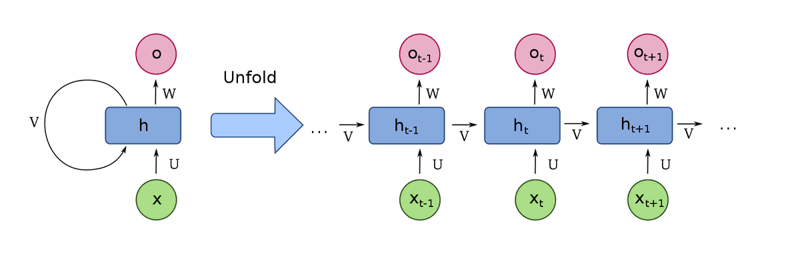
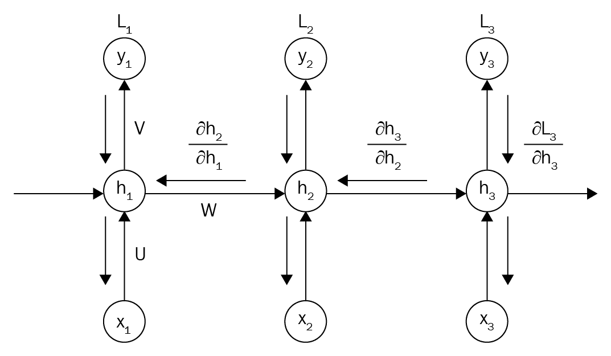
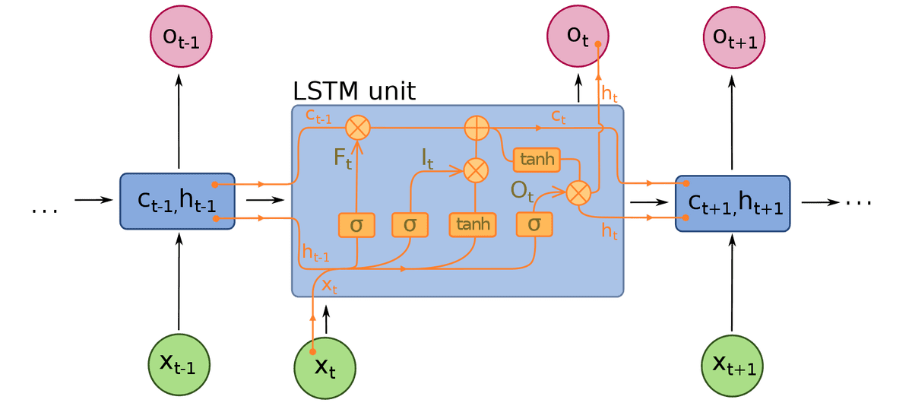
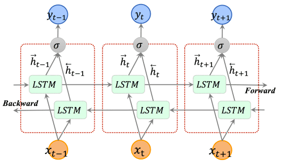
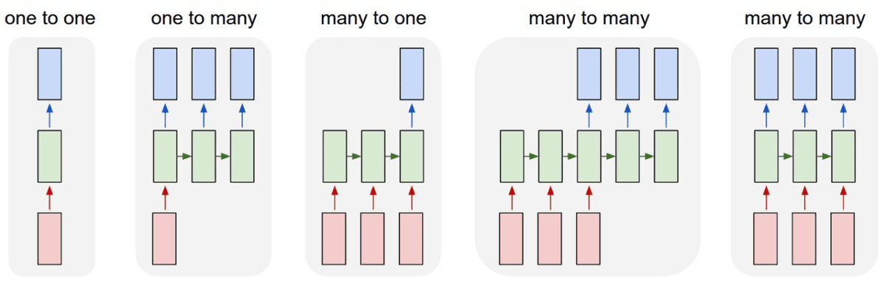

# Recurrent Neural Networks: Building a Custom LSTM Cell

**Source**: `raw/understanding-lstm/full-article.html` (491 KB), `raw/understanding-lstm/full-article.md` (markdown view)  
**URL**: https://theaisummer.com/understanding-lstm/  
**Author**: Nikolas Adaloglou (AI Summer), 2020-09-10  
**Ingested**: 2026-06-06  
**Tags**: #summary

## Summary

This AI Summer tutorial demystifies [[Recurrent Neural Networks]] for practitioners coming from computer vision. Nikolas Adaloglou argues that frameworks hide the time dimension behind abstractions, and that understanding sequence unrolling is prerequisite to designing efficient architectures. A vanilla RNN cell connects each timestep's output back to the next input with **shared weights**, giving the first notion of memory; unlike [[Convolutional Neural Networks]] on grids, recurrent layers target variable-length sequences (video frames, text, sensor streams).

Training requires **backpropagation through time (BPTT)**: a length-\(N\) sequence is unrolled into \(N\) copies of the same cell, each with identical parameters. Losses are computed per timestep and gradients from all paths are summed — analogous to gradient accumulation across micro-batches. Time and space complexity grow linearly with sequence length, which caps practical training on very long sequences. The article cites Karpathy's warning that RNNs do not "magically" accept sequences without architectural intent.

The core of the piece is a gate-by-gate walkthrough of [[LSTM]] equations (input, forget, cell update, output, hidden state), aligned with PyTorch's implementation (no peephole connections from \(c_{t-1}\) into input/forget gates). Greff et al. (2016) motivates focusing on standard LSTM over many variants. Adaloglou then implements `LSTM_cell_AI_SUMMER` in PyTorch, stacks two cells to predict a sine wave (replacing `nn.LSTMCell`), and validates parity with the official example — a sanity-check workflow for custom layers. The tutorial closes with temporal vs spatial stacking, [[Bidirectional RNN]] tradeoffs (doubled parameters, concatenated outputs), flexible input–output mappings, and RNN vs conv **receptive field**: RNNs theoretically model infinite context while CNNs have finite [[Receptive Field]] unless dilated or deepened.

## Key Claims

- RNN cells process sequential data with shared weights across timesteps; output at \(t\) feeds input at \(t{+}1\) via unrolling.
- BPTT represents an RNN as a repeated feedforward network; gradients from all timesteps sum into shared parameters.
- RNN forward/backward time and space complexity is asymptotically **linear in sequence length**.
- Greff et al. (2016): LSTM variants show no significant improvement over standard LSTM at scale — LSTM remains the dominant gated RNN.
- LSTM gates: input \(i_t\), forget \(f_t\), cell \(c_t = f_t \odot c_{t-1} + i_t \odot \tanh(\cdot)\), output \(o_t\), hidden \(h_t = o_t \odot \tanh(c_t)\).
- PyTorch/TensorFlow use simplified LSTM without peephole connections (\(c_{t-1}\) in input/forget gate linear terms).
- Weight matrix first index = vector processed; second index = gate representation.
- Stacking LSTMs in **time**: unroll hidden/cell states across timesteps; in **space**: hidden output of layer \(k\) becomes input to layer \(k{+}1\).
- Custom PyTorch LSTM cell reproduces sine-wave prediction from official PyTorch LSTM example when swapped in.
- Bidirectional LSTM doubles parameters; forward and backward hidden states are concatenated — only useful when reverse-time context matters.
- RNNs offer theoretically infinite receptive field for long-term dependencies; CNNs have finite RF (see [[Receptive Field]], [[Dilated Convolution]]).
- Recurrent models support flexible input-to-output sequence mappings (many-to-one, one-to-many, many-to-many).

## Figures

| Figure | Caption | Page |
|--------|---------|------|
|  | RNN cell time unrolling: shared-weight cell repeated across timesteps | — |
|  | Input unrolling and backpropagation through time (BPTT) | — |
|  | LSTM unit structure: gates, cell state, and hidden state flow | — |
|  | Bidirectional LSTM: forward and backward passes with concatenated outputs | — |
|  | RNN input-to-hidden, hidden-to-hidden, and hidden-to-output connection patterns | — |

Unrolling connects each timestep's hidden state to the next input, implementing memory with shared parameters.

BPTT treats the unrolled graph as a deep feedforward net; gradients from each timestep accumulate into the same weights.

Standard LSTM block diagram showing input, forget, and output gates modulating cell and hidden states.

## Entities

- [[AI Summer]] — educational blog publishing this LSTM tutorial (2020).
- [[Nikolas Adaloglou]] — primary author.
- [[Recurrent Neural Networks]] — architecture family the tutorial explains from first principles.
- [[LSTM]] — gated memory cell derived and implemented step by step.
- PyTorch — framework used for the custom cell and validation example (no wiki entity page yet).
- [[Bidirectional RNN]] — forward/backward extension discussed with parameter-cost tradeoffs.
- [[Deep Learning]] — textbook treatment of LSTM/GRU complements this practitioner guide.

## Questions & Gaps

- Sine-wave validation is a toy task; no comparison on NLP or video benchmarks.
- GRU comparison now covered in [[Recurrent Neural Networks: Building GRU Cells VS LSTM Cells in PyTorch]].
- Does not cover truncated BPTT, gradient clipping, or vanishing/exploding gradient mitigations in depth.
- Pre-transformer era framing; limited discussion of when transformers supersede LSTMs in practice.
- Peephole LSTM variant mentioned but not implemented or benchmarked.

## Related

- [[Deep Learning]] — Chapter 10 canonical LSTM/GRU and sequence-model theory.
- [[GRU]] — lighter gated alternative; see [[Recurrent Neural Networks: Building GRU Cells VS LSTM Cells in PyTorch]].
- [[Recurrent Neural Networks: Building GRU Cells VS LSTM Cells in PyTorch]] — direct sequel with GRU equations and LSTM-vs-GRU tradeoffs.
- [[Vanishing Gradients]] — motivation for LSTM gates over vanilla RNNs.
- [[Backpropagation Through Time]] — training mechanism central to this tutorial.
- [[Encoder-Decoder Architecture]] — common LSTM application pattern for seq2seq.
- [[Understanding the Receptive Field of Deep Convolutional Networks]] — same author's RF survey; RNN-vs-CNN receptive-field comparison cross-links here.
- [[Bidirectional RNN]] — expanded treatment of reverse-time processing.
