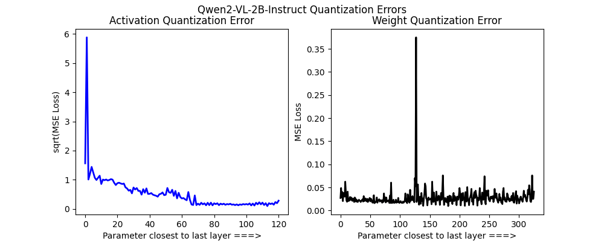

# Unsloth Dynamic Quantization

**Ingested**: 2026-07-22  
**Tags**: #summary #topic

## Summary

Unsloth's **dynamic quantization** line selectively quantizes layers by sensitivity rather than uniform 4-bit QLoRA. Evolution: **Dynamic 4-bit** (per-layer bit allocation), **DeepSeek R1 1.58-bit** dynamic GGUF, and **Dynamic 2.0** GGUFs with improved MMLU/KLD tradeoffs. Goal: maximize compression while minimizing perplexity and downstream task regression.

## Key Claims

- **Dynamic 4-bit** (dynamic-4bit): layer-wise quantization map; sensitive layers stay higher precision; reports better MMLU vs uniform 4-bit at same VRAM.
- **DeepSeek R1 dynamic** (deepseekr1-dynamic): **1.58-bit** GGUF variant for reasoning model; KLD vs full-precision baseline tracked.
- **Dynamic 2.0** (dynamic-v2): refined lattice + selective layers; improved GGUF compatibility (llama.cpp, Ollama).
- Benchmarking uses **MMLU** and **KLD** on calibration sets—not just perplexity.
- Integrates with Unsloth export pipeline post-QLoRA.

## Figures

| Figure | Caption |
|--------|---------|
|  | Dynamic quant error vs uniform 4-bit (MMLU/KLD) |

## Entities

- [[Model Compression and Efficiency]] — quantization taxonomy.
- [[DeepSeek]] — R1 1.58-bit target model.
- [[Unsloth]] — implementation.

## Questions & Gaps

- Optimal layer-selection heuristic not fully open-sourced.
- 1.58-bit reasoning quality on math/code vs FP16 needs broader evals.

## Related

- [[Unsloth Quantization-Aware Training]]
- [[Unsloth Model Support 2025]]
- [[GGUF]]

## Sources

- `raw/dynamic-4bit/full-article.html`
- `raw/deepseekr1-dynamic/full-article.html`
- `raw/dynamic-v2/full-article.html`
