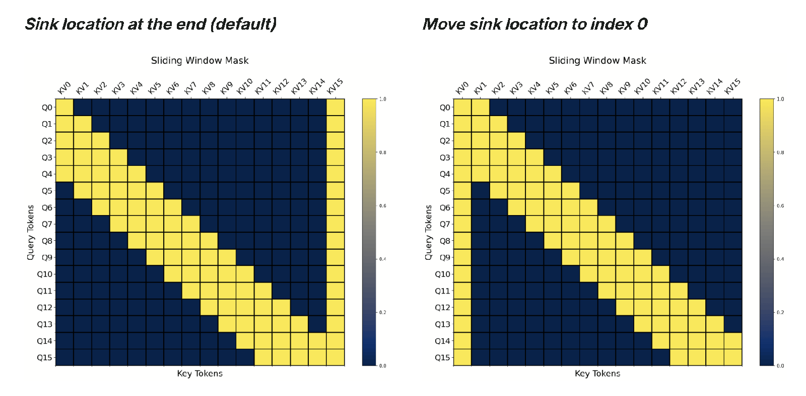
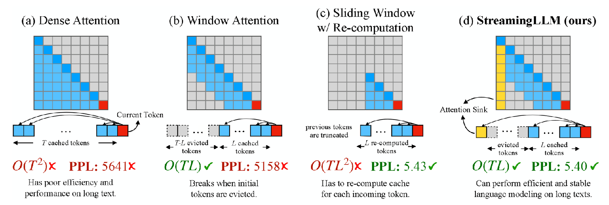

# Unsloth Long Context Training

**Ingested**: 2026-07-22  
**Tags**: #summary #topic

## Summary

Unsloth attacks long-context **training** memory and speed via async gradient checkpointing, **Flex Attention** masks, **attention sinks**, chunked fused loss, and **Tiled MLP**. Coverage spans generic long-context fine-tuning (long-context), **GPT-OSS** 128K+ recipes (gpt-oss-context), and **500K context** extreme fine-tuning (500k-context-length-fine-tuning). Llama 3.3's Apple **Cut Cross Entropy** is cross-referenced from the 2024 model page.

## Key Claims

- **Async gradient checkpointing** (long-context): overlap recompute with backward pass; ~30% step-time reduction at 32K+.
- **GPT-OSS context** (gpt-oss-context): **Flex Attention** block-sparse masks + **attention sinks** for stable 128K training on consumer GPUs.
- **500K fine-tuning** (500k-context-length-fine-tuning):
  - **Chunked fused cross-entropy** — never materialize full `[seq, vocab]` logits.
  - **Tiled MLP** — shard MLP forward/backward along sequence dimension.
- **Cut Cross Entropy** (Llama 3.3): Apple trick to avoid full vocab logits; Unsloth kernel integration.
- RoPE scaling (YaRN, PI) must match inference engine at export time.

## Figures

| Figure | Caption |
|--------|---------|
|  | Attention sinks + Flex Attention mask pattern |
|  | Tiled MLP memory timeline vs standard MLP |

## Entities

- [[Flex Attention]] — PyTorch 2.5+ block-sparse attention API.
- [[Attention Sinks]] — sink tokens stabilizing long-context attention.
- [[Cut Cross Entropy]] — vocab-sliced CE for memory savings.
- [[Tiled MLP]] — sequence-sharded MLP for 500K training.
- [[Unsloth Gradient Checkpointing]] — async checkpointing variant.
- [[Long Context]] — topic hub.
- [[KV Cache]] — inference-side counterpart.

## Questions & Gaps

- 500K training still requires multi-GPU for 70B+; single-GPU limits undocumented.
- Flex Attention portability to non-CUDA backends.

## Related

- [[Unsloth Model Support 2024]]
- [[Unsloth Training Efficiency and Kernels]]
- [[Sliding Window Attention]]
- [[Long Context]]

## Sources

- `raw/long-context/full-article.html`
- `raw/gpt-oss-context/full-article.html`
- `raw/500k-context-length-fine-tuning/full-article.html`
