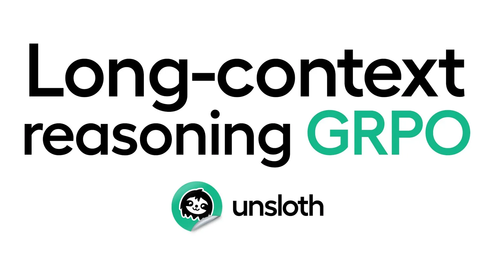

# Unsloth Reinforcement Learning

**Ingested**: 2026-07-22  
**Tags**: #summary #topic

## Summary

Unsloth's RL stack centers on **GRPO** for reasoning models, extended to long context, vision (**GSPO**), FP8, and memory-efficient multi-model training. Sources cover DeepSeek R1 reasoning recipes, GRPO tutorials, VLM-RL, GPT-OSS reward hacking, custom RL environments, and Standby weight-sharing for fitting actor+ref+reward on one GPU.

## Key Claims

| Topic | Key point |
|-------|-----------|
| R1 reasoning (r1-reasoning) | GRPO intro for DeepSeek-style reasoning fine-tunes |
| GRPO (grpo) | Default optimizer; no critic network; group-relative advantages |
| GRPO long context (grpo-long-context) | 32K+ RL with chunked loss + packing |
| Memory-efficient RL (memory-efficient-rl) | **Standby** mode: weight-sharing across actor/ref/reward models |
| FP8 RL (fp8-reinforcement-learning) | FP8 actor training; ~40% VRAM savings |
| VLM RL (vision-reinforcement-learning-vlm-rl) | **GSPO** for vision-language GRPO variant |
| GPT-OSS RL (gpt-oss-reinforcement-learning) | Reward hacking mitigations; format rewards |
| RL environments (rl-environments) | Custom Gym-style envs for tool-use / code RL |

- Integrates with TRL `GRPOTrainer` + Unsloth kernels.
- **RLVR** alignment for math/reasoning verifiable rewards (cross-ref [[Reinforcement Learning with Verifiable Rewards]]).

## Figures

| Figure | Caption |
|--------|---------|
|  | GRPO vs PPO: no value network |
|  | GSPO vision-language reward flow |

## Entities

- [[GRPO]] — core algorithm.
- [[GSPO]] — vision GRPO variant.
- [[Reinforcement Learning with Verifiable Rewards]] — verifiable reward RL.
- [[Reinforcement Learning Topic]] — parent topic.
- [[Reward Hacking]] — GPT-OSS failure mode.
- [[DeepSeek]] — R1 reasoning target.
- [[Unsloth]] — RL memory optimizations.

## Questions & Gaps

- Standby mode interaction with FSDP/multi-GPU.
- GSPO generality beyond specific VLM architectures.

## Related

- [[Unsloth Model Support 2025]]
- [[Unsloth Training Efficiency and Kernels]]
- [[GRPO]]
- [[GSPO]]
- [[Reinforcement Learning Topic]]

## Sources

- `raw/r1-reasoning/full-article.md`
- `raw/grpo/full-article.md`
- `raw/grpo-long-context/full-article.md`
- `raw/memory-efficient-rl/full-article.md`
- `raw/fp8-reinforcement-learning/full-article.md`
- `raw/vision-reinforcement-learning-vlm-rl/full-article.md`
- `raw/gpt-oss-reinforcement-learning/full-article.md`
- `raw/rl-environments/full-article.md`
