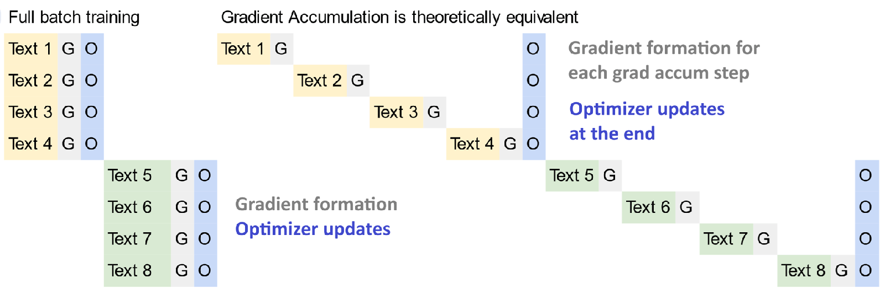

# Unsloth Training Efficiency and Kernels

**Ingested**: 2026-07-22  
**Tags**: #summary #topic

## Summary

Core Unsloth engineering: **gradient accumulation loss fix**, **3× faster packing** (padding-free / sample packing), **faster MoE**, **NVIDIA collaboration** kernels, and **continued pretraining** recipes. These optimizations sit below model-specific pages and power the headline 2–30× speedups.

## Key Claims

- **Gradient accumulation fix** (gradient): correct loss scaling when `gradient_accumulation_steps > 1`; prior HF+TRL stacks under-weighted accumulated gradients.
- **3× faster packing** (3x-faster-training-packing):
  - Fused **QK RoPE** in attention.
  - **Padding-free** / **sample packing** — multiple sequences per batch without pad tokens.
  - ~3× throughput on variable-length SFT data.
- **Faster MoE** (faster-moe): fused expert routing, grouped GEMM, memory-efficient expert parallelism for DeepSeek/Llama 4/Qwen3 MoE.
- **NVIDIA collab** (nvidia-collab): packed-metadata caching, double-buffered checkpointing, MoE bincount routing optimizations.
- **Continued pretraining** (contpretraining): domain-adaptive pretrain from base checkpoints with Unsloth memory tricks.

## Figures

| Figure | Caption |
|--------|---------|
|  | Sample packing attention pattern (no pad waste) |
|  | Gradient accumulation correct vs incorrect loss scaling |

## Entities

- [[Sample Packing]] — training efficiency concept.
- [[Gradient Accumulation]] — micro-batch scaling.
- [[Mixture of Experts]] — MoE kernel targets.
- [[NVIDIA]] — co-developed optimizations.
- [[Continued Pretraining]] — CPT workflow.
- [[Unsloth]] — Triton kernel author.
- [[Native-Speed vLLM Transformers Modeling Backend]] — inference cross-ref.

## Questions & Gaps

- Packing requires careful attention-mask construction; failure modes with multimodal data.
- MoE speedups hardware-dependent (H100 vs A100 vs consumer).

## Related

- [[Unsloth Origins and Mission]]
- [[Unsloth Long Context Training]]
- [[Unsloth Model Support 2025]]
- [[Mixture of Experts]]

## Sources

- `raw/gradient/full-article.html`
- `raw/3x-faster-training-packing/full-article.html`
- `raw/faster-moe/full-article.md`
- `raw/nvidia-collab/full-article.html`
- `raw/contpretraining/full-article.html`
