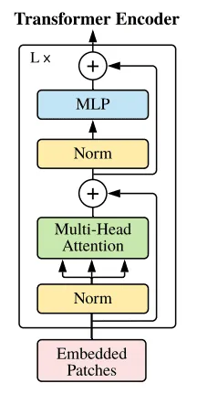
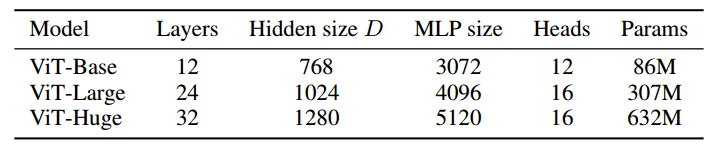
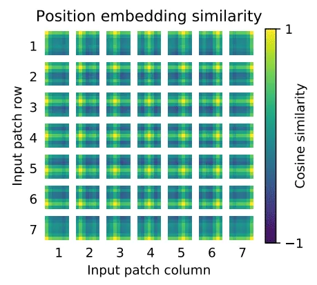
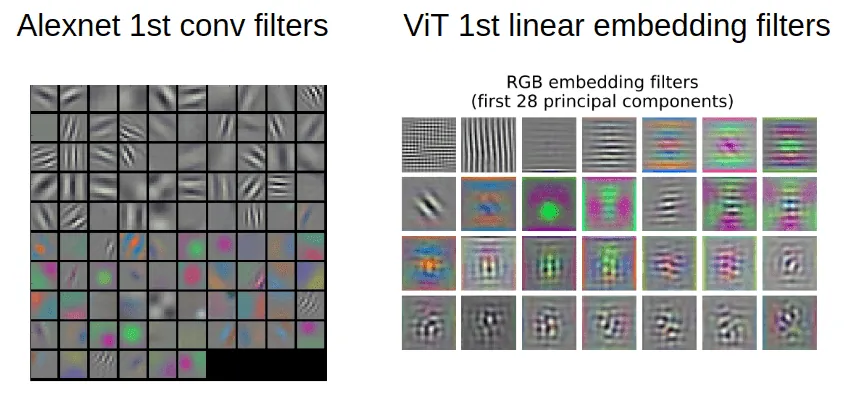
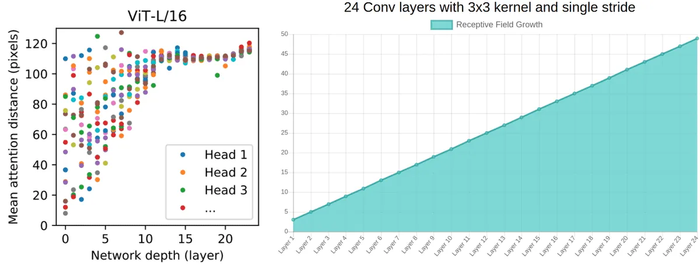

# How the Vision Transformer (ViT) Works in 10 Minutes: An Image Is Worth 16×16 Words

**Source**: `raw/vision-transformer/full-article.md` (360 KB), `raw/vision-transformer/full-article.md` (markdown view)  
**URL**: https://theaisummer.com/vision-transformer/  
**Author**: Nikolas Adaloglou (AI Summer), 2021-01-28  
**Ingested**: 2026-06-06  
**Tags**: #summary

## Summary

This AI Summer follow-up to [[How Transformers Work in Deep Learning and NLP: An Intuitive Introduction]] explains how Dosovitskiy et al.'s [[Vision Transformer]] (ViT) adapts the standard transformer **encoder** for image classification with minimal architectural changes. [[Convolutional Neural Networks|CNNs]] bake in translation invariance and local [[Receptive Field|receptive fields]] via convolution; transformers are **permutation invariant** and expect sequences — so ViT **tokenizes images as patches**: split → flatten → linear embed → add [[Positional Embeddings]] → stack identical transformer encoder blocks → classify via an MLP head (no decoder).

The engineering insight is treating each \(P \times P\) patch (e.g. 16×16×3 = 768 dims) as a "word," giving sequence length \(N = HW/P^2\). A learnable **[CLS] token** (borrowed from BERT) supplies the global representation for classification. Three scale variants (Base / Large / Huge) differ in depth, [[Multi-Head Attention]] heads, and MLP width while keeping hidden dimension \(D\) fixed for short [[Skip Connections|residual skip connections]].

Data scale is the catch: ViT needs **>14M labeled images** (JFT-scale pretraining) to match or beat strong CNNs; on smaller datasets, [[ResNet]] or [[EfficientNet]] remain better choices. The standard recipe is large-scale pretrain → fine-tune downstream by swapping the MLP head for a \(D \times K\) classifier. Authors recommend **fine-tuning at higher resolution** than pretraining, with **2D interpolation** of learned position embeddings. Adaloglou also analyzes ViT's emergent behavior: early-layer global attention within patches, depth-growing mean attention distance (analogous to RF growth), localized attention heads that resemble early conv filters, and semantically meaningful attention maps for classification.

## Key Claims

- ViT pipeline: patchify image → flatten → `nn.Linear(P²C, D)` → add trainable position embeddings → standard transformer encoder → MLP classification head.
- Encoder block is **identical** to Vaswani et al. (2017); only the number of blocks and model width vary across ViT-Base/Large/Huge.
- **No decoder**; classification uses a prepended CLS token and final linear layer (NLP-style pooling trick).
- Hidden size \(D\) is constant across layers to enable short residual paths.
- ViT approaches SOTA CNNs only when trained on **≥14M images**; otherwise prefer ResNets or EfficientNets.
- Fine-tuning: replace pretrained MLP head with \(D \times K\) layer for \(K\) downstream classes.
- Fine-tuning at **higher resolution** than pretraining works via 2D interpolation of position embeddings (they are trainable, not fixed sinusoids).
- Patch sequence length \(N = HW/P^2\); title "16×16 words" refers to 16×16 patches flattened to 768-dim tokens.
- Einops `rearrange` elegantly reshapes `b c (h p1) (w p2) -> b (h w) (p1 p2 c)` for square patches.
- At patch granularity, many positional embedding schemes performed similarly; trainable absolute embeddings suffice.
- Learned position embeddings exhibit **2D spatial structure** after training; sinusoidal PE used for high-resolution fine-tuning.
- Early ViT patch-projection weights (PCA visualization) can resemble smooth AlexNet first-layer filters (CS231n comparison).
- For patch size \(P\), max within-patch attention distance is \(P \times P\) (128 for 16×16) **from layer 1** — global pixel interactions without stacked conv layers.
- Mean attention distance grows with depth, paralleling receptive-field growth in conv nets.
- Some early-layer heads maintain small attention distances; hybrid ResNet→Transformer models show **fewer** highly localized heads (conv layers substitute that role).
- Attention distance metric: \(\sum d \cdot w\) over query-to-pixel distances weighted by attention; averaged over 128 images.
- Attention maps highlight semantically relevant image regions for the predicted class.
- Full PyTorch ViT implementation uses `self_attention_cv.TransformerEncoder`, CLS token, and trainable 1D position embeddings.

## Figures

| Figure | Caption | Page |
|--------|---------|------|
|  | ViT pipeline animation: image → patches → transformer encoder → classification (Google AI blog) | — |
|  | Standard transformer encoder block used inside ViT (Dosovitskiy et al. 2020) | — |
|  | ViT-Base / Large / Huge model configuration table (layers, heads, MLP size, hidden dim) | — |
|  | Learned 2D positional embeddings after training (Dosovitskiy et al. 2020) | — |
|  | First-layer filter visualization: AlexNet (CS231n) vs ViT patch projections (PCA) | — |
|  | Mean attention distance per head vs depth: ViT (left) vs 24-layer 3×3 conv net (right) | — |
|  | ViT attention maps attending to semantically relevant regions (Dosovitskiy et al. 2020) | — |

Images become sequences of patch tokens fed to a standard transformer encoder — the core ViT design move.

ViT reuses the NLP transformer encoder block unchanged; patch embedding replaces the word embedding layer.

Base, Large, and Huge differ in depth, attention heads, and MLP width while sharing the same block structure.

Early ViT layers already achieve global within-patch interactions; attention distance grows with depth like conv receptive fields.

## Entities

- [[AI Summer]] — published this ViT primer (2021).
- [[Nikolas Adaloglou]] — author.
- [[Vision Transformer]] — subject architecture; patch-token formulation for image classification.
- [[Self-Attention]] — core mixing mechanism inside each encoder block.
- [[Multi-Head Attention]] — parallel attention heads; ViT-Base uses 12 heads.
- [[Positional Embeddings]] — trainable absolute embeddings added to patch tokens.
- [[Convolutional Neural Networks]] — contrasted for inductive bias (locality, translation invariance).
- [[ResNet]] — recommended baseline when pretraining data is insufficient.
- [[EfficientNet]] — recommended baseline for smaller-scale training.
- [[Papers Explained 25 - Vision Transformers]] — paper-level treatment of the same Dosovitskiy et al. architecture in this wiki.

## Questions & Gaps

- Original JFT-300M pretraining data is proprietary; reproducibility requires alternative large-scale datasets (ImageNet-21k, LAION, etc.).
- Article predates later ViT improvements (DeiT distillation, hybrid CNN stems, hierarchical designs like Swin).
- Does not cover detection/segmentation ViT variants (only classification).
- CLS token vs global average pooling of patch tokens — article uses CLS only.

## Related

- [[How Transformers Work in Deep Learning and NLP: An Intuitive Introduction]] — prerequisite transformer encoder background.
- [[How Positional Embeddings Work in Self-Attention (Code in PyTorch)]] — extends PE discussion with 2D vision variants.
- [[Why Multi-Head Self Attention Works: Math, Intuitions and 10+1 Hidden Insights]] — deeper analysis of attention heads ViT relies on.
- [[Understanding the Receptive Field of Deep Convolutional Networks]] — conv RF concepts contrasted with ViT attention distance.
- [[Best Deep CNN Architectures and Their Principles: from AlexNet to EfficientNet]] — CNN baselines ViT must beat at scale.
- [[Computer Vision]] — topic hub for vision architectures including ViT and successors.
- [[Papers Explained 25 - Vision Transformers]] — primary paper summary for the same model family.
