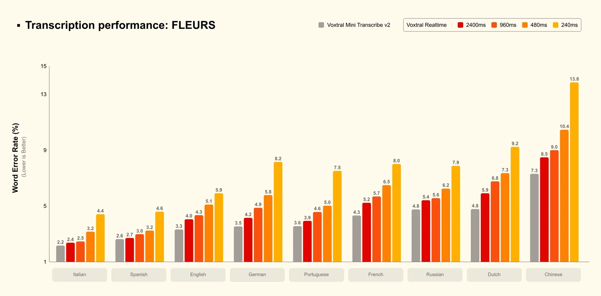
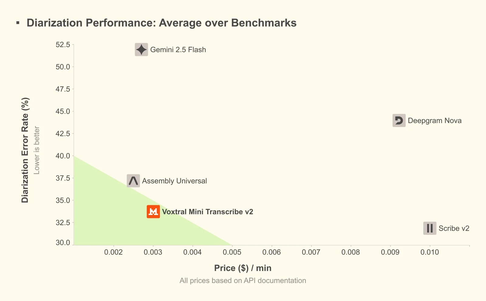
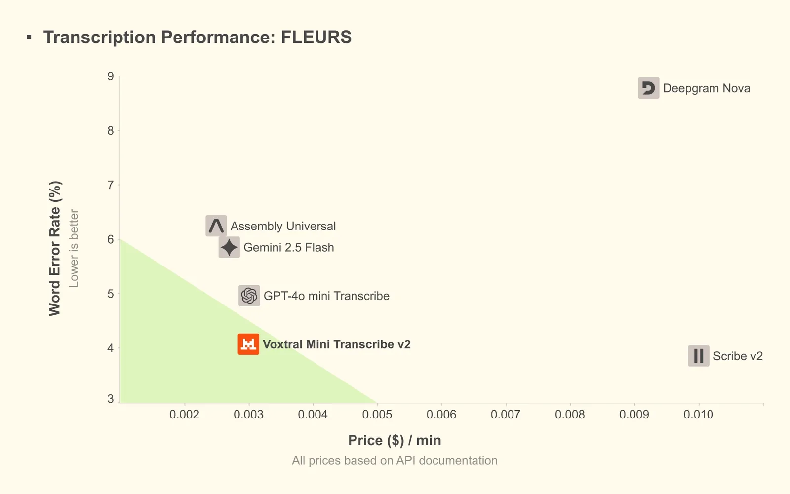
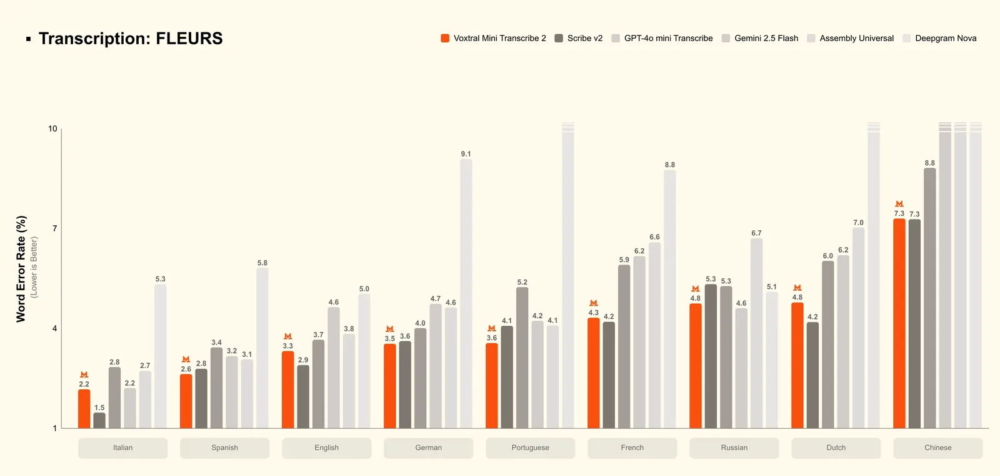

# Voxtral transcribes at the speed of sound.

**Source**: `raw/voxtral-transcribe-2/full-article.html` (223 KB), `raw/voxtral-transcribe-2/full-article.md` (markdown view)  
**URL**: https://mistral.ai/news/voxtral-transcribe-2/  
**Ingested**: 2026-06-06  
**Tags**: #summary

## Summary

Mistral AI releases **Voxtral Transcribe 2**, a next-generation speech-to-text family with SOTA transcription, speaker diarization, and ultra-low latency. **Voxtral Mini Transcribe V2** targets batch transcription with diarization, context biasing, and word-level timestamps in **13 languages** at **$0.003/min**. **Voxtral Realtime** is purpose-built for live streaming transcription with delay configurable down to **sub-200ms** (4B params, Apache 2.0 open weights on Hugging Face, API at **$0.006/min**).

Realtime uses a novel streaming architecture (not chunked offline adaptation): at 2.4s delay it matches Mini Transcribe V2 on FLEURS; at 480ms delay WER stays within 1–2% of offline—enabling voice agents with near-batch accuracy. Mini Transcribe V2 claims ~4% WER on FLEURS top languages, outperforming GPT-4o mini Transcribe, Gemini 2.5 Flash, Assembly Universal, and Deepgram Nova, with ~3× faster processing than ElevenLabs Scribe v2 at one-fifth the cost. An audio playground in Mistral Studio supports instant testing with diarization and timestamps.

## Key Claims

- Two models: Voxtral Mini Transcribe V2 (batch) and Voxtral Realtime (live, Apache 2.0 open weights).
- Realtime: sub-200ms configurable latency; 4B params; 13 languages; edge-deployable.
- Mini Transcribe V2: speaker diarization, context biasing (up to 100 terms), word-level timestamps, 3-hour max audio per request.
- ~4% WER on FLEURS at $0.003/min—claimed best price-performance among compared APIs.
- Realtime at 480ms delay within 1–2% WER of offline; at 2.4s delay matches Mini Transcribe V2.
- Outperforms GPT-4o mini Transcribe, Gemini 2.5 Flash, Assembly Universal, Deepgram Nova on accuracy benchmarks cited.
- GDPR/HIPAA-compliant on-prem and private cloud deployments supported.
- Mistral Studio audio playground: up to 10 files, 1GB each (.mp3, .wav, .m4a, .flac, .ogg).

## Figures

| Figure | Caption | Page |
|--------|---------|------|
|  | Voxtral Realtime WER across FLEURS languages at streaming delay settings | — |
|  | Diarization error rate vs. price per minute (English + TalkBank multilingual) | — |
|  | Transcription WER on FLEURS top-10 languages vs. price per minute | — |
|  | FLEURS WER across languages (Mini Transcribe V2) | — |

## Entities

- [[Audio Models]] — streaming and batch ASR, diarization, speech-to-text APIs.
- [[Large Language Models]] — speech pipelines paired with LLM + TTS for voice agents.

## Questions & Gaps

- No dedicated Papers Explained page yet; technical architecture details limited to blog claims (streaming vs. chunked offline).
- Context biasing optimized for English; other languages experimental.
- Diarization with overlapping speech transcribes one speaker only.

## Related

- [[voxtral]] — original Voxtral speech-understanding release and model family context.
- [[Papers Explained 434 - Voxtral]] — foundational Voxtral architecture and training methodology.
- [[Audio Models]] — ASR, diarization, and real-time speech AI.
- [[voxtral-tts]] — TTS output layer for full speech-to-speech voice pipelines.
- [[Agentic AI]] — voice agents and real-time transcription for conversational AI.
