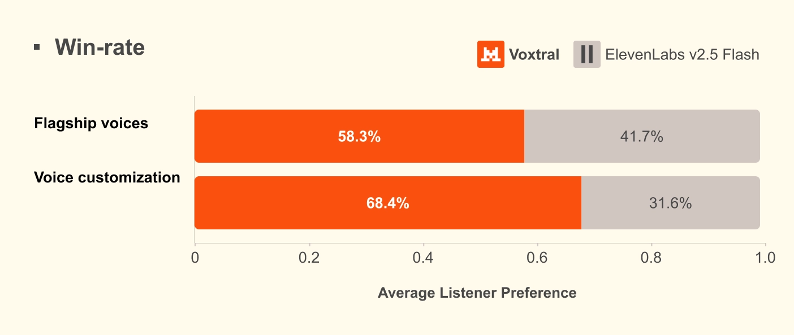
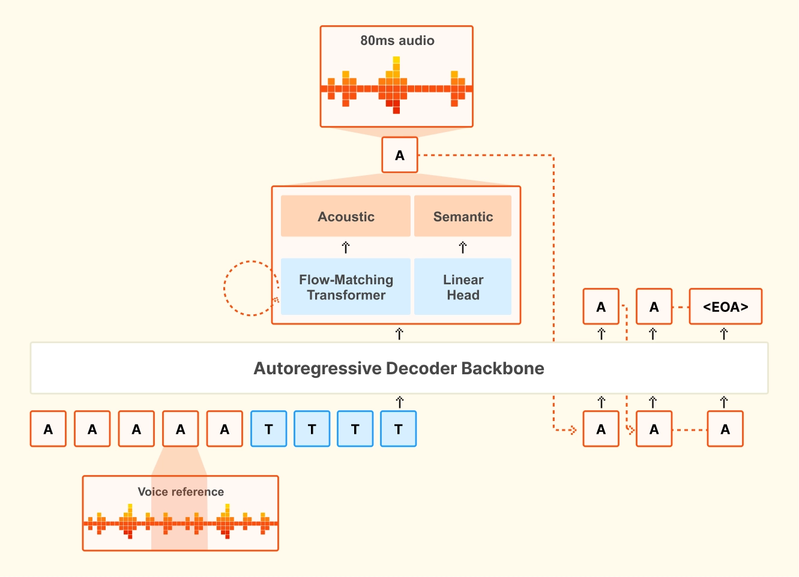

# Speaking of Voxtral

**Source**: `raw/voxtral-tts/full-article.md` (223 KB), `raw/voxtral-tts/full-article.md` (markdown view)  
**URL**: https://mistral.ai/news/voxtral-tts/  
**Ingested**: 2026-06-06  
**Tags**: #summary

## Summary

Mistral AI releases **Voxtral TTS**, its first text-to-speech model—a **4B-parameter** flow-matching TTS system built on Ministral 3B for enterprise voice agents. The model targets realistic, emotionally expressive speech in **9 languages** (English, French, German, Spanish, Dutch, Portuguese, Italian, Hindi, Arabic) with very low time-to-first-audio and instant voice adaptation from as little as **3 seconds** of reference audio.

Human evaluations claim superior naturalness vs. ElevenLabs Flash v2.5 at similar TTFA, and parity with ElevenLabs v3 on quality—including emotion steering. Architecture: 3.4B transformer decoder + 390M flow-matching acoustic transformer + 300M in-house neural codec (semantic VQ + acoustic FSQ at 12.5 Hz). Model latency is **70ms** for a typical 10s voice / 500-char input (RTF ≈9.7×). API pricing: **$0.016 per 1k characters**; reference-voice weights on Hugging Face under CC BY-NC 4.0. Pairs with [[voxtral]] / [[voxtral-transcribe-2]] for full speech-to-speech stacks.

## Key Claims

- 4B-param TTS: 9 languages, diverse dialects, emotional expressiveness, sub-100ms model latency for typical inputs.
- Voice adaptation from 3s reference; captures accent, rhythm, intonation, disfluencies; zero-shot cross-lingual voice transfer (e.g., French-accented English from French prompt).
- Human eval: beats ElevenLabs Flash v2.5 on naturalness at similar TTFA; parity with ElevenLabs v3 on quality.
- Architecture: autoregressive transformer + flow-matching acoustic model + causal in-house codec (12.5 Hz frames).
- RTF ≈9.7×; natively generates up to 2 min audio; API handles longer via interleaving.
- API $0.016/1k chars; Mistral Studio and Le Chat; open weights (reference voices) CC BY-NC 4.0 on Hugging Face.
- Closes enterprise voice loop with Voxtral Transcribe for speech-to-speech or cascaded STT→LLM→TTS.

## Figures

| Figure | Caption | Page |
|--------|---------|------|
|  | Human evaluation win rate: Voxtral TTS vs. ElevenLabs Flash v2.5 (zero-shot custom voice) | — |
|  | Voxtral TTS architecture (transformer + flow-matching + neural codec) | — |

## Entities

- [[Audio Models]] — text-to-speech, voice cloning, and low-latency speech generation.
- [[Large Language Models]] — Ministral 3B decoder backbone for semantic token prediction.
- [[Multilingual Models]] — 9-language TTS with dialect and cross-lingual voice adaptation.

## Questions & Gaps

- Open weights are CC BY-NC 4.0 (non-commercial); full commercial deployment via API.
- Automated metrics (WER, audio quality scores) deemed insufficient; reliance on native-speaker human evals only.
- Research paper referenced but not ingested separately.

## Related

- [[voxtral]] — speech understanding input side of Voxtral audio stack.
- [[voxtral-transcribe-2]] — latest ASR/diarization for speech-to-speech pipelines.
- [[Audio Models]] — TTS, ASR, and end-to-end voice AI.
- [[Agentic AI]] — voice agents requiring low-latency, natural TTS output.
