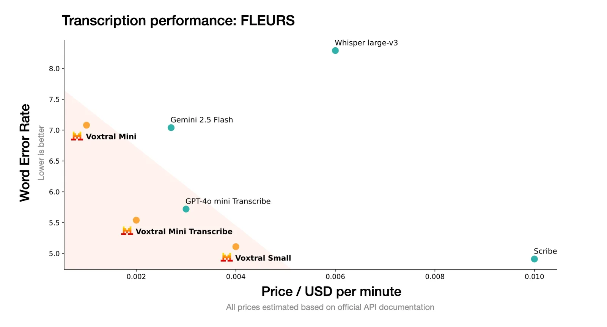
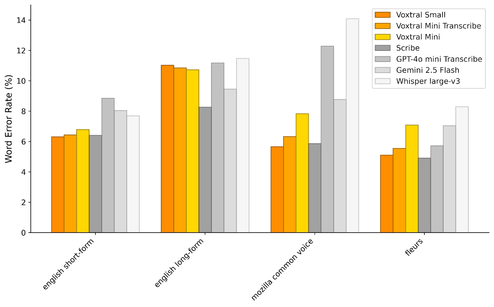
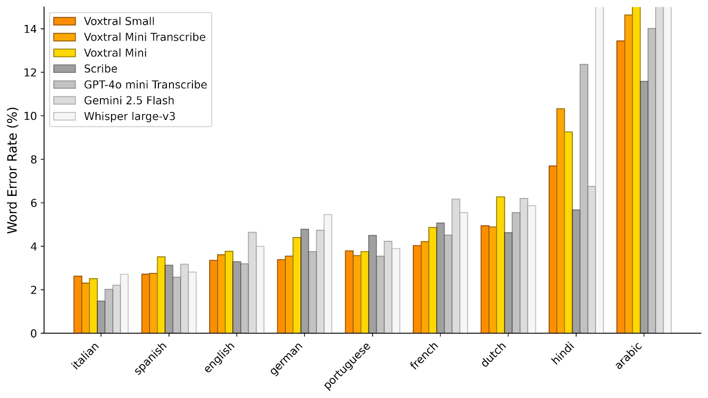
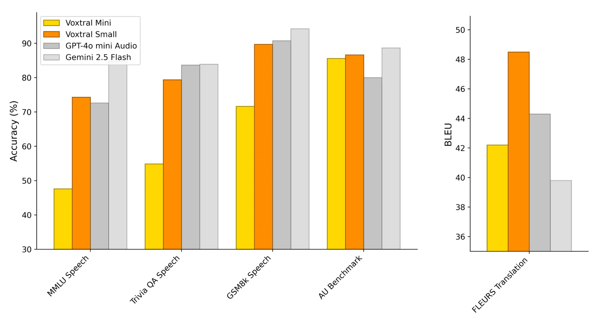
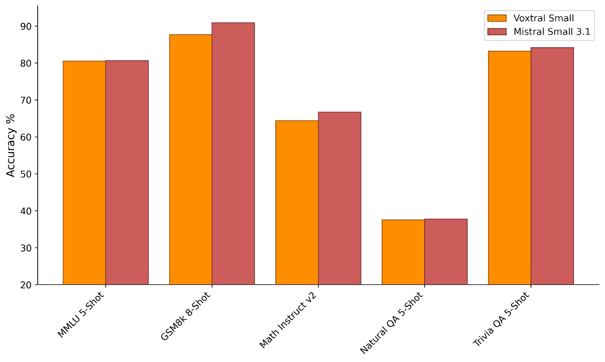

# Voxtral

**Source**: `raw/voxtral/full-article.md` (225 KB), `raw/voxtral/full-article.md` (markdown view)  
**URL**: https://mistral.ai/news/voxtral/  
**Ingested**: 2026-06-06  
**Tags**: #summary

## Summary

Mistral AI releases **Voxtral**, a family of speech-understanding models that combine transcription with native semantic understanding—bridging the gap between high-WER open ASR and expensive closed multimodal APIs. **Voxtral Small** (24B) and **Voxtral Mini** (3B) ship under Apache 2.0 on Hugging Face and via API from **$0.001/minute**. A transcribe-optimized **Voxtral Mini Transcribe** route targets cost-sensitive batch ASR.

Both sizes support **32k-token context** (up to ~30 min transcription / 40 min understanding), built-in Q&A and summarization, multilingual auto-detection, function-calling from voice, and retained text capabilities from Mistral Small 3.1 / Ministral backbones. The blog claims SOTA or near-SOTA transcription vs. Whisper large-v3, GPT-4o mini Transcribe, Gemini 2.5 Flash, and ElevenLabs Scribe—at less than half comparable API cost. Architecture and training are covered in [[Papers Explained 434 - Voxtral]] and the research paper.

## Key Claims

- Two open sizes: Voxtral Small (24B) and Voxtral Mini (3B); Apache 2.0; API from $0.001/min.
- 32k context: ~30 min transcription, ~40 min audio understanding; built-in Q&A, summarization, function-calling from speech.
- Multilingual SOTA or competitive on English short/long-form, Mozilla Common Voice, and FLEURS vs. Whisper, GPT-4o mini Transcribe, Gemini 2.5 Flash, ElevenLabs Scribe.
- Audio understanding competitive with GPT-4o mini and Gemini 2.5 Flash; SOTA speech translation on FLEURS-Translation.
- Retains text LM performance of Mistral Small 3.1 / Ministral—drop-in text replacement.
- Voxtral Mini Transcribe beats Whisper at under half the price; Voxtral Small matches Scribe at under half the price.
- Available on Hugging Face, Mistral API, and Le Chat voice mode; enterprise private deployment and fine-tuning offered.

## Figures

| Figure | Caption | Page |
|--------|---------|------|
|  | Voxtral model family overview (speech understanding stack) | — |
|  | Speech transcription benchmark comparison (macro-average WER) | — |
|  | Audio understanding benchmarks (speech-synthesized text tasks + in-house AU) | — |
|  | Speech translation and long-form audio understanding results | — |
|  | Text benchmark retention vs. Ministral / Mistral Small 3.1 backbone | — |

## Entities

- [[Audio Models]] — multimodal speech understanding, ASR, and audio Q&A.
- [[Large Language Models]] — language-decoder backbones (Ministral 3B, Mistral Small 24B).
- [[Multilingual Models]] — multilingual transcription and understanding across major languages.

## Questions & Gaps

- Blog emphasizes benchmarks and pricing; encoder/adapter architecture and pretraining patterns are in [[Papers Explained 434 - Voxtral]].
- Roadmap items (speaker segmentation, emotion, word timestamps, non-speech audio) announced but not yet shipped.
- Le Chat voice rollout described as phased over weeks.

## Related

- [[Papers Explained 434 - Voxtral]] — architecture (Whisper encoder, adapter, LM decoder), pretraining patterns, and full benchmark tables.
- [[Audio Models]] — speech understanding, ASR, and audio-language models.
- [[Large Language Models]] — backbone LMs and multimodal extensions.
- [[voxtral-transcribe-2]] — successor transcription family (Realtime + Mini Transcribe V2).
- [[voxtral-tts]] — companion TTS model for end-to-end voice pipelines.
