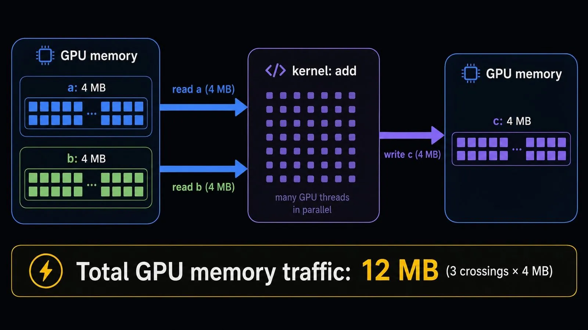
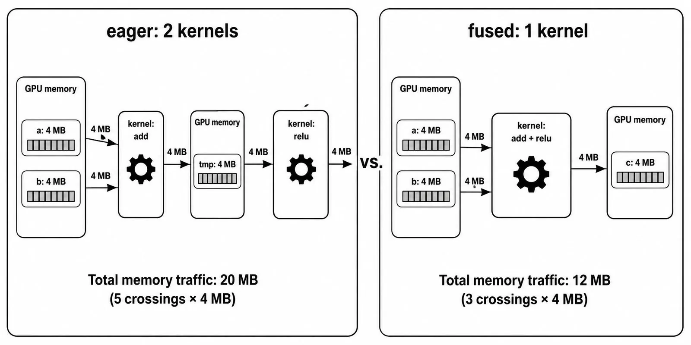
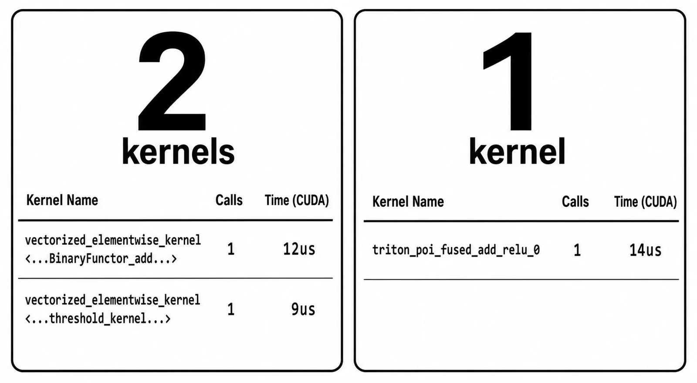
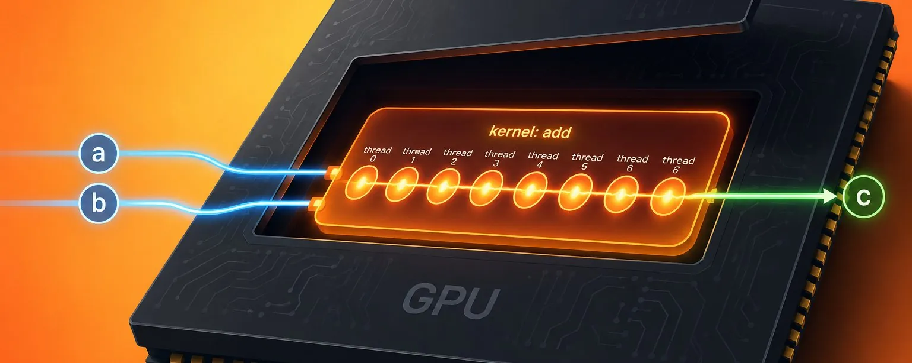

# What Even Is a Kernel?

**Source**: `raw/what-even-is-a-kernel/full-article.md`, `raw/what-even-is-a-kernel/full-article.md`  
**Ingested**: 2026-08-23  
**Tags**: #summary

## Summary

A tutorial article by Adam Mainz (@MainzOnX) that explains what happens physically and logically when PyTorch executes tensor code on a GPU. Moving from a single scalar add up to million-element vectors, Mainz establishes that a GPU kernel is not an operating system kernel or mathematical kernel, but simply a small function executed across thousands of hardware threads in parallel on tensor data living in device memory (HBM on datacenter cards like NVIDIA A100/H100, GDDR on consumer cards like RTX 4090). A kernel execution begins when the host CPU issues a lightweight launch instruction (taking microseconds), after which threads arranged in 32-thread warps read operands, compute results, and write outputs back to GPU memory.

The central performance bottleneck in eager PyTorch execution is that every operation dispatches independently without lookahead. When chaining two operations like `c = (a + b).relu()`, PyTorch dispatches two distinct kernels. The first kernel computes the elementwise addition and writes a full intermediate tensor (`tmp`) out to GPU global memory; moments later, the second kernel launches and reads that entire `tmp` array back in from global memory before computing ReLU and writing the output `c`. Chaining the two ops therefore increases global memory traffic from 3 array-sized transfers to 5, forcing a full round-trip through relatively slow memory.

To eliminate this intermediate memory traffic, operations can be fused into a single kernel where the intermediate result remains strictly inside thread-local registers or scratchpad memory and never touches global memory. While writing fused kernels by hand across arbitrary tensor shapes and broadcast rules is complex, PyTorch provides `torch.compile` to capture computation graphs and automatically generate fused kernels via Triton/Inductor. The article demonstrates this using `torch.profiler`, showing how two eager CUDA kernels (`vectorized_elementwise_kernel` for add and threshold/relu) collapse into a single fused kernel (`triton_poi_fused_add_relu_0`), and highlights the necessity of a warm-up invocation before profiling compiled functions.

## Key Claims

- In GPU computing, a kernel is a small function launched asynchronously by the host CPU and executed in parallel across hardware threads (grouped in 32-thread warps) over data in GPU global memory (HBM/GDDR).
- In PyTorch eager mode, every individual operation dispatches immediately as an isolated kernel, writing intermediate results out to GPU global memory and reading them back for downstream operations.
- A chained operation `(a + b).relu()` executed eagerly launches two kernels requiring 5 array-sized memory transfers (read `a`, read `b`, write `tmp`, read `tmp`, write `c`), compared to 3 transfers for a single operation.
- Kernel fusion combines adjacent operations into a single kernel, keeping intermediate values in thread-local registers or scratchpad memory, reducing memory traffic for `(a + b).relu()` from 5 array transfers down to 3.
- `torch.compile` automates kernel fusion across simple operator chains by generating fused kernels via compiler backends such as Triton and TorchInductor.
- In `torch.profiler`, eager chained elementwise ops show separate CUDA kernel rows (`vectorized_elementwise_kernel`), whereas compiled execution shows a single fused row (e.g., `triton_poi_fused_add_relu_0`).
- The initial call to a `torch.compile`d function incurs JIT compilation overhead, requiring a warm-up invocation before benchmarking kernel execution time.

## Figures

| Figure | Caption | File |
|--------|---------|------|
|  | What even is a kernel? header banner | `wiki/assets/what-even-is-a-kernel/fig-1.webp` |
|  | GPU thread execution and roundtrip memory traffic across HBM/GDDR | `wiki/assets/what-even-is-a-kernel/fig-2.webp` |
|  | Kernel fusion combining add and relu into a single pass without intermediate memory write | `wiki/assets/what-even-is-a-kernel/fig-3.webp` |
|  | Profiler trace comparison: 2 eager CUDA kernels collapsing into 1 fused Triton kernel | `wiki/assets/what-even-is-a-kernel/fig-4.webp` |

## Entities

- [[Adam Mainz]] — author of the article; AI/ML performance engineer (ex-Meta, Google PyTorch TPU).
- [[PyTorch]] — deep learning framework featuring eager execution, `torch.profiler`, and `torch.compile`.
- [[NVIDIA]] — manufacturer of GPUs (A100, H100, RTX 4090) utilizing CUDA thread/warp execution hierarchies.

## Questions & Gaps

- The article focuses on elementwise operation fusion; custom reductions, non-trivial broadcasting, and memory-layout transformations that `torch.compile` cannot automatically fuse require handwritten Triton/CUDA kernels, which are deferred to future articles.
- Does not discuss shared memory caching or register spill constraints when fusing larger blocks of operations (e.g., Attention or MLP blocks).

## Related

- [[Two Speeds of a GPU]] — companion article (Part 2) explaining why memory traffic dominates GPU runtime and introducing arithmetic intensity and the roofline model.
- [[GPU Kernel]] — concept page on GPU kernel execution, launches, and thread organization.
- [[Kernel Fusion]] — concept page on combining operations to minimize global memory round-trips.
- [[Torch Compile]] — concept page on PyTorch 2.x JIT graph compilation and automated kernel fusion.
- [[Profiling in PyTorch (Part 1): A Beginner's Guide to torch.profiler]] — complementary deep dive into Perfetto traces and profiler metrics.
