# Explainable AI (XAI): A Survey of Recent Methods, Applications and Frameworks

**Source**: `raw/xai/full-article.md` (markdown view: `raw/xai/full-article.md`)  
**URL**: https://theaisummer.com/xai/  
**Author**: Ilias Papastratis (AI Summer), 2021-03-04  
**Ingested**: 2026-06-06  
**Tags**: #summary

## Summary

Ilias Papastratis's AI Summer survey introduces **[[Explainable AI]]** (XAI) as the response to deep learning's black-box problem: models that surpass humans on image, speech, and recommendation tasks still fail to justify their predictions, which is unacceptable in safety-critical domains like autonomous driving and medical diagnosis. The article organizes interpretability methods by **explanation modality** — visual (saliency maps, plots), textual (natural-language rationales), and numerical (concept scores, local linear approximations).

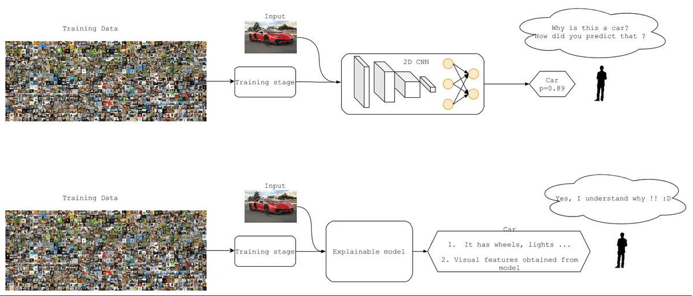

**Visual methods** dominate the survey. **[[Class Activation Mapping]]** (CAM) localizes CNN discriminative regions via global average pooling weights; **[[Grad-CAM]]** generalizes CAM by backpropagating class-specific gradients through the final conv layer to produce coarse heatmaps without architectural constraints. **[[Layer-Wise Relevance Propagation]]** (LRP) decomposes the classification decision backward through layers into pixel relevance scores. Additional visual techniques covered include PRM (weakly supervised segmentation peaks), CLEAR (class-enhanced attentive response), Zeiler deconvolution feature visualization, DeepResolve (feature importance maps for genomics), SCOUTER (slot-attention classifier), and visual-feedback filter attribution.

Plot-based visualizations use **t-SNE** and **PCA** to project hidden activations and scene-factor embeddings (TreeView partitions feature space into interpretable decision trees). **Textual methods** include LSTM cell activation values, Interpnet (internal activations → caption explanations), VQA co-attention maps, semantic-information-guided video captioning, and visual dialog. **Numerical methods** include **[[Concept Activation Vectors]]** (TCAV: user-defined concept sensitivity via binary classifiers on hidden layers), linear probe classifiers on intermediate features (Alain & Bengio), and **[[LIME]]** (local interpretable surrogate models minimizing approximation error plus complexity).

Application sections cover explainable autonomous driving (global scene context + local object branches with spoken rationales; attention maps for traffic-light decisions) and explainable medical imaging (COVID/pneumonia X-ray classification with Grad-CAM lesion highlighting). Frameworks surveyed: **iNNvestigate** (LRP, CAM, PatternNet implementations), **explAIner** (interactive model visualization + explanation-guided optimization), and **InterpretML** (unified Python API for multiple interpretability algorithms).

## Key Claims

- Deep learning models are black boxes; lack of explainability undermines trust and is dangerous in autonomous driving and healthcare where errors can be fatal.
- Interpretability is categorized by explanation form: **visual** (saliency/heatmap/plot), **textual** (NL rationales), **numerical** (concept scores, local linear approximations).
- **CAM** uses GAP-layer weights \(w_c^k\) to produce class activation maps \(M_c(x,y) = \sum_k w_c^k f_k(x,y)\); requires specific CNN architecture (GAP before FC).
- **Grad-CAM** weights feature maps by averaged gradients \(\partial y^c / \partial A_k\), enabling heatmaps on arbitrary CNNs without retraining.
- **LRP** propagates relevance scores backward: \(R^l(i) = \sum_j \frac{x(i)w(i,j)}{\sum_i x(i)w(i,j)} R^{l+1}(j)\).
- **LIME** learns a local surrogate \(g \in G\) minimizing \(L(f,g) + \Omega(g)\) around a prediction — model-agnostic, works on any classifier.
- **TCAV/CAVs** quantify sensitivity of class \(k\) to user-defined concept \(C\) via \(S_{C,k,l} = h_{k,l}(\nabla f_l(x) \cdot u_C^l)\).
- Linear probes on intermediate layers show deeper layers carry more classification-useful information (Alain & Bengio 2016).
- Real-world XAI deployments: explainable self-driving (Xu et al. 2020; Kim et al. 2020 advisable learning) and COVID X-ray diagnosis with Grad-CAM overlays (Brunese et al. 2020).
- Practical toolkits: iNNvestigate, explAIner, InterpretML lower the barrier to applying XAI methods.

## Figures

| Figure | Caption | Page |
|--------|---------|------|
| 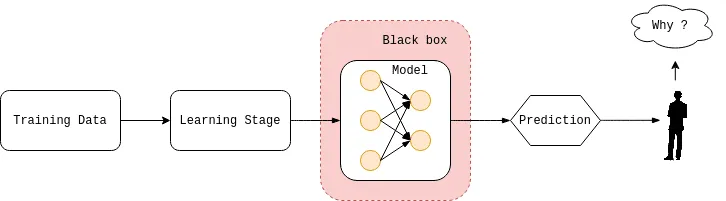 | ML models as black boxes lacking human-understandable justification | — |
|  | Comparison of opaque deep learning vs explainable model | — |
| 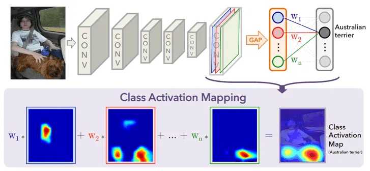 | Class Activation Mapping (CAM) highlighting class-important regions | — |
| 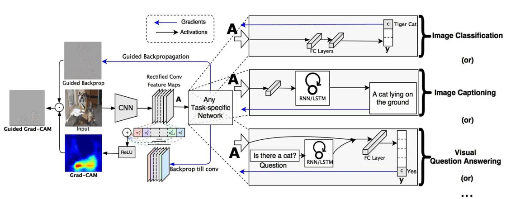 | Grad-CAM gradient-weighted localization heatmap | — |
|  | Layer-Wise Relevance Propagation pixel contributions | — |
| 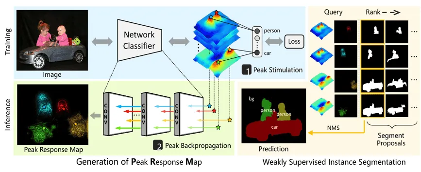 | Peak Response Maps for weakly supervised instance segmentation | — |
| 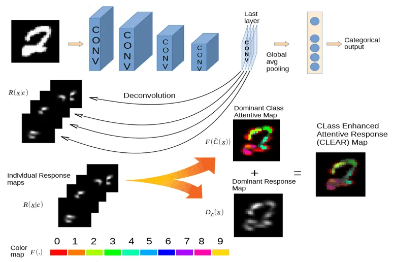 | CLEAR class-enhanced attentive response overlay | — |
| 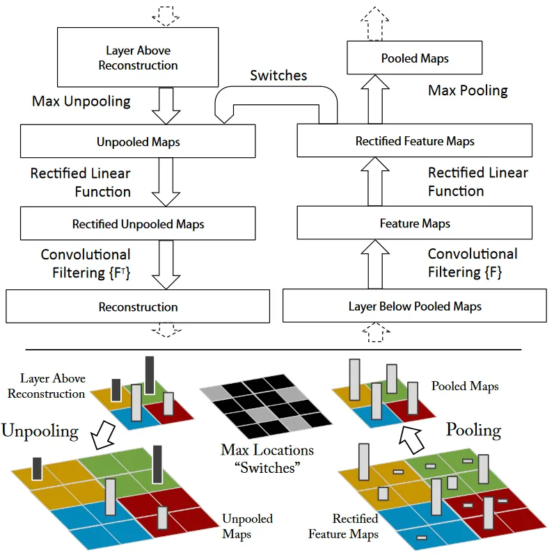 | Deconvolutional network feature visualization (Zeiler & Fergus) | — |
| 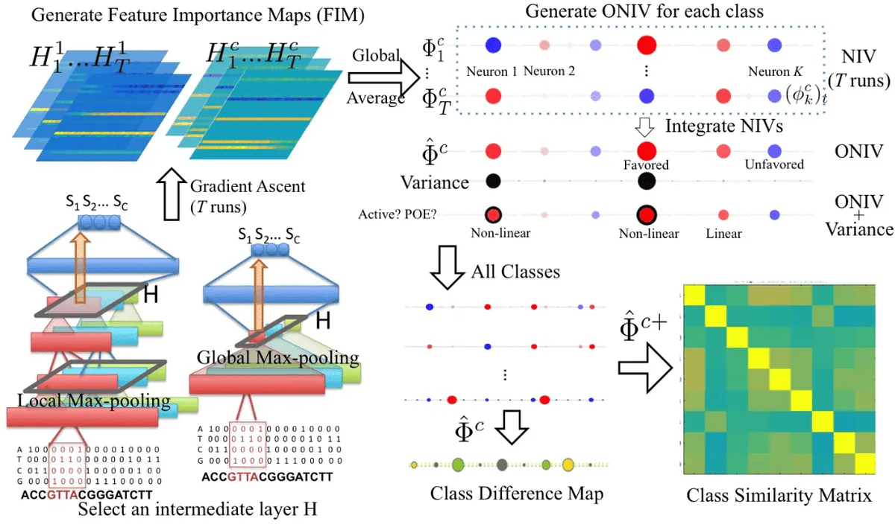 | DeepResolve feature importance maps and class similarity | — |
| 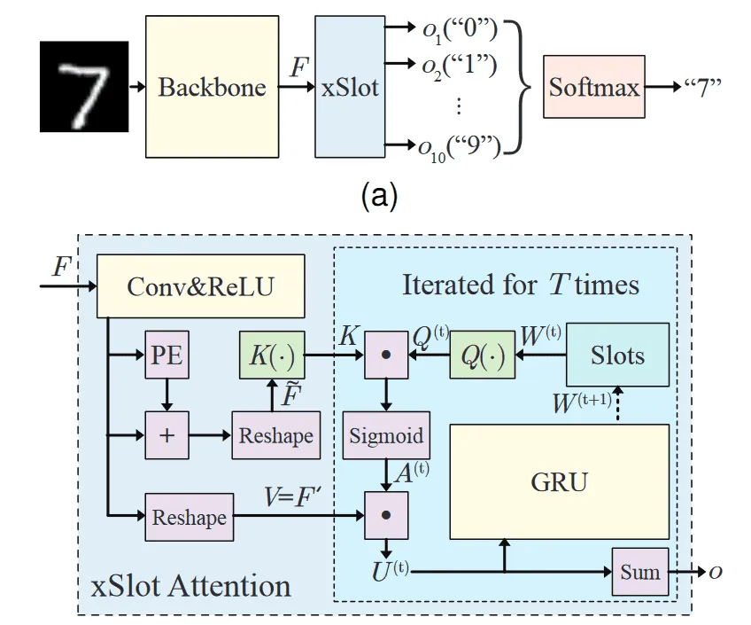 | SCOUTER slot-attention explainable classifier | — |
| 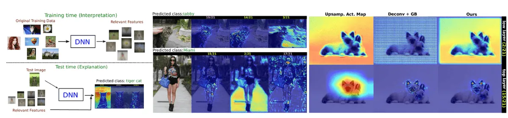 | Visual feedback relevant-feature attribution maps | — |
| 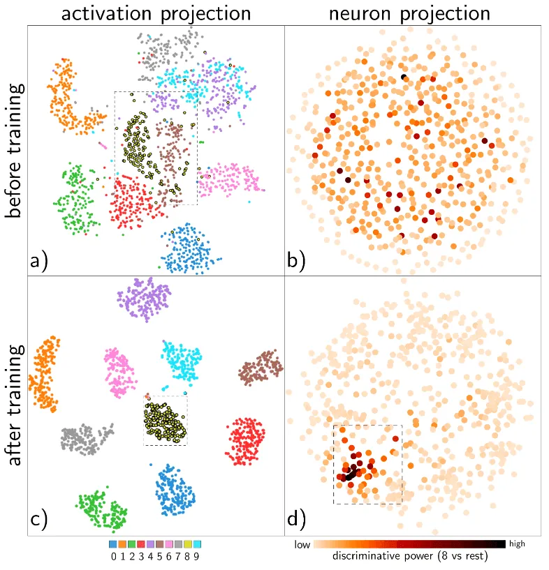 | t-SNE visualization of hidden neural network activations | — |
| 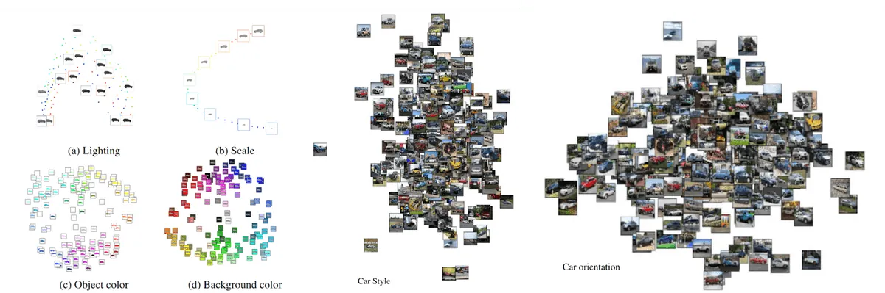 | PCA projection of CNN embeddings by scene factors | — |
| 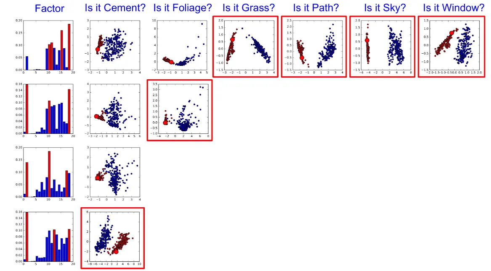 | TreeView feature-space partitioning decision tree | — |
| 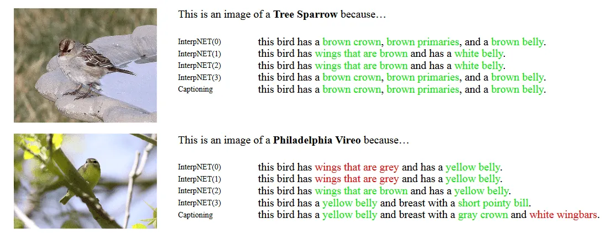 | Interpnet textual explanations from internal activations | — |
| 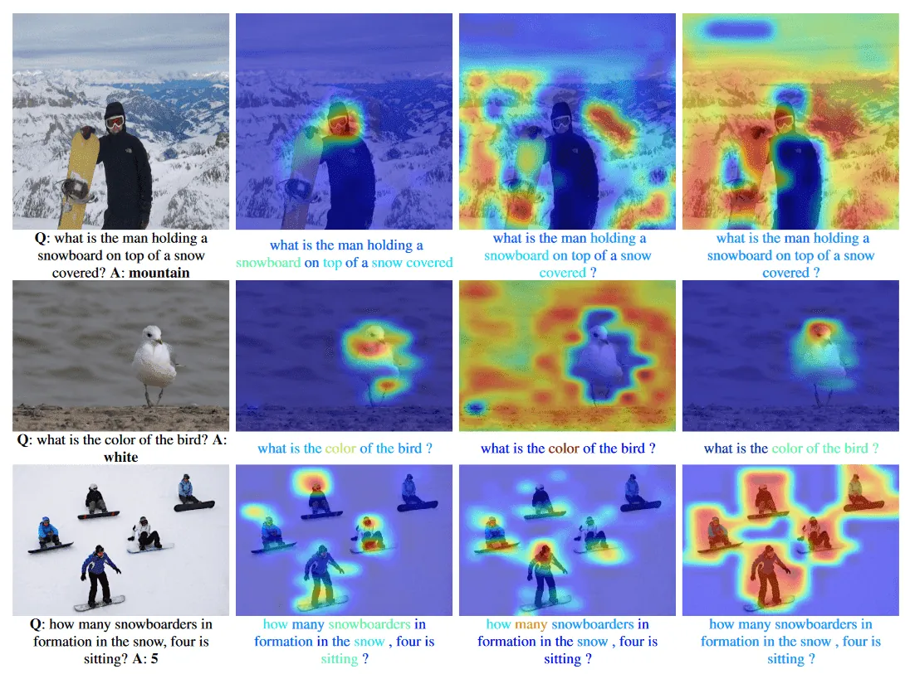 | VQA hierarchical co-attention maps | — |
| 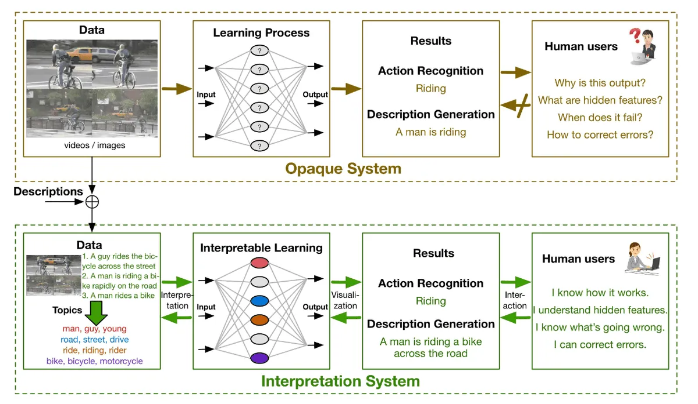 | Semantic-information-guided interpretable video captioning | — |
| 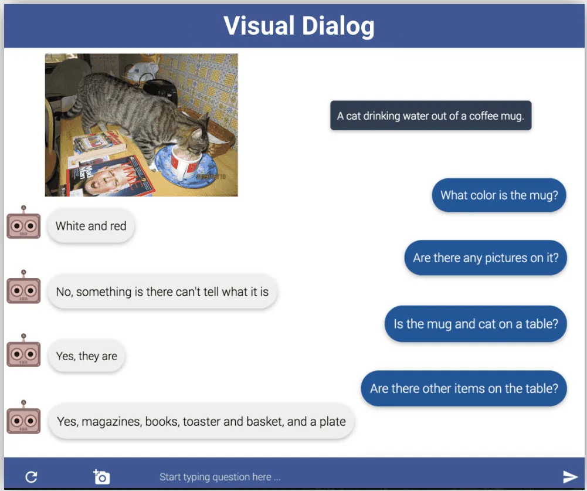 | Visual dialog: AI agent conversing about image content | — |
| 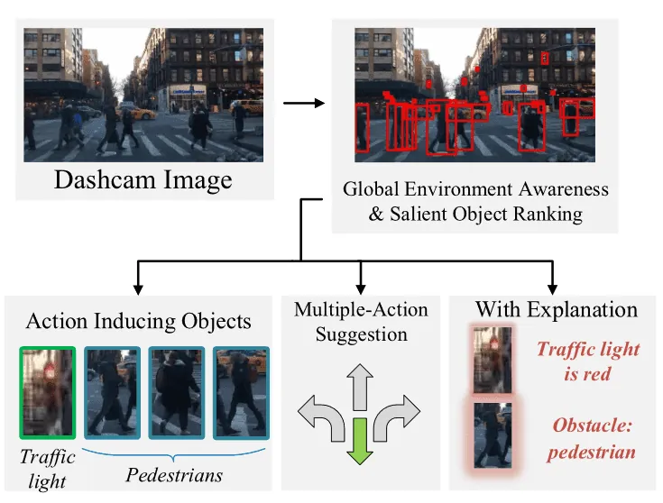 | Explainable autonomous driving actions and visual explanations | — |
| 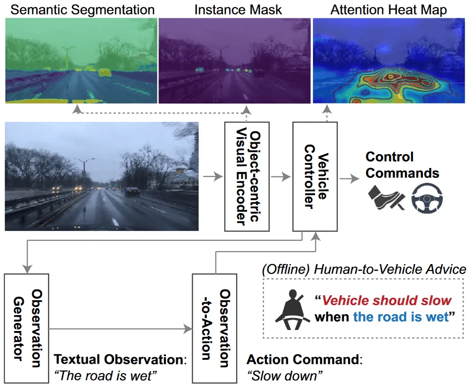 | Advisable learning self-driving system overview with attention maps | — |
| 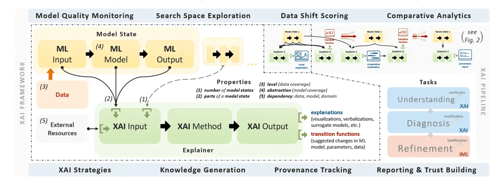 | explAIner visual analytics framework pipeline | — |
| 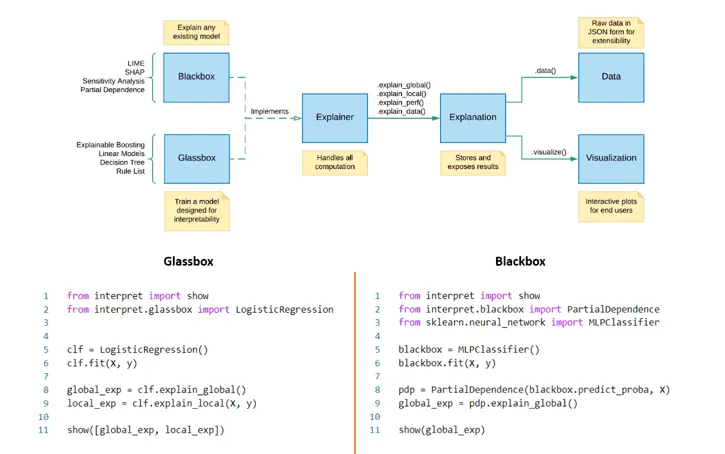 | InterpretML unified interpretability library usage | — |

Grad-CAM backpropagates class-specific gradients to the final conv layer, producing coarse localization maps without requiring a GAP layer — the most widely adopted CNN saliency method in practice.

Numerical methods like LIME and TCAV complement visual heatmaps by quantifying which input perturbations or abstract concepts most influence a specific prediction.

## Entities

- [[AI Summer]] — published this XAI survey (2021).
- [[Ilias Papastratis]] — author.
- [[Explainable AI]] — umbrella field for methods that make ML decisions understandable to humans.
- [[Grad-CAM]] — gradient-based CNN class localization; used in medical X-ray explanation example.
- [[LIME]] — model-agnostic local surrogate explanations.
- [[Class Activation Mapping]] — foundational CNN saliency via GAP weights.
- [[Layer-Wise Relevance Propagation]] — backward relevance decomposition for pixel attribution.
- [[Concept Activation Vectors]] — TCAV concept sensitivity testing in hidden layers.
- [[Convolutional Neural Networks]] — primary target architecture for CAM/Grad-CAM/LRP methods.
- [[Evaluation and Benchmarks]] — interpretability as an evaluation dimension for model trustworthiness.

## Questions & Gaps

- Survey is from 2021; omits SHAP, integrated gradients, attention rollout, and LLM-specific explainability (chain-of-thought is not covered).
- Several citation cross-references in the medical section appear misnumbered (Grad-CAM cited as [26] instead of [22]).
- Framework section is brief; no comparison of explanation fidelity metrics or user-study validation standards.
- Textual explanation methods (VQA, visual dialog) blur the line between interpretability and multimodal reasoning — not all outputs are faithful explanations.

## Related

- [[Extrinsic Hallucinations in LLMs]] — complementary trustworthiness problem in language models (factuality vs explainability).
- [[How the Vision Transformer (ViT) Works in 10 Minutes: An Image Is Worth 16×16 Words]] — ViT attention maps as implicit visual explanations (not covered here).
- [[Safety and Alignment]] — broader model trust, reliability, and human oversight beyond post-hoc explanation.
- [[Computer Vision]] — primary application domain for saliency-based XAI methods surveyed here.
- [[In-layer Normalization Techniques for Training Very Deep Neural Networks]] — same AI Summer author series on training deep networks.
